# Business Flow

## SimplePOS — Sistem Kasir & Penjualan Sederhana

**Document Version:** 1.0  
**Status:** Initial Business Workflow Specification  
**Authoritative Product Source:** `docs/PRD.md`  
**Technical References:** `docs/SRS.md`, `docs/SYSTEM_DESIGN.md`

> This document defines the major business workflows for SimplePOS. It does not introduce product behavior outside the approved PRD. Where generic workflow examples such as public user registration, approval, cancellation, or external payment are not supported by the PRD, this document explicitly marks them as not applicable rather than inventing new behavior.

---

# 1. Business Flow Overview

SimplePOS is a single-store retail POS system with three operational actors:

- **Owner**
- **Administrator**
- **Cashier**

The major business flows are:

1. User account administration.
2. Authentication and logout.
3. Category management.
4. Product management.
5. Main POS transaction.
6. Cash payment.
7. Checkout completion.
8. Receipt access.
9. Transaction history and lookup.
10. Inventory deduction from sales.
11. Manual stock adjustment.
12. Low-stock identification.
13. Dashboard monitoring.
14. Sales reporting.
15. Store settings administration.
16. User role/status administration.
17. Audit/activity recording.
18. In-application notification/error feedback.

The MVP does **not** include:

- self-service public user registration;
- transaction approval workflow;
- external payment gateway;
- completed-sale cancellation/void workflow;
- returns/refunds;
- purchase orders;
- supplier procurement;
- multi-branch stock transfer;
- external email/SMS/WhatsApp notifications.

---

# 2. Core Business Entities and States

## 2.1 User State

Valid account states:

```text
ACTIVE
INACTIVE
```

Valid transitions:

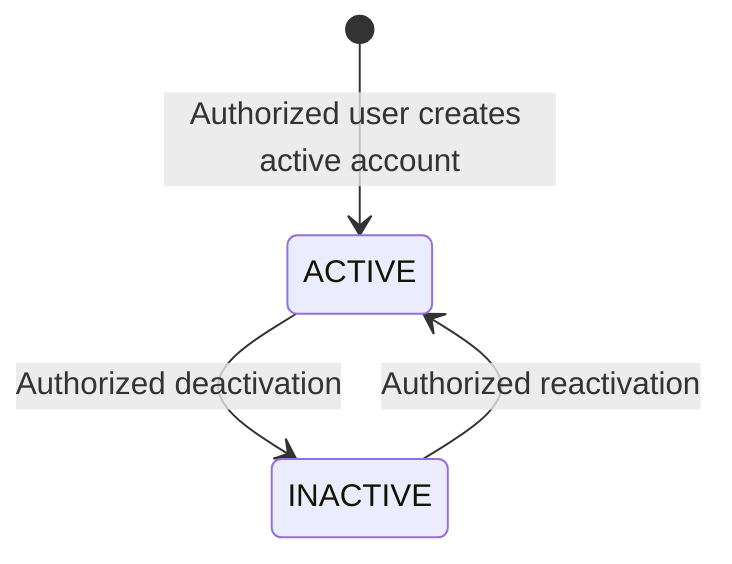

Rules:

- only active users may authenticate;
- deactivation must not remove historical transaction/audit references;
- protected Owner account restrictions apply to Administrator actions.

---

## 2.2 Category State

Valid category states:

```text
ACTIVE
INACTIVE
```

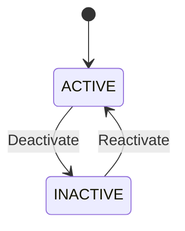

Category deactivation must not erase historical product or transaction information.

---

## 2.3 Product State

Valid product availability states:

```text
ACTIVE
INACTIVE
```

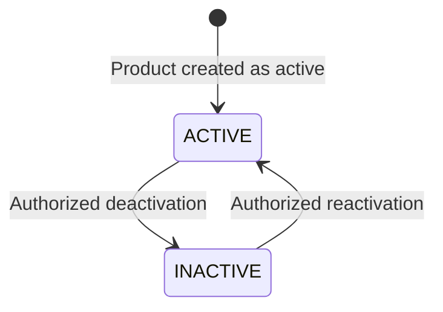

Rules:

- only active sellable products may enter new POS sales;
- historical transaction snapshots remain valid after deactivation;
- product master price changes do not alter completed sales.

---

## 2.4 POS Cart State

Conceptual cart states:

```text
EMPTY
OPEN
READY_FOR_PAYMENT
CHECKOUT_VALIDATION
COMPLETED
```

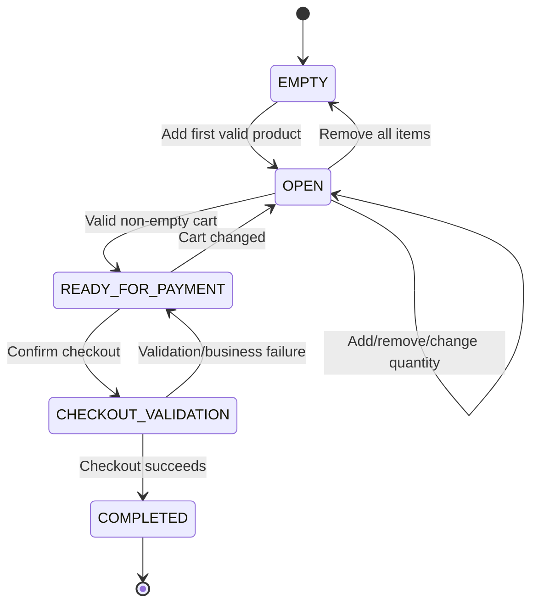

These are workflow states; the PRD does not require persistent cart records.

---

## 2.5 Transaction State

The approved MVP distinguishes successful completed sales from failed/incomplete checkout attempts.

Required persistent business state:

```text
COMPLETED
```

A failed checkout must **not** be represented as a completed transaction.

Conceptual transition:

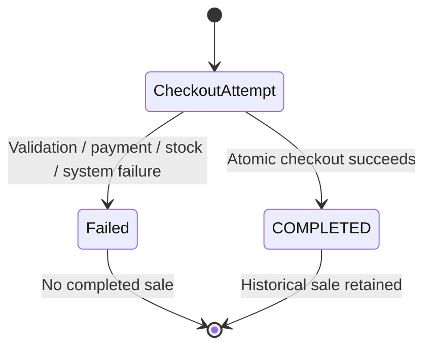

No standard MVP transition exists from `COMPLETED` to:

- CANCELLED;
- VOID;
- REFUNDED;
- DELETED.

Those workflows require future product requirements.

---

## 2.6 Stock Movement Type

The MVP requires at least these business causes:

```text
SALE
MANUAL_ADJUSTMENT
```

A sale movement decreases applicable stock.

A manual adjustment may increase or decrease stock according to the authorized correction.

---

# 3. User Account Creation / Registration Workflow

## Applicability

SimplePOS does **not** provide public self-registration in the MVP.

"User registration" is therefore implemented as **authorized internal user creation** by management.

## 1. Trigger

Owner or permitted Administrator selects the function to create an operational user.

## 2. Actor

Primary:
- Owner.

Conditional:
- Administrator, subject to the permissions matrix.

## 3. Preconditions

- actor is authenticated;
- actor is active;
- actor has user-management permission;
- requested role is assignable by the actor;
- Administrator cannot create or assign a protected Owner role under default MVP rules.

## 4. Main Flow

1. Actor opens user management.
2. Actor selects Add User.
3. Actor enters required identity/login information.
4. Actor selects an allowed role.
5. Actor sets required credentials.
6. Actor submits.
7. System validates fields and role authority.
8. System creates the operational user.
9. System records relevant user-management audit activity.
10. System confirms success.

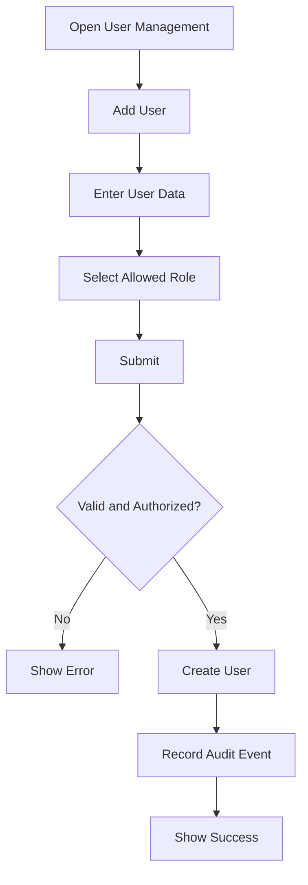

## 5. Alternative Flow

- Actor creates the account initially inactive if the released user-management behavior permits it.
- Administrator creates a Cashier or permitted Administrator-level account but not a protected Owner account.

## 6. Error Flow

- missing required data;
- duplicate login identifier where uniqueness applies;
- invalid role;
- Administrator attempts protected Owner management;
- actor loses authorization/session before submission.

No user is created on failure.

## 7. Business Rules

- only authorized management users may create accounts;
- role assignment must obey the permissions matrix;
- public registration is unavailable;
- created users must have exactly one supported operational role under the MVP model.

## 8. Database State Changes

On success:

```text
users: INSERT
audit_logs: INSERT relevant user creation event
```

On failure:

```text
No valid user record created
```

## 9. Notifications

- success feedback after creation;
- validation/authorization feedback on failure.

No external notification is required.

## 10. Audit Events

Record:
- actor;
- user created;
- assigned role;
- active status where relevant;
- timestamp.

## 11. Final State

A new operational user exists and may authenticate only when active.

---

# 4. Authentication Workflow

## 1. Trigger

User submits login credentials.

## 2. Actor

- Owner;
- Administrator;
- Cashier.

## 3. Preconditions

- user account exists;
- login interface is available.

## 4. Main Flow

1. User opens login.
2. User enters credentials.
3. System validates authentication request.
4. System locates account.
5. System verifies credentials.
6. System verifies account is active.
7. System creates/regenerates authenticated session.
8. User is redirected to an allowed application area.

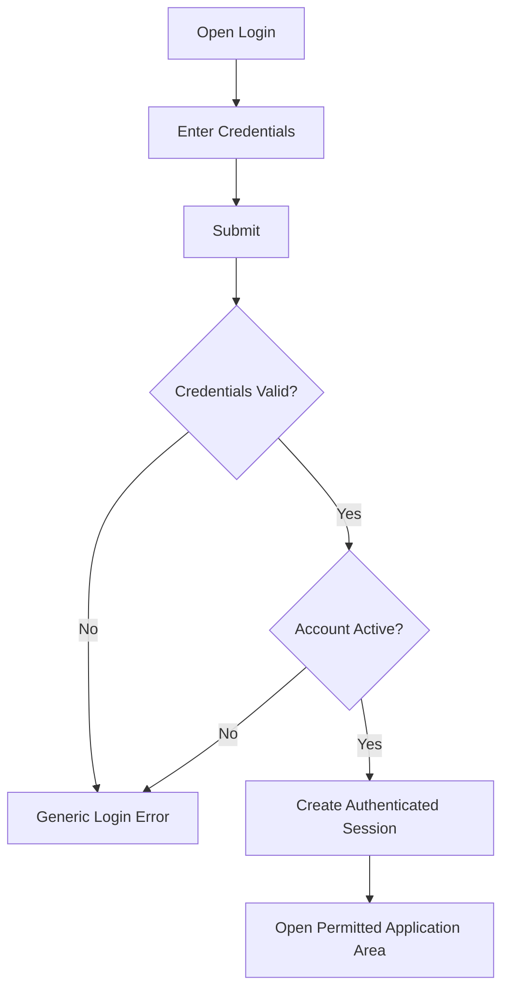

## 5. Alternative Flow

An already authenticated user navigates directly to a permitted route without logging in again while the session remains valid.

## 6. Error Flow

- invalid credentials;
- inactive account;
- expired/invalid session;
- unexpected authentication system error.

Authentication failure must not reveal unnecessary account existence information.

## 7. Business Rules

- inactive users cannot authenticate;
- authentication does not imply authorization for every function;
- session access is role-controlled.

## 8. Database State Changes

Normally no core business record changes are required merely for successful login, except any framework/session storage or approved login metadata.

## 9. Notifications

- generic authentication error on failure;
- no external notification required.

## 10. Audit Events

The PRD requires auditability of defined sensitive business activities but does not mandate persistent audit records for every successful login. Diagnostic/security logging may record authentication events according to the SRS.

## 11. Final State

Success:
- active authenticated session.

Failure:
- unauthenticated state.

---

# 5. Logout Workflow

## 1. Trigger

Authenticated user selects Logout.

## 2. Actor

Any authenticated operational user.

## 3. Preconditions

Authenticated session exists.

## 4. Main Flow

1. User selects Logout.
2. System invalidates authenticated session.
3. Anti-forgery/session state is refreshed as required.
4. User returns to an unauthenticated page.

## 5. Alternative Flow

Session expires automatically according to configured session policy.

## 6. Error Flow

If the existing session is already invalid, the user remains unauthenticated.

## 7. Business Rules

Protected application pages require authentication after logout.

## 8. Database State Changes

No core POS business records change.

Session storage may change according to the selected session mechanism.

## 9. Notifications

Optional standard logout feedback.

## 10. Audit Events

No mandatory business audit event is defined by the PRD.

## 11. Final State

User is unauthenticated.

---

# 6. Category Management Workflow

## 1. Trigger

Authorized management user creates or updates a category.

## 2. Actor

- Owner;
- Administrator.

## 3. Preconditions

- actor authenticated;
- actor authorized for category management.

## 4. Main Flow — Create

1. Open category management.
2. Select Add Category.
3. Enter required category name.
4. Submit.
5. System validates data.
6. Category is created.
7. Success feedback is displayed.

## 5. Alternative Flow

Actor edits, deactivates, or reactivates an existing category.

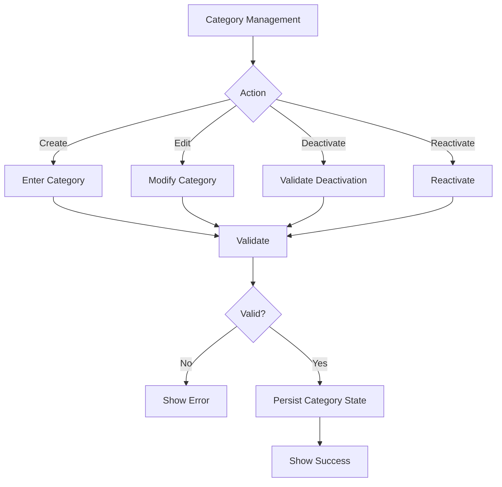

## 6. Error Flow

- missing category name;
- unauthorized actor;
- attempted state change violates active-data rules.

## 7. Business Rules

- inactive categories cannot be used for new sellable product assignments where this would violate PRD rules;
- deactivation does not delete historical records.

## 8. Database State Changes

Create:
```text
categories: INSERT
```

Edit/status:
```text
categories: UPDATE
```

## 9. Notifications

In-app success/error feedback.

## 10. Audit Events

No mandatory dedicated category audit event is specified in the PRD.

## 11. Final State

Category exists in a valid active/inactive state.

---

# 7. Product Creation and Maintenance Workflow

## 1. Trigger

Authorized user creates or changes a product.

## 2. Actor

- Owner;
- Administrator.

## 3. Preconditions

- actor authenticated and authorized;
- required category/business context exists;
- SKU is available for new product;
- barcode, when provided, is available.

## 4. Main Flow — Create Product

1. Actor opens product management.
2. Selects Add Product.
3. Enters product name.
4. Enters unique SKU.
5. Optionally enters unique barcode.
6. Selects valid category.
7. Enters selling price.
8. Optionally enters cost price.
9. Enters/configures stock information required by the released product.
10. Selects active state.
11. Submits.
12. System validates all fields and uniqueness.
13. Product is created.
14. Active sellable product becomes discoverable in POS.

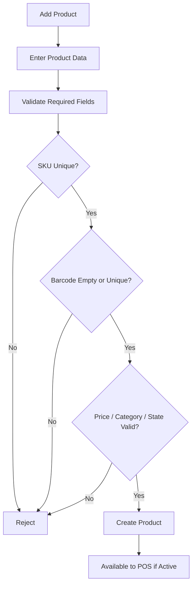

## 5. Alternative Flow

Actor:
- edits product master data;
- changes current selling price;
- changes category;
- deactivates product;
- reactivates product.

## 6. Error Flow

- duplicate SKU;
- duplicate non-empty barcode;
- negative selling price;
- invalid category;
- unauthorized actor;
- invalid required data.

## 7. Business Rules

- SKU is unique;
- populated barcode is unique;
- selling price cannot be negative;
- inactive product cannot enter a new sale;
- current product edits must not rewrite historical transaction snapshots.

## 8. Database State Changes

Create:
```text
products: INSERT
```

Edit/state:
```text
products: UPDATE
```

Historical transaction tables:
```text
NO retroactive change
```

## 9. Notifications

In-app success/error feedback.

## 10. Audit Events

The PRD does not mandate full product-change audit logging. Sensitive audit coverage may be expanded later without changing transaction history.

## 11. Final State

Product master record is stored in a valid state and is available/unavailable to POS according to active status.

---

# 8. Main POS Transaction Workflow

## 1. Trigger

Cashier begins serving a customer and selects products for sale.

## 2. Actor

Primary:
- Cashier.

Also permitted:
- Owner;
- Administrator.

## 3. Preconditions

- actor authenticated;
- actor authorized to access POS;
- at least one active sellable product exists for a non-empty sale;
- required store configuration is available.

## 4. Main Flow

1. Actor opens POS.
2. Cart starts empty.
3. Actor searches/selects a product.
4. System confirms product is active/sellable.
5. Product is added to cart.
6. Actor repeats selection as needed.
7. Actor changes quantities where required.
8. System recalculates subtotal.
9. Actor optionally applies permitted transaction-level discount.
10. System calculates amount due.
11. Cart becomes ready for payment.
12. Actor proceeds to cash payment workflow.

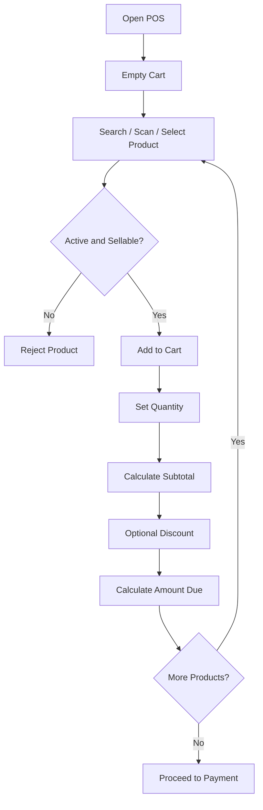

## 5. Alternative Flow

- same product selected again: quantity updates predictably;
- actor decreases quantity;
- actor removes item;
- all items removed: cart returns to empty;
- actor changes cart after amount due is shown: totals are recalculated.

## 6. Error Flow

- product inactive;
- product cannot be found;
- invalid quantity;
- requested quantity violates stock rule;
- cart becomes empty;
- session expires.

No completed transaction exists at this stage.

## 7. Business Rules

- cart must contain at least one valid item before checkout;
- quantities must be positive;
- only active sellable products may be sold;
- displayed totals are provisional until server checkout validation;
- discount cannot reduce final total below zero.

## 8. Database State Changes

The PRD does not require persistent carts.

Before checkout, database changes are normally:

```text
None for transaction completion
```

## 9. Notifications

- invalid/inactive product warning;
- stock warning where relevant;
- validation feedback.

## 10. Audit Events

No completed-sale audit state is created merely by building a cart.

## 11. Final State

A valid cart is ready for payment, or the cart remains open/empty.

---

# 9. Cash Payment Workflow

## 1. Trigger

Actor proceeds to payment with a valid non-empty cart.

## 2. Actor

Authorized POS user.

## 3. Preconditions

- valid cart exists;
- amount due has been calculated;
- MVP payment method is cash.

## 4. Main Flow

1. System displays final provisional amount due.
2. Actor enters cash received.
3. System validates numeric/payment input.
4. System compares cash received to amount due.
5. If sufficient, system calculates change.
6. System displays change.
7. Actor explicitly confirms checkout.
8. Control passes to checkout completion workflow.

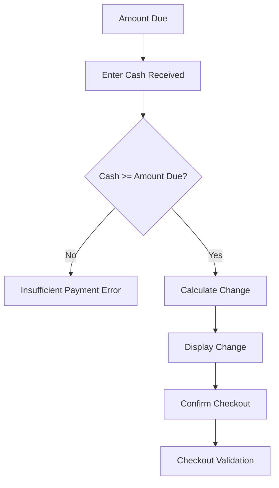

## 5. Alternative Flow

Actor changes the cart before confirmation. The payment calculation must be recalculated from the changed amount due.

## 6. Error Flow

- cash received is missing/invalid;
- cash received is below amount due;
- session expires;
- product/stock state changes before final checkout.

## 7. Business Rules

```text
change = cash_received - final_amount_due
```

- cash received must be at least amount due;
- external payment methods are not part of MVP;
- payment is not final until checkout commits successfully.

## 8. Database State Changes

No completed financial record should be created until checkout succeeds.

## 9. Notifications

- insufficient payment;
- invalid payment input;
- calculated change display.

## 10. Audit Events

Cashier identity is recorded when the transaction successfully completes, not merely when payment input is entered.

## 11. Final State

Payment data is valid and checkout is ready for final server-side completion, or payment remains unresolved.

---

# 10. Checkout Completion Workflow

## 1. Trigger

Authorized POS user confirms checkout.

## 2. Actor

- Cashier;
- Owner;
- Administrator.

## 3. Preconditions

- authenticated session;
- POS authorization;
- non-empty cart;
- valid cash payment input;
- products still satisfy sale rules.

## 4. Main Flow

1. System receives checkout confirmation.
2. System revalidates actor authorization.
3. System reloads authoritative product data.
4. System validates product active states.
5. System validates quantities.
6. System validates current stock.
7. System recalculates item values.
8. System recalculates subtotal.
9. System validates/applies discount.
10. System recalculates final total.
11. System validates cash received.
12. System recalculates change.
13. System begins atomic business transaction.
14. System generates/assigns unique invoice number.
15. System creates transaction record.
16. System creates transaction item snapshots.
17. System reduces applicable product stock.
18. System creates sale stock movement records.
19. System completes the transaction state.
20. System commits all required changes.
21. System returns completed transaction.
22. Receipt becomes available.
23. Transaction becomes available to history/reports.

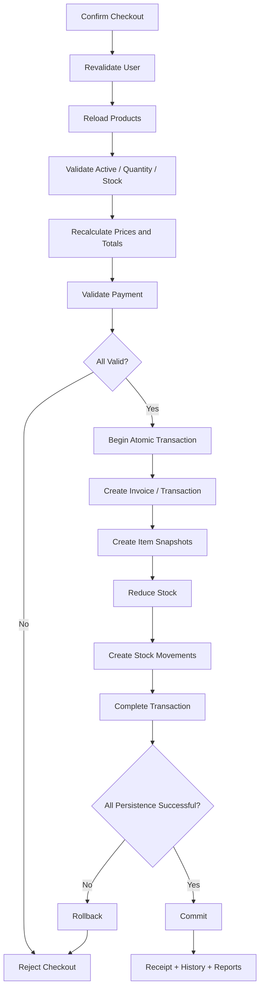

## 5. Alternative Flow

If cart/product state changed since the UI last calculated totals, the authoritative server calculation is used. If this creates a condition requiring user correction, checkout is rejected and the actor must review the cart/payment.

## 6. Error Flow

- unauthorized actor;
- inactive product;
- insufficient stock;
- invalid discount;
- insufficient payment;
- duplicate/failed invoice creation;
- database failure;
- stock persistence failure.

Required result:

```text
No contradictory COMPLETED transaction + missing required stock effects
```

The atomic transaction must roll back required persistence on failure.

## 7. Business Rules

- exactly one completed transaction per successful checkout;
- invoice number unique;
- transaction item values are historical snapshots;
- stock decreases only for successful completed sale;
- failed checkout is excluded from revenue/reporting;
- completed transaction is not normally editable or hard-deletable.

## 8. Database State Changes

Success:

```text
transactions: INSERT completed sale
transaction_items: INSERT one or more snapshots
products: UPDATE applicable stock
stock_movements: INSERT SALE movements
```

Failure:

```text
Atomic required changes rolled back
No completed sale state
```

## 9. Notifications

Success:
- checkout success;
- receipt-ready state.

Failure:
- actionable business error or safe system error.

## 10. Audit Events

Required traceability is provided through:

- cashier identity on transaction;
- sale-related stock movement records;
- timestamps.

A duplicate generic audit entry for every sale is not required unless later approved.

## 11. Final State

Success:
- transaction `COMPLETED`;
- stock updated;
- receipt available;
- sale included in reports.

Failure:
- no completed transaction;
- required stock state unchanged by failed attempt.

---

# 11. Receipt Workflow

## 1. Trigger

A sale completes successfully or an authorized user opens an allowed completed transaction.

## 2. Actor

- Cashier within allowed transaction scope;
- Administrator;
- Owner.

## 3. Preconditions

- completed transaction exists;
- actor may view the transaction.

## 4. Main Flow

1. System loads completed transaction.
2. System loads transaction item snapshots.
3. System loads displayable store settings.
4. System renders receipt.
5. User views or opens printable representation.

## 5. Alternative Flow

Authorized user reopens a historical transaction and views/prints its receipt.

## 6. Error Flow

- transaction not found;
- actor not authorized;
- store logo missing: receipt should remain usable using available store text information;
- unexpected rendering failure.

## 7. Business Rules

Receipt must show the PRD-required sale information.

Financial values come from completed transaction data, not current product prices.

## 8. Database State Changes

Normally none.

## 9. Notifications

Controlled error if receipt cannot be accessed.

## 10. Audit Events

Receipt viewing/printing is not defined as a mandatory audit event in the PRD.

## 11. Final State

Receipt is presented without changing the completed sale.

---

# 12. Transaction History and Search Workflow

## 1. Trigger

Authorized user opens transaction history or searches for a transaction.

## 2. Actor

- Owner;
- Administrator;
- Cashier within allowed scope.

## 3. Preconditions

Authenticated and authorized.

## 4. Main Flow

1. Actor opens transaction history.
2. System limits accessible records according to role.
3. Actor optionally enters invoice number.
4. Actor optionally selects date range.
5. Management actor may filter by cashier.
6. System validates filters.
7. System retrieves matching permitted completed transactions.
8. System displays results.
9. Actor may open transaction detail.

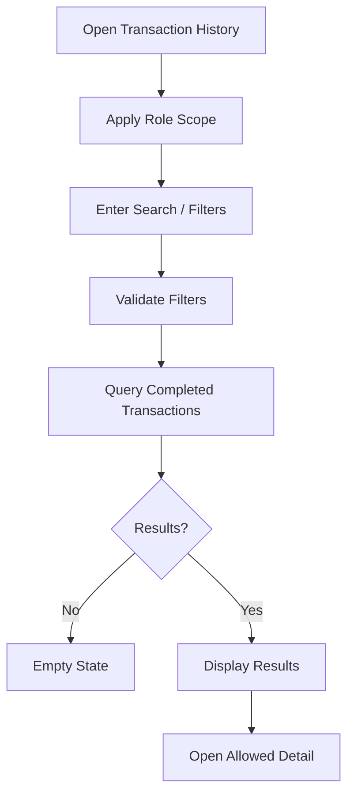

## 5. Alternative Flow

- clear filters to restore allowed unfiltered result set;
- exact invoice search retrieves one known transaction.

## 6. Error Flow

- invalid date range;
- unauthorized record access;
- missing transaction.

## 7. Business Rules

- search cannot bypass role permissions;
- completed transaction financial history is read-only under normal MVP behavior.

## 8. Database State Changes

None.

## 9. Notifications

- empty state;
- invalid filter feedback;
- forbidden/not-found state.

## 10. Audit Events

Transaction viewing is not a mandatory audit event.

## 11. Final State

Actor sees only authorized historical transaction information.

---

# 13. Sale-Driven Inventory Movement Workflow

## 1. Trigger

Checkout successfully completes a sale containing stock-tracked products.

## 2. Actor

Business actor:
- Cashier/Owner/Administrator completing sale.

System actor:
- SimplePOS checkout workflow.

## 3. Preconditions

- checkout validations passed;
- sufficient stock under configured MVP stock rule;
- atomic checkout transaction active.

## 4. Main Flow

For each applicable transaction item:

1. identify product;
2. determine quantity sold;
3. reduce stock by sold quantity;
4. create `SALE` stock movement;
5. associate movement with transaction/reference;
6. continue until all applicable items are processed;
7. commit with transaction.

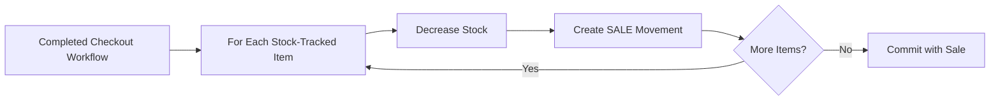

## 5. Alternative Flow

Products that are not subject to stock tracking, if such behavior is approved in final product configuration, do not create a quantity deduction.

## 6. Error Flow

Any required stock update/movement failure causes the atomic checkout to fail/roll back.

## 7. Business Rules

```text
new_stock = previous_stock - sold_quantity
```

where negative stock is prohibited:

```text
sold_quantity <= available_stock
```

## 8. Database State Changes

```text
products.stock_quantity: UPDATE
stock_movements: INSERT SALE movement
```

## 9. Notifications

Normally surfaced as checkout success.

Insufficient stock is surfaced before completion.

## 10. Audit Events

Stock movement itself provides sale-related inventory traceability.

## 11. Final State

Inventory reflects the successfully completed sale.

---

# 14. Manual Stock Adjustment Workflow

## 1. Trigger

Owner or Administrator identifies a legitimate need to correct stock.

## 2. Actor

- Owner;
- Administrator.

Cashier is not permitted.

## 3. Preconditions

- actor authenticated;
- actor authorized for manual stock adjustment;
- product exists;
- adjustment input valid;
- reason supplied.

## 4. Main Flow

1. Actor opens inventory/product stock function.
2. Actor selects product.
3. Actor enters adjustment direction/value.
4. Actor enters reason.
5. System validates authorization and data.
6. System determines resulting stock.
7. Actor confirms.
8. System begins atomic transaction.
9. Product stock is updated.
10. `MANUAL_ADJUSTMENT` movement is created.
11. Required audit record is created.
12. Transaction commits.
13. Updated stock is displayed.

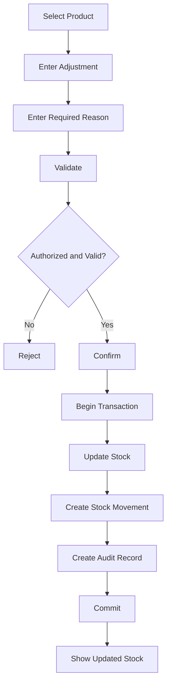

## 5. Alternative Flow

Adjustment increases stock or decreases stock depending on the correction required and allowed product rules.

## 6. Error Flow

- Cashier attempts adjustment;
- missing reason;
- invalid quantity;
- product not found;
- resulting stock violates stock policy;
- database failure.

On persistence failure, stock and its required movement record must not become inconsistent.

## 7. Business Rules

- reason mandatory;
- responsible user mandatory;
- adjustment must be traceable;
- Cashier cannot adjust stock.

## 8. Database State Changes

Success:

```text
products.stock_quantity: UPDATE
stock_movements: INSERT MANUAL_ADJUSTMENT
audit_logs: INSERT
```

## 9. Notifications

- adjustment success;
- validation/error feedback.

## 10. Audit Events

Record:
- actor;
- product;
- adjustment value;
- reason;
- timestamp.

## 11. Final State

Product stock reflects the approved manual correction with traceable history.

---

# 15. Low-Stock Identification Workflow

## 1. Trigger

Management user opens dashboard/inventory view that exposes low-stock information.

## 2. Actor

- Owner;
- Administrator.

## 3. Preconditions

- authenticated;
- authorized to view management stock information;
- low-stock threshold behavior is configured/defined by released product rules.

## 4. Main Flow

1. System evaluates products against low-stock rule.
2. System identifies matching products.
3. System displays count/list sufficient to identify affected products.

## 5. Alternative Flow

No product is low stock; system shows zero/empty state.

## 6. Error Flow

Data/query failure returns safe application error.

## 7. Business Rules

Low-stock warning is informational and does not automatically create procurement activity.

## 8. Database State Changes

None.

## 9. Notifications

In-application dashboard/inventory warning only.

## 10. Audit Events

None required.

## 11. Final State

Management user can identify products requiring stock attention.

---

# 16. Dashboard Monitoring Workflow

## 1. Trigger

Owner or Administrator opens dashboard.

## 2. Actor

- Owner;
- Administrator.

Cashier does not receive unrestricted business-wide metrics by default.

## 3. Preconditions

Authenticated and authorized.

## 4. Main Flow

1. System identifies current business day/defined metric period.
2. System queries eligible completed transactions.
3. System calculates current-day sales revenue.
4. System calculates transaction count.
5. System identifies low-stock information.
6. System calculates best-selling product indicator for defined period.
7. System presents dashboard.

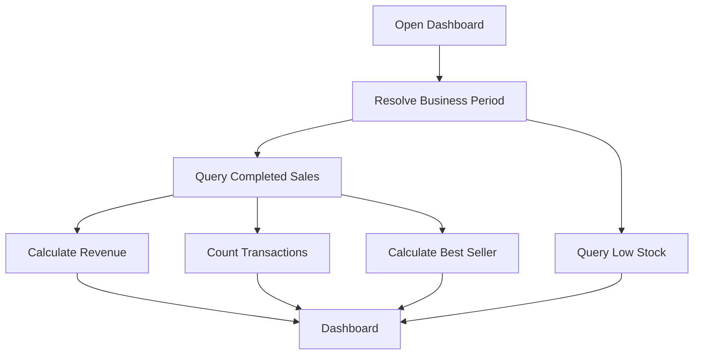

## 5. Alternative Flow

No eligible transactions:
- revenue = zero;
- transaction count = zero;
- explicit empty states where needed.

## 6. Error Flow

Report/query error returns safe failure state.

## 7. Business Rules

Dashboard metrics must reconcile with reports using equivalent period/eligibility rules.

## 8. Database State Changes

None.

## 9. Notifications

Low-stock visibility and empty states.

## 10. Audit Events

Dashboard viewing is not a mandatory audit event.

## 11. Final State

Authorized management user sees current business indicators.

---

# 17. Sales Reporting Workflow

## 1. Trigger

Owner or Administrator opens Reports.

## 2. Actor

- Owner;
- Administrator.

## 3. Preconditions

Authenticated and authorized.

## 4. Main Flow

1. Actor opens sales report.
2. Actor selects daily or date-range period.
3. System validates dates.
4. System retrieves eligible completed transactions.
5. System calculates total sales.
6. System calculates completed transaction count.
7. System retrieves transaction items for product-sales aggregation.
8. System calculates quantities sold by product.
9. System displays reporting period and results.

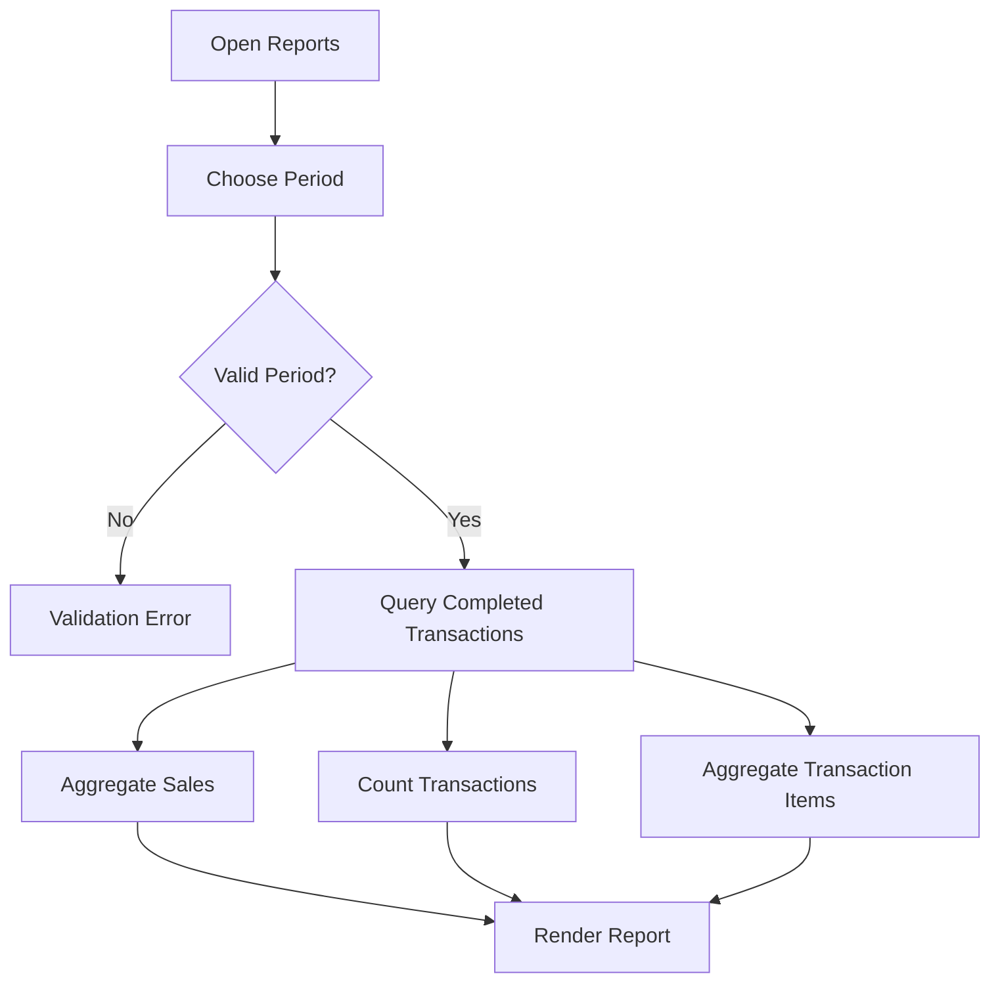

## 5. Alternative Flow

No eligible data:
- report displays explicit empty/zero state.

If future approved export exists:
- export uses identical filters and totals.

## 6. Error Flow

- invalid date range;
- unauthorized actor;
- database/query failure.

## 7. Business Rules

- only completed eligible transactions count;
- historical values come from transaction snapshots;
- current product price changes cannot rewrite historical report totals;
- report period must be displayed.

## 8. Database State Changes

None for standard report viewing.

## 9. Notifications

- invalid filter;
- empty report state;
- safe error feedback.

## 10. Audit Events

Report viewing is not a mandatory audit event.

## 11. Final State

Authorized user receives a reconciled read-only report.

---

# 18. Store Settings Administration Workflow

## 1. Trigger

Authorized user changes store configuration.

## 2. Actor

Primary:
- Owner.

Limited:
- Administrator according to released permission configuration.

## 3. Preconditions

- authenticated;
- authorized for the requested setting;
- input valid.

## 4. Main Flow

1. Actor opens store settings.
2. Actor changes supported fields:
   - store name;
   - address;
   - contact;
   - currency display;
   - receipt footer;
   - optional logo.
3. System validates values.
4. If logo is supplied, file upload flow validates it.
5. System persists settings.
6. System records sensitive settings audit event.
7. New settings apply to subsequent supported displays/receipts.

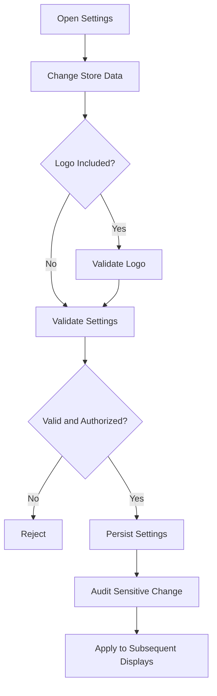

## 5. Alternative Flow

Actor changes only one setting; unrelated settings remain unchanged.

## 6. Error Flow

- invalid file;
- file too large;
- unauthorized Administrator setting;
- invalid business setting;
- storage failure.

Invalid logo must not replace currently valid logo.

## 7. Business Rules

- store settings affect future display behavior;
- historical transaction financial values do not change;
- store identity is configurable, not hard-coded.

## 8. Database State Changes

```text
store_settings: INSERT/UPDATE or equivalent settings persistence
audit_logs: INSERT for sensitive changes
```

File storage may also change for logo.

## 9. Notifications

- settings saved;
- validation/file error.

## 10. Audit Events

Sensitive settings changes record:
- actor;
- setting/action context;
- timestamp.

## 11. Final State

Valid store configuration is active for subsequent supported product behavior.

---

# 19. User Role Change Workflow

## 1. Trigger

Authorized management user changes another operational user's role.

## 2. Actor

- Owner;
- limited Administrator where allowed.

## 3. Preconditions

- authenticated;
- target user exists;
- actor authorized;
- requested transition is allowed;
- Administrator cannot alter protected Owner role under default rules.

## 4. Main Flow

1. Actor opens target user.
2. Actor selects permitted new role.
3. System validates actor authority.
4. System validates target account protection.
5. System updates role.
6. System records audit event.
7. New authorization applies according to session/authorization behavior.

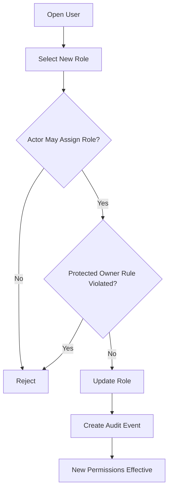

## 5. Alternative Flow

Owner changes Cashier to Administrator or Administrator to Cashier where valid.

## 6. Error Flow

- unauthorized actor;
- protected Owner modification;
- invalid role;
- target user missing.

## 7. Business Rules

Valid role values:

```text
OWNER
ADMINISTRATOR
CASHIER
```

Role transitions are only valid when the actor has authority to assign the target role.

Default protected rule:

```text
Administrator -> cannot create/change/deactivate protected Owner
```

## 8. Database State Changes

```text
users.role: UPDATE
audit_logs: INSERT
```

## 9. Notifications

Success/error in application.

## 10. Audit Events

Mandatory:
- actor;
- target user;
- role change context;
- timestamp.

## 11. Final State

Target user has the approved new role; historical transactions remain unchanged.

---

# 20. User Activation / Deactivation Workflow

## 1. Trigger

Authorized user changes operational account active state.

## 2. Actor

- Owner;
- limited Administrator.

## 3. Preconditions

- actor authenticated;
- target exists;
- actor authorized;
- protected Owner restriction satisfied.

## 4. Main Flow — Deactivation

1. Actor opens target user.
2. Actor selects Deactivate.
3. System validates authority.
4. System updates account from `ACTIVE` to `INACTIVE`.
5. System records audit event.
6. Future authentication for that account is rejected.

## 5. Alternative Flow — Reactivation

```text
INACTIVE -> ACTIVE
```

when authorized management reactivates the account.

## 6. Error Flow

- Administrator attempts protected Owner deactivation;
- target missing;
- unauthorized actor.

## 7. Business Rules

Valid transitions:

```text
ACTIVE -> INACTIVE
INACTIVE -> ACTIVE
```

Deactivation must not delete:
- historical transactions;
- cashier references;
- audit records.

## 8. Database State Changes

```text
users.active: UPDATE
audit_logs: INSERT
```

## 9. Notifications

In-app success/error.

## 10. Audit Events

Mandatory user status change audit.

## 11. Final State

Target account is active or inactive according to approved transition.

---

# 21. Notification / User Feedback Workflow

## 1. Trigger

Any user operation produces a success, validation failure, business warning, authorization failure, or system failure.

## 2. Actor

Any operational user/system.

## 3. Preconditions

An application action has produced a result requiring user feedback.

## 4. Main Flow

1. System classifies result.
2. System selects safe user-facing feedback.
3. Feedback is shown in the relevant interface.
4. If unexpected failure occurred, diagnostic details are logged separately.

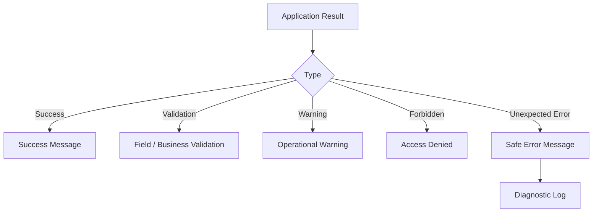

## 5. Alternative Flow

Low-stock information appears as dashboard/inventory visibility rather than a transient message.

## 6. Error Flow

Notification rendering failure must not change underlying business transaction state.

## 7. Business Rules

- never show success for failed operation;
- errors must not expose secrets/internal stack details;
- no external notification channel is required.

## 8. Database State Changes

Normally none.

## 9. Notifications

This workflow itself defines in-app notifications.

## 10. Audit Events

Not every UI notification creates an audit event.

## 11. Final State

User receives accurate feedback corresponding to actual operation state.

---

# 22. Audit Event Workflow

## 1. Trigger

A business action defined as auditable succeeds.

## 2. Actor

- Owner;
- Administrator;
- system in context of an authenticated actor.

## 3. Preconditions

The underlying business action is successful or reaches the defined auditable point.

## 4. Main Flow

1. Business operation identifies auditable action.
2. System captures actor.
3. System captures action.
4. System captures target/reference.
5. System captures relevant context.
6. System records timestamp.
7. Audit record is persisted.

Required MVP audit categories include:

- manual stock adjustment;
- user role change;
- user active-status change;
- sensitive store setting change.

## 5. Alternative Flow

Completed sales rely on transaction cashier identity and stock movement traceability rather than requiring a duplicate generic audit row.

## 6. Error Flow

For workflows where the audit record is explicitly required as part of the atomic business operation, failure to record it must cause that operation to fail/roll back where specified by the system design.

## 7. Business Rules

- Cashier cannot edit audit records;
- standard application users cannot silently delete audit history;
- audit visibility is role-controlled.

## 8. Database State Changes

```text
audit_logs: INSERT
```

## 9. Notifications

Normally none beyond the underlying business action result.

## 10. Audit Events

The resulting audit row is the event record.

## 11. Final State

Sensitive business action is traceable.

---

# 23. Approval Process

## Applicability

A generic approval workflow is **not part of the SimplePOS MVP**.

The PRD does not define:

- manager approval for checkout;
- approval for discounts;
- approval for stock adjustment;
- approval queues;
- maker-checker workflow.

Therefore no approval status or approval transition is introduced.

Current model:

```text
Authorized Action
      |
      v
Validation + Business Rules
      |
      v
Immediate Success / Failure
```

If future versions require approval, the PRD must first define:

- actions requiring approval;
- requester;
- approver;
- pending status;
- rejection;
- expiration;
- audit requirements.

---

# 24. Cancellation / Void / Refund Workflow

## Applicability

Cancellation of a **completed** transaction is not supported by the approved MVP.

Valid completed-sale behavior:

```text
COMPLETED
   |
   +--> View
   +--> Search
   +--> Receipt
   +--> Report
```

Not currently valid:

```text
COMPLETED -> CANCELLED
COMPLETED -> VOID
COMPLETED -> REFUNDED
COMPLETED -> DELETED
```

## Pre-Checkout Cancellation

A cashier may effectively abandon or empty the working cart before checkout because no completed transaction exists yet.

```mermaid
flowchart LR
    A[Open Cart] --> B[Remove Items]
    B --> C{Any Items Left?}
    C -->|Yes| A
    C -->|No| D[Empty Cart]
```

This is not a financial cancellation because the sale has not completed.

Future returns/refunds require separate product/business rules for:

- transaction status;
- stock reversal;
- refund amount;
- audit;
- reporting treatment;
- receipt/reference relationship.

---

# 25. Payment Status Changes

The MVP supports cash payment as part of synchronous checkout.

It does not define a long-lived payment lifecycle such as:

```text
PENDING -> PAID -> FAILED -> REFUNDED
```

Instead:

```text
Cash Input
   |
Validate
   |
Checkout
   |
+-- Failure -> No completed sale
|
+-- Success -> Completed transaction with recorded payment values
```

There is no asynchronous payment status in MVP.

---

# 26. Import / Export Workflow

## Applicability

Bulk import/export is optional/post-MVP according to the PRD.

No mandatory MVP business workflow is defined.

If a commercial release includes import:

```mermaid
flowchart TD
    A[Upload Import File] --> B[Validate File]
    B --> C[Validate Rows]
    C --> D{All / Rows Valid?}
    D -->|No| E[Show Rejected Rows / Errors]
    D -->|Yes| F[Persist Approved Data]
    F --> G[Show Import Result]
```

Any future import must obey existing product uniqueness and validation rules.

Any future export must obey authorization and active filters.

---

# 27. File Upload Workflow — Store Logo

## 1. Trigger

Authorized settings user uploads a store logo.

## 2. Actor

- Owner;
- permitted Administrator.

## 3. Preconditions

- actor authenticated and authorized;
- settings page available.

## 4. Main Flow

1. Actor selects image.
2. System validates file type.
3. System validates file size.
4. System stores valid new file.
5. System updates store logo reference.
6. Previous file is retired/removed only when safe.
7. Sensitive settings activity is auditable.
8. New logo appears in supported displays.

## 5. Alternative Flow

Actor changes non-file settings without uploading a logo.

## 6. Error Flow

- invalid file type;
- excessive size;
- storage failure;
- unauthorized actor.

Existing valid logo remains active when replacement fails.

## 7. Business Rules

Only explicitly supported image files are accepted.

## 8. Database State Changes

```text
store settings logo reference: UPDATE
audit_logs: INSERT where applicable
```

File storage:
```text
new logo file persisted
```

## 9. Notifications

Upload/save success or validation/storage error.

## 10. Audit Events

Sensitive settings change audit.

## 11. Final State

New valid logo is active, or previous valid logo remains unchanged on failure.

---

# 28. Administration Overview Flow

Administration combines controlled master-data and configuration workflows.

```mermaid
flowchart TD
    A[Owner / Administrator Login] --> B[Administration Area]
    B --> C[Users]
    B --> D[Categories]
    B --> E[Products]
    B --> F[Inventory]
    B --> G[Reports]
    B --> H[Settings]

    C --> I[Authorization Rules]
    D --> I
    E --> I
    F --> I
    G --> I
    H --> I

    I --> J{Permitted?}
    J -->|No| K[Access Denied]
    J -->|Yes| L[Execute Valid Business Workflow]
```

Administration must not bypass the same validation, authorization, historical integrity, and audit rules used elsewhere.

---

# 29. End-to-End Retail Business Flow

```mermaid
flowchart TD
    A[Management Configures Store] --> B[Create Categories]
    B --> C[Create Active Products]
    C --> D[Ensure Stock Available]
    D --> E[Cashier Authenticates]
    E --> F[Open POS]
    F --> G[Add Customer Products]
    G --> H[Calculate Cart]
    H --> I[Enter Cash]
    I --> J[Confirm Checkout]
    J --> K{Server Validation Passes?}
    K -->|No| L[Correct Cart / Payment / Stock Issue]
    L --> G
    K -->|Yes| M[Atomic Completed Sale]
    M --> N[Stock Reduced]
    M --> O[Transaction History]
    M --> P[Receipt]
    O --> Q[Dashboard / Reports]
    N --> R[Low Stock Monitoring]
```

This is the primary commercial value flow of SimplePOS.

---

# 30. Status Transition Matrix

## 30.1 User

| Current | Action | Next | Allowed Actor |
|---|---|---|---|
| ACTIVE | Deactivate | INACTIVE | Owner / permitted Administrator |
| INACTIVE | Reactivate | ACTIVE | Owner / permitted Administrator |
| ACTIVE | Protected Owner deactivation by Administrator | Invalid | Not allowed |

## 30.2 Category

| Current | Action | Next |
|---|---|---|
| ACTIVE | Deactivate | INACTIVE |
| INACTIVE | Reactivate | ACTIVE |

## 30.3 Product

| Current | Action | Next |
|---|---|---|
| ACTIVE | Deactivate | INACTIVE |
| INACTIVE | Reactivate | ACTIVE |
| INACTIVE | Add to new sale | Invalid |

## 30.4 Cart

| Current | Action | Next |
|---|---|---|
| EMPTY | Add valid product | OPEN |
| OPEN | Modify cart | OPEN |
| OPEN | Remove all items | EMPTY |
| OPEN | Proceed with valid totals | READY_FOR_PAYMENT |
| READY_FOR_PAYMENT | Modify cart | OPEN |
| READY_FOR_PAYMENT | Confirm | CHECKOUT_VALIDATION |
| CHECKOUT_VALIDATION | Validation failure | READY_FOR_PAYMENT / correction required |
| CHECKOUT_VALIDATION | Success | COMPLETED |

## 30.5 Completed Transaction

| Current | Action | Next |
|---|---|---|
| Checkout attempt | Successful atomic checkout | COMPLETED |
| Checkout attempt | Failure | No completed transaction |
| COMPLETED | Normal edit financial values | Invalid |
| COMPLETED | Hard delete | Invalid |
| COMPLETED | Cancel/void/refund | Not defined in MVP |

---

# 31. Database State Change Summary

| Workflow | Primary State Changes |
|---|---|
| User creation | Insert user; audit event |
| Authentication | Session/auth state; no required core business mutation |
| Category create/update | Insert/update category |
| Product create/update | Insert/update product |
| Build cart | No required persistent transaction |
| Cash input | No completed transaction yet |
| Successful checkout | Insert transaction + items; update stock; insert stock movements |
| Failed checkout | No completed transaction; atomic required changes rolled back |
| Receipt view | None |
| Transaction search | None |
| Manual stock adjustment | Update stock; insert movement; insert audit |
| Dashboard | None |
| Reporting | None |
| Store settings | Update settings; file reference where applicable; audit |
| User role change | Update role; audit |
| User active-status change | Update active state; audit |
| Low-stock view | None |

---

# 32. Business Invariants

The following must always remain true.

### INV-01
Every completed transaction has a unique invoice number.

### INV-02
Every completed transaction contains at least one valid transaction item.

### INV-03
Completed transaction financial values are historical and do not change because product master prices change.

### INV-04
A failed checkout is not counted as revenue.

### INV-05
A successful stock-tracked sale creates the corresponding stock reduction.

### INV-06
A failed checkout cannot leave a completed sale with missing required stock effects.

### INV-07
Manual stock adjustment has a reason and responsible user.

### INV-08
Inactive products cannot enter new sales.

### INV-09
Inactive users cannot authenticate.

### INV-10
Cashier cannot perform unrestricted administrative operations.

### INV-11
Administrator cannot control the protected Owner account under default MVP rules.

### INV-12
Historical transaction references survive product/user deactivation.

### INV-13
Report totals derive from eligible completed transactions.

### INV-14
Current product price cannot be used to rewrite historical sale totals.

### INV-15
Standard MVP functions do not hard-delete completed transactions.

---

# 33. Workflow Scope Boundaries

The following flows must not be silently added during implementation without updating the PRD and related documentation:

```text
Public Registration
Approval Workflow
Completed Transaction Cancellation
Void Transaction
Refund / Return
Credit Sale
Debt / Accounts Receivable
External Payment Gateway
Supplier Purchase
Purchase Order
Stock Transfer
Multi-Warehouse
Multi-Branch
Customer Loyalty
Accounting Posting
Email Notification
SMS / WhatsApp Notification
SaaS Tenant Workflow
```

If one becomes commercially necessary, it requires:

1. PRD update;
2. business rules;
3. valid states and transitions;
4. permissions;
5. data effects;
6. reporting treatment;
7. audit behavior;
8. acceptance criteria;
9. SRS/System Design update.

---

# 34. Primary Business Flow Summary

The defining SimplePOS workflow is:

```text
SETUP
 |
 +-- Store Settings
 +-- Users
 +-- Categories
 +-- Products
 +-- Stock
 |
 v
OPERATE
 |
 Cashier Login
 |
 POS Cart
 |
 Cash Payment
 |
 Checkout Validation
 |
 Atomic Completed Sale
 |
 +------------------+------------------+
 |                  |                  |
 v                  v                  v
Receipt         Stock Movement    Transaction History
                                       |
                                       v
                              Dashboard / Reports
```

The most important business rule is:

> **A sale is successful only when the completed transaction and all required stock effects are persisted consistently.**

SimplePOS must preserve this invariant before adding future commercial features.
