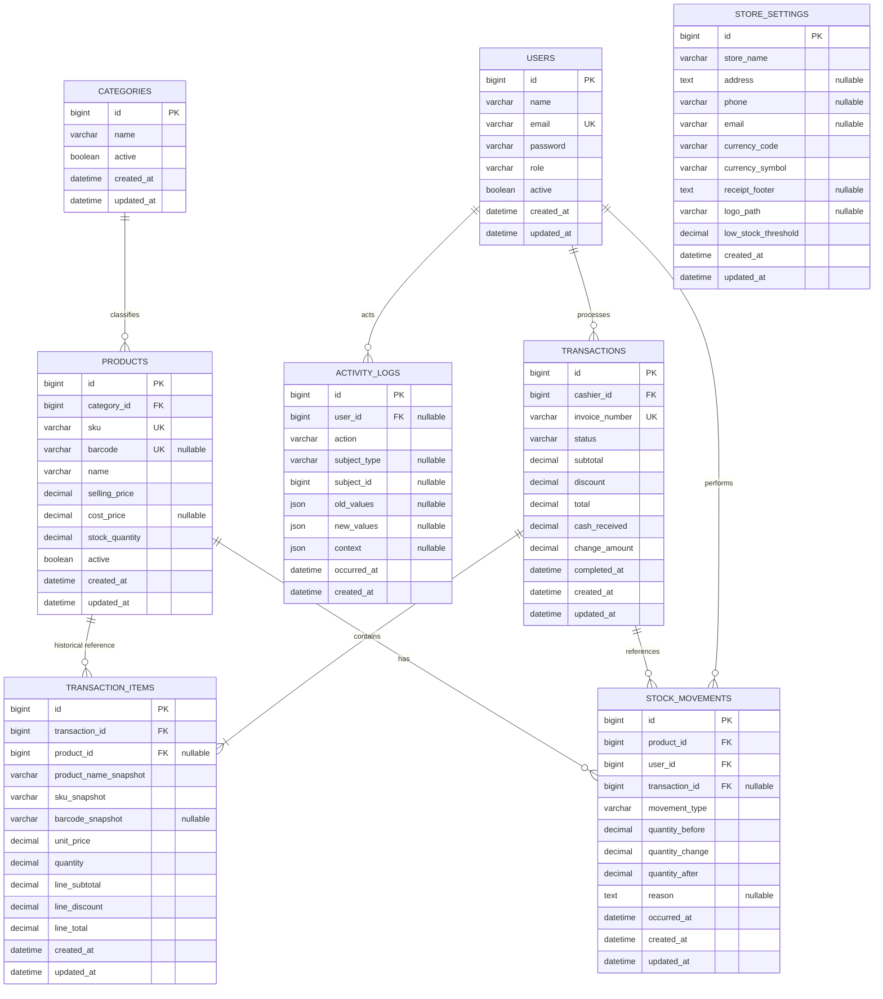

# Database Design

## SimplePOS — Sistem Kasir & Penjualan Sederhana

**Document Version:** 1.0  
**Status:** Initial Database Specification  
**Authoritative Product Source:** `docs/PRD.md`  
**Technical References:** `docs/SRS.md`, `docs/SYSTEM_DESIGN.md`, `docs/BUSINESS_FLOW.md`

> This document defines the logical and relational database design for SimplePOS. It intentionally does not create Laravel migrations yet. The schema prioritizes transaction integrity, historical accuracy, maintainability, and future commercial expansion without unnecessary overengineering.

---

# 1. Database Design Principles

The SimplePOS database must follow these principles.

## 1.1 Relational Integrity First

Use MySQL relational constraints for business invariants that belong at persistence level:

- unique SKU;
- unique invoice number;
- unique non-empty barcode;
- required foreign-key relationships;
- valid non-null business fields.

Application validation remains necessary, but the database must provide a second protection layer.

## 1.2 Historical Financial Stability

Completed transaction data must remain historically correct even after:

- product name changes;
- product SKU changes;
- product price changes;
- product deactivation;
- user deactivation.

Therefore completed transaction items store sale-time snapshots.

## 1.3 Atomic Sales

A successful sale and its required inventory effects must be persisted in one database transaction boundary.

The database design must support:

```text
transaction
+ transaction items
+ stock reductions
+ stock movement records
```

as one consistent operation.

## 1.4 Avoid Premature SaaS Design

The MVP is single-store.

Do not add:

- tenant tables;
- tenant_id to every table;
- subscription tables;
- billing tables;
- multi-branch tables;
- warehouse tables.

Future SaaS migration must be handled as a deliberate product/architecture phase.

## 1.5 Avoid Over-Normalization

Normalize business entities where consistency matters, but preserve transaction snapshots where historical data must remain immutable.

## 1.6 Laravel-Friendly Schema

Use conventional:

- unsigned bigint primary keys;
- `created_at`;
- `updated_at`;
- nullable foreign keys only when business history requires decoupling;
- explicit indexes and constraints;
- snake_case table/column naming.

## 1.7 Money Uses Exact Decimal Storage

Never store persisted monetary values as floating point.

Use exact decimal data types.

## 1.8 Prefer Status Flags Over Destructive Deletion

For business master data such as:

- users;
- categories;
- products;

prefer active/inactive state.

For completed transactions and audit history, do not provide normal destructive deletion.

## 1.9 Queryability

Design indexes for the documented access patterns:

- product lookup by SKU/barcode/name;
- transaction lookup by invoice number;
- transaction filtering by date;
- transaction filtering by cashier;
- report aggregation by completed date;
- stock movement lookup by product/date;
- audit lookup by actor/subject/date.

---

# 2. Entity List

Core MVP entities:

1. `users`
2. `categories`
3. `products`
4. `transactions`
5. `transaction_items`
6. `stock_movements`
7. `store_settings`
8. `activity_logs`

No separate `roles` table is required for the MVP because the approved role model is fixed:

```text
OWNER
ADMINISTRATOR
CASHIER
```

No persistent `carts` table is required by the PRD.

No separate `payments` table is required for MVP because payment model is a single synchronous cash payment recorded directly on the completed transaction.

No separate `notifications` table is required for MVP because notifications are in-application feedback only.

---

# 3. Table Descriptions

## 3.1 `users`

Stores operational user accounts.

Primary business responsibilities:

- authentication identity;
- role;
- active/inactive state;
- historical cashier/actor references.

## 3.2 `categories`

Stores product categories.

Primary business responsibilities:

- group products;
- control category active state.

## 3.3 `products`

Stores current product master data.

Primary business responsibilities:

- product identity;
- current SKU/barcode;
- current selling price;
- optional cost price;
- current stock;
- active state.

## 3.4 `transactions`

Stores completed sales.

Primary business responsibilities:

- unique invoice;
- responsible cashier;
- sale timestamp;
- subtotal;
- discount;
- total;
- cash received;
- change;
- completed status.

## 3.5 `transaction_items`

Stores immutable sale-time item snapshots.

Primary business responsibilities:

- historical product name/SKU;
- historical selling price;
- sale quantity;
- line total.

## 3.6 `stock_movements`

Stores inventory movement history.

Primary business responsibilities:

- sale deductions;
- manual adjustments;
- responsible actor;
- quantity change;
- traceable reference;
- reason when required.

## 3.7 `store_settings`

Stores business/store configuration.

Primary business responsibilities:

- store identity;
- contact;
- currency;
- receipt footer;
- logo reference;
- low-stock threshold if implemented globally.

## 3.8 `activity_logs`

Stores audit events required by the PRD/SRS.

Primary business responsibilities:

- user role changes;
- user active status changes;
- manual stock adjustment traceability where additional audit context is needed;
- sensitive store setting changes.

---

# 4. Column Definitions

The column definitions below are logical design definitions. Exact migration syntax is deferred.

---

# 5. Data Types

Recommended MySQL-compatible logical data types:

- Primary keys: `BIGINT UNSIGNED`
- Foreign keys: `BIGINT UNSIGNED`
- Short strings: `VARCHAR`
- Long text: `TEXT`
- Boolean flags: `BOOLEAN` / `TINYINT(1)`
- Money: `DECIMAL(15,2)`
- Standard integer quantity: `DECIMAL(15,3)` or `BIGINT` depending on approved quantity model
- Date/time: `DATETIME` or Laravel timestamp-compatible field
- JSON context: `JSON`
- Enum-like state: `VARCHAR` with application-level controlled values unless final schema explicitly chooses DB enum

For future retail flexibility, quantities are recommended as:

```text
DECIMAL(15,3)
```

rather than integer-only, because some retail products may eventually be sold using fractional units.

If the commercial product is intentionally restricted to whole-unit inventory, this may be simplified to integer during migration design.

---

# 6. Primary Keys

All business tables use:

```text
id BIGINT UNSIGNED
```

as primary key.

Reason:

- Laravel-friendly;
- predictable foreign keys;
- sufficient scale;
- avoids premature UUID complexity.

Invoice number remains a business identifier, not the primary key.

---

# 7. Foreign Keys

Primary relationships:

```text
products.category_id -> categories.id

transactions.cashier_id -> users.id

transaction_items.transaction_id -> transactions.id
transaction_items.product_id -> products.id (nullable recommended)

stock_movements.product_id -> products.id
stock_movements.user_id -> users.id
stock_movements.transaction_id -> transactions.id (nullable)

activity_logs.user_id -> users.id (nullable only if historical retention strategy requires it)
```

Foreign-key delete behavior must avoid erasing history.

---

# 8. Unique Constraints

Required uniqueness:

## `users`

A unique login identity is required.

Recommended:

```text
email UNIQUE
```

if email is selected as login identifier.

If a username-based login is chosen during implementation, use:

```text
username UNIQUE
```

The PRD/SRS do not explicitly mandate the login identifier, so exact field choice remains implementation-defined.

## `products`

```text
sku UNIQUE
barcode UNIQUE when populated
```

## `transactions`

```text
invoice_number UNIQUE
```

No unique constraint is needed for product name or category name unless later business rules require it.

---

# 9. Nullable Rules

Nullable design must be intentional.

Examples:

## `products.barcode`

Nullable because barcode is optional.

## `products.cost_price`

Nullable because cost price is optional in the approved PRD.

## `transaction_items.product_id`

Recommended nullable to protect historical records if product hard deletion were ever introduced administratively outside normal workflow.

However, since MVP prefers product deactivation instead of deletion, keeping it non-null is also valid.

Recommended design:

```text
product_id NULLABLE
```

with snapshots always present.

This makes historical transaction integrity independent from current product record lifecycle.

## `stock_movements.transaction_id`

Nullable because manual adjustments are not linked to a transaction.

## `stock_movements.reason`

Nullable for SALE movements, required by business rule for MANUAL_ADJUSTMENT.

## `store_settings.logo_path`

Nullable.

## `activity_logs.subject_id`

Nullable when an audit event is not tied to one specific persistent entity.

---

# 10. Default Values

Recommended defaults:

## Users

```text
role = CASHIER only if user creation workflow explicitly chooses a safe default;
active = true
```

Safer implementation: require explicit role selection.

## Categories

```text
active = true
```

## Products

```text
active = true
stock_quantity = 0
```

## Transactions

```text
status = COMPLETED
```

Since only completed sales are persisted in MVP, avoid storing failed transaction attempts as transaction rows.

## Store Settings

No hard-coded customer branding defaults should be stored in schema.

Application seed data may provide placeholder defaults.

---

# 11. Index Strategy

Indexes must follow documented query patterns.

## Users

- unique login identifier;
- index on `role`;
- index on `active`.

## Categories

- index on `active`;
- optional index on `name` for management search.

## Products

- unique `sku`;
- unique `barcode`;
- index `name`;
- index `category_id`;
- index `active`;
- index `stock_quantity` only if low-stock queries benefit from it.

## Transactions

- unique `invoice_number`;
- index `completed_at`;
- index `cashier_id`;
- index `status` if status remains physically stored;
- composite indexes described later.

## Transaction Items

- index `transaction_id`;
- index `product_id`;
- optional index on snapshot SKU if historical item-level search is later added.

## Stock Movements

- index `product_id`;
- index `user_id`;
- index `transaction_id`;
- index `occurred_at`;
- index `movement_type`.

## Activity Logs

- index `user_id`;
- index `subject_type`, `subject_id`;
- index `action`;
- index `occurred_at`.

---

# 12. Composite Indexes

Recommended composite indexes:

## Transactions

For cashier/date filters:

```text
(cashier_id, completed_at)
```

For status/date reporting if multiple statuses are introduced:

```text
(status, completed_at)
```

Since MVP persists only completed transactions, this second index may be unnecessary initially.

## Transaction Items

For transaction detail:

```text
(transaction_id, id)
```

Normally the foreign-key index on `transaction_id` is sufficient.

For product sales aggregation:

```text
(product_id, transaction_id)
```

may help if product reports join heavily across transactions.

## Stock Movements

For product movement history:

```text
(product_id, occurred_at)
```

For movement-type reporting:

```text
(movement_type, occurred_at)
```

## Activity Logs

For subject history:

```text
(subject_type, subject_id, occurred_at)
```

Do not create every possible composite index at launch.

Confirm with actual query plans and workload.

---

# 13. Referential Integrity

## Category to Product

Recommended:

```text
categories.id
    -> products.category_id
ON DELETE RESTRICT
```

Reason:

Products should not silently disappear when category is removed.

Since category uses active/inactive lifecycle, hard deletion should be rare.

## User to Transaction

Recommended:

```text
users.id
    -> transactions.cashier_id
ON DELETE RESTRICT
```

User deactivation, not deletion, is the normal lifecycle.

## Transaction to Transaction Items

Recommended:

```text
transactions.id
    -> transaction_items.transaction_id
ON DELETE RESTRICT
```

or no application-level delete path for completed transactions.

## Product to Transaction Items

If nullable product reference:

```text
products.id
    -> transaction_items.product_id
ON DELETE SET NULL
```

Snapshot fields preserve history.

## Product to Stock Movements

Recommended:

```text
ON DELETE RESTRICT
```

because inventory history should remain traceable.

## Transaction to Stock Movements

Recommended:

```text
ON DELETE RESTRICT
```

for sale-linked movements.

---

# 14. Soft Delete Strategy

## Users

Do **not** require soft deletes for MVP.

Use:

```text
active = false
```

Reason:

- simpler business meaning;
- preserves transaction references;
- matches PRD terminology.

## Categories

Do not require soft delete.

Use active/inactive.

## Products

Do not require soft delete.

Use active/inactive.

## Transactions

Do not soft delete.

Completed financial records remain retained.

## Transaction Items

Do not soft delete.

## Stock Movements

Do not soft delete.

## Store Settings

No soft delete required.

## Activity Logs

Do not soft delete through standard business workflow.

---

# 15. Audit Timestamps

All mutable business tables should use:

```text
created_at
updated_at
```

For events, add a domain event time field where clearer.

Examples:

## Transactions

```text
completed_at
```

## Stock Movements

```text
occurred_at
```

## Activity Logs

```text
occurred_at
```

Reason:

Business event time should not depend solely on generic row timestamps.

---

# 16. Status Fields

## Users

```text
active BOOLEAN
```

Role:

```text
role VARCHAR
```

Allowed application values:

```text
OWNER
ADMINISTRATOR
CASHIER
```

## Categories

```text
active BOOLEAN
```

## Products

```text
active BOOLEAN
```

## Transactions

The MVP only persists completed transactions.

Recommended:

```text
status VARCHAR default COMPLETED
```

This supports future controlled evolution without inventing current transitions.

Allowed MVP value:

```text
COMPLETED
```

Do not introduce:

```text
CANCELLED
VOID
REFUNDED
PENDING
FAILED
```

until the PRD defines those workflows.

## Stock Movements

```text
movement_type VARCHAR
```

Allowed MVP values:

```text
SALE
MANUAL_ADJUSTMENT
```

---

# 17. Money / Decimal Handling

Use:

```text
DECIMAL(15,2)
```

for:

- product selling price;
- product cost price;
- transaction subtotal;
- transaction discount;
- transaction total;
- cash received;
- change;
- transaction item unit price;
- transaction item line total.

Rules:

1. do not use FLOAT/DOUBLE;
2. application calculations must use decimal-safe arithmetic;
3. stored completed transaction totals are authoritative historical values;
4. reports aggregate stored transaction values;
5. currency formatting is a display concern and does not change stored numeric values.

---

# 18. File Reference Handling

Store logo binary data should **not** be stored directly in MySQL.

Use file storage and persist only a path/reference.

Recommended field:

```text
store_settings.logo_path VARCHAR(500) NULL
```

Rules:

- path points to application-managed storage;
- failed replacement must not overwrite existing valid path;
- physical file deletion occurs only after new file persistence and settings update are successful;
- storage abstraction should allow future local-to-object-storage migration.

---

# 19. Settings Architecture

For MVP, use one row in:

```text
store_settings
```

rather than a generic untyped key-value table.

Reason:

- known finite settings;
- explicit columns;
- type safety;
- easier validation;
- easier documentation;
- easier commercial maintenance.

Recommended fields:

```text
id
store_name
address
phone
email
currency_code
currency_symbol
receipt_footer
logo_path
low_stock_threshold
created_at
updated_at
```

If future product growth produces many modular settings, a hybrid settings model can be introduced later.

Do not use a generic JSON blob for all core store settings in MVP.

---

# 20. Activity Logging

Use dedicated `activity_logs`.

Recommended fields:

```text
id
user_id
action
subject_type
subject_id
old_values
new_values
context
occurred_at
created_at
```

`old_values`, `new_values`, and `context` may use JSON.

Required event examples:

```text
USER_CREATED
USER_ROLE_CHANGED
USER_STATUS_CHANGED
STOCK_MANUAL_ADJUSTED
STORE_SETTINGS_UPDATED
```

A completed sale does not require a duplicate generic activity event because it is already represented by:

- transaction record;
- cashier ID;
- stock movement;
- timestamps.

---

# 21. Transaction Boundaries

## 21.1 Checkout Boundary

One DB transaction must include:

```text
create transaction
create transaction items
update product stock
create stock movements
```

Pseudo-boundary:

```text
BEGIN
    validate/reload authoritative state
    create transaction
    create item snapshots
    update stock
    create stock movement rows
COMMIT
```

Any required persistence failure:

```text
ROLLBACK
```

## 21.2 Manual Stock Adjustment Boundary

One DB transaction must include:

```text
update product stock
create stock movement
create required audit log
```

## 21.3 User Role/Status Change

Recommended transaction:

```text
update user
create audit log
```

## 21.4 Store Settings Change

When updating logo + settings + audit:

```text
file persistence coordination
database transaction for settings + audit
safe old-file retirement
```

File storage itself cannot be rolled back by MySQL, so application workflow must compensate safely.

---

# 22. Complete Mermaid ERD



---

# 23. Table: `users`

## Purpose

Stores operational application accounts.

## Columns

| Column | Type | Null | Default | Key | Description |
|---|---|---:|---|---|---|
| `id` | BIGINT UNSIGNED | No | auto | PK | Internal identifier |
| `name` | VARCHAR(150) | No | — | — | Display name |
| `email` | VARCHAR(191) | No | — | UNIQUE | Recommended login identifier |
| `password` | VARCHAR(255) | No | — | — | Secure password hash |
| `role` | VARCHAR(32) | No | — | INDEX | OWNER / ADMINISTRATOR / CASHIER |
| `active` | BOOLEAN | No | true | INDEX | Authentication eligibility |
| `created_at` | TIMESTAMP/DATETIME | No | framework-managed | — | Creation time |
| `updated_at` | TIMESTAMP/DATETIME | No | framework-managed | — | Last update |

## Relationships

```text
users 1 -> many transactions
users 1 -> many stock_movements
users 1 -> many activity_logs
```

## Indexes

- unique `email`;
- index `role`;
- index `active`.

## Constraints

- role must use approved values;
- inactive account cannot authenticate;
- normal business workflow does not delete historical users.

---

# 24. Table: `categories`

## Purpose

Stores product grouping.

## Columns

| Column | Type | Null | Default | Key | Description |
|---|---|---:|---|---|---|
| `id` | BIGINT UNSIGNED | No | auto | PK | Category identifier |
| `name` | VARCHAR(150) | No | — | INDEX optional | Category name |
| `active` | BOOLEAN | No | true | INDEX | Availability state |
| `created_at` | TIMESTAMP/DATETIME | No | managed | — | Created |
| `updated_at` | TIMESTAMP/DATETIME | No | managed | — | Updated |

## Relationships

```text
categories 1 -> many products
```

## Indexes

- `active`;
- optional `name`.

## Constraints

- name required;
- no destructive cascade to products.

---

# 25. Table: `products`

## Purpose

Stores current product master data and current stock.

## Columns

| Column | Type | Null | Default | Key | Description |
|---|---|---:|---|---|---|
| `id` | BIGINT UNSIGNED | No | auto | PK | Product identifier |
| `category_id` | BIGINT UNSIGNED | No | — | FK/INDEX | Category |
| `sku` | VARCHAR(100) | No | — | UNIQUE | Product SKU |
| `barcode` | VARCHAR(100) | Yes | NULL | UNIQUE | Optional barcode |
| `name` | VARCHAR(200) | No | — | INDEX | Product name |
| `selling_price` | DECIMAL(15,2) | No | — | — | Current selling price |
| `cost_price` | DECIMAL(15,2) | Yes | NULL | — | Optional cost price |
| `stock_quantity` | DECIMAL(15,3) | No | 0 | — | Current stock |
| `active` | BOOLEAN | No | true | INDEX | Sellable state |
| `created_at` | TIMESTAMP/DATETIME | No | managed | — | Created |
| `updated_at` | TIMESTAMP/DATETIME | No | managed | — | Updated |

## Relationships

```text
products many -> 1 category
products 1 -> many transaction_items
products 1 -> many stock_movements
```

## Indexes

- unique `sku`;
- unique nullable `barcode`;
- `name`;
- `category_id`;
- `active`;
- optional `(active, category_id)` after workload verification.

## Constraints

- selling price >= 0;
- SKU unique;
- barcode unique when non-null;
- category must exist;
- inactive product cannot be added to new sales;
- historical transactions do not use current price for prior sales.

---

# 26. Table: `transactions`

## Purpose

Stores successful completed POS sales.

## Columns

| Column | Type | Null | Default | Key | Description |
|---|---|---:|---|---|---|
| `id` | BIGINT UNSIGNED | No | auto | PK | Internal sale ID |
| `cashier_id` | BIGINT UNSIGNED | No | — | FK/INDEX | User who completed sale |
| `invoice_number` | VARCHAR(64) | No | — | UNIQUE | Business invoice identifier |
| `status` | VARCHAR(32) | No | COMPLETED | INDEX optional | MVP value: COMPLETED |
| `subtotal` | DECIMAL(15,2) | No | 0 | — | Sum before discount |
| `discount` | DECIMAL(15,2) | No | 0 | — | Transaction-level discount |
| `total` | DECIMAL(15,2) | No | 0 | — | Amount due |
| `cash_received` | DECIMAL(15,2) | No | 0 | — | Cash accepted |
| `change_amount` | DECIMAL(15,2) | No | 0 | — | Change returned |
| `completed_at` | DATETIME | No | — | INDEX | Business completion time |
| `created_at` | TIMESTAMP/DATETIME | No | managed | — | Row created |
| `updated_at` | TIMESTAMP/DATETIME | No | managed | — | Row updated |

## Relationships

```text
transactions many -> 1 cashier/user
transactions 1 -> many transaction_items
transactions 1 -> many sale stock_movements
```

## Indexes

- unique `invoice_number`;
- `completed_at`;
- `cashier_id`;
- composite `(cashier_id, completed_at)`;
- optional `(status, completed_at)` only if future statuses justify it.

## Constraints

- exactly one unique invoice per completed sale;
- total >= 0;
- discount >= 0;
- cash_received >= total for MVP cash sale;
- change_amount = cash_received - total by business rule;
- standard workflow does not hard delete completed transactions.

---

# 27. Table: `transaction_items`

## Purpose

Stores immutable sale-time product item snapshots.

## Columns

| Column | Type | Null | Default | Key | Description |
|---|---|---:|---|---|---|
| `id` | BIGINT UNSIGNED | No | auto | PK | Item row |
| `transaction_id` | BIGINT UNSIGNED | No | — | FK/INDEX | Parent sale |
| `product_id` | BIGINT UNSIGNED | Yes | NULL | FK/INDEX | Optional current product reference |
| `product_name_snapshot` | VARCHAR(200) | No | — | — | Name at sale time |
| `sku_snapshot` | VARCHAR(100) | No | — | — | SKU at sale time |
| `barcode_snapshot` | VARCHAR(100) | Yes | NULL | — | Barcode at sale time |
| `unit_price` | DECIMAL(15,2) | No | — | — | Sale-time unit price |
| `quantity` | DECIMAL(15,3) | No | — | — | Sold quantity |
| `line_subtotal` | DECIMAL(15,2) | No | — | — | Unit price × qty before line discount |
| `line_discount` | DECIMAL(15,2) | No | 0 | — | Reserved for future compatibility; MVP may remain zero |
| `line_total` | DECIMAL(15,2) | No | — | — | Final line amount |
| `created_at` | TIMESTAMP/DATETIME | No | managed | — | Created |
| `updated_at` | TIMESTAMP/DATETIME | No | managed | — | Updated |

## Relationships

```text
transaction_items many -> 1 transaction
transaction_items many -> 0..1 current product
```

## Indexes

- `transaction_id`;
- `product_id`;
- optional composite `(product_id, transaction_id)` if report query plans justify it.

## Constraints

- quantity > 0;
- unit_price >= 0;
- historical snapshots required;
- row must not be recalculated after product changes.

### Note on `line_discount`

The PRD defines transaction-level discount only.

This field is optional from a strict MVP perspective.

Recommended options:

**Simplest MVP:** omit `line_discount`.

**Future-friendly:** keep `line_discount = 0`.

To avoid unnecessary overengineering, the preferred initial schema is to **omit `line_discount` unless implementation needs proportional discount allocation for reporting**.

---

# 28. Table: `stock_movements`

## Purpose

Provides traceable inventory movement history.

## Columns

| Column | Type | Null | Default | Key | Description |
|---|---|---:|---|---|---|
| `id` | BIGINT UNSIGNED | No | auto | PK | Movement ID |
| `product_id` | BIGINT UNSIGNED | No | — | FK/INDEX | Affected product |
| `user_id` | BIGINT UNSIGNED | No | — | FK/INDEX | Responsible user |
| `transaction_id` | BIGINT UNSIGNED | Yes | NULL | FK/INDEX | Sale reference |
| `movement_type` | VARCHAR(32) | No | — | INDEX | SALE / MANUAL_ADJUSTMENT |
| `quantity_before` | DECIMAL(15,3) | No | — | — | Stock before movement |
| `quantity_change` | DECIMAL(15,3) | No | — | — | Signed change |
| `quantity_after` | DECIMAL(15,3) | No | — | — | Stock after movement |
| `reason` | TEXT | Yes | NULL | — | Required for manual adjustment |
| `occurred_at` | DATETIME | No | — | INDEX | Business movement time |
| `created_at` | TIMESTAMP/DATETIME | No | managed | — | Created |
| `updated_at` | TIMESTAMP/DATETIME | No | managed | — | Updated |

## Relationships

```text
stock_movements many -> 1 product
stock_movements many -> 1 user
stock_movements many -> 0..1 transaction
```

## Indexes

- `product_id`;
- `user_id`;
- `transaction_id`;
- `movement_type`;
- `occurred_at`;
- composite `(product_id, occurred_at)`.

## Constraints

For `SALE`:

```text
transaction_id IS NOT NULL
quantity_change < 0
```

For `MANUAL_ADJUSTMENT`:

```text
reason IS NOT NULL/non-empty
```

Cross-column business constraints may be enforced primarily at application level if MySQL CHECK use is intentionally kept simple.

---

# 29. Table: `store_settings`

## Purpose

Stores configuration for one SimplePOS store instance.

## Columns

| Column | Type | Null | Default | Key | Description |
|---|---|---:|---|---|---|
| `id` | BIGINT UNSIGNED | No | 1/auto | PK | Settings record |
| `store_name` | VARCHAR(200) | No | — | — | Store display name |
| `address` | TEXT | Yes | NULL | — | Store address |
| `phone` | VARCHAR(50) | Yes | NULL | — | Store phone |
| `email` | VARCHAR(191) | Yes | NULL | — | Store contact email |
| `currency_code` | VARCHAR(10) | No | IDR recommended seed | — | Display currency code |
| `currency_symbol` | VARCHAR(10) | No | Rp recommended seed | — | Display symbol |
| `receipt_footer` | TEXT | Yes | NULL | — | Receipt footer |
| `logo_path` | VARCHAR(500) | Yes | NULL | — | Stored logo reference |
| `low_stock_threshold` | DECIMAL(15,3) | No | configurable seed | — | Global low-stock threshold |
| `created_at` | TIMESTAMP/DATETIME | No | managed | — | Created |
| `updated_at` | TIMESTAMP/DATETIME | No | managed | — | Updated |

## Relationships

No required direct foreign keys.

## Indexes

No additional index required for single-row settings.

## Constraints

- application should enforce one active settings row;
- currency fields required;
- logo path references storage, not binary data.

### Low-Stock Threshold Note

The PRD requires low-stock behavior to be configured/defined but does not specify per-product threshold.

The simplest MVP design is a **single global threshold**.

A future version can add `products.low_stock_threshold` if per-product control becomes a product requirement.

---

# 30. Table: `activity_logs`

## Purpose

Stores business audit events.

## Columns

| Column | Type | Null | Default | Key | Description |
|---|---|---:|---|---|---|
| `id` | BIGINT UNSIGNED | No | auto | PK | Audit row |
| `user_id` | BIGINT UNSIGNED | Yes | NULL | FK/INDEX | Actor |
| `action` | VARCHAR(100) | No | — | INDEX | Event code |
| `subject_type` | VARCHAR(100) | Yes | NULL | INDEX | Logical target type |
| `subject_id` | BIGINT UNSIGNED | Yes | NULL | INDEX | Target ID |
| `old_values` | JSON | Yes | NULL | — | Relevant previous values |
| `new_values` | JSON | Yes | NULL | — | Relevant new values |
| `context` | JSON | Yes | NULL | — | Reason/reference/additional context |
| `occurred_at` | DATETIME | No | — | INDEX | Business event time |
| `created_at` | TIMESTAMP/DATETIME | No | managed | — | Insert time |

`updated_at` is intentionally optional/omitted because audit entries should not normally be edited.

## Relationships

```text
activity_logs many -> 0..1 user
```

The `subject_type` / `subject_id` pair is polymorphic logically but does not require database foreign-key enforcement.

## Indexes

- `user_id`;
- `action`;
- `occurred_at`;
- composite `(subject_type, subject_id, occurred_at)`.

## Constraints

- action required;
- audit rows not editable through standard user workflow;
- no normal deletion workflow.

---

# 31. Invoice Number Architecture

Invoice number must be unique and human-readable.

The exact format is not defined by PRD.

Recommended logical pattern:

```text
INV-YYYYMMDD-XXXXXX
```

or another deterministic business-safe format.

Requirements:

1. unique database constraint;
2. generation must be concurrency-safe;
3. invoice generation belongs inside checkout transaction workflow;
4. displayed invoice must not depend on internal numeric ID alone unless approved.

Do not design branch codes because multi-branch is out of MVP scope.

---

# 32. Stock Architecture

Current stock is stored on `products.stock_quantity`.

Movement history is stored on `stock_movements`.

This dual model is intentional.

## Current State

```text
products.stock_quantity
```

provides fast operational reads.

## Audit History

```text
stock_movements
```

provides movement traceability.

Invariant:

```text
current stock should reconcile with historical movements
```

from an approved baseline/opening stock process.

Because the PRD does not yet define a separate opening-stock entity, initial product stock at product creation functions as the starting balance.

If future strict inventory accounting is required, an explicit `OPENING_BALANCE` movement type may be introduced.

Do not add it unless required by implementation/reporting acceptance.

---

# 33. Reporting Data Sources

## Daily/Date Range Sales

Source:

```text
transactions
WHERE status = COMPLETED
AND completed_at within period
```

## Transaction Count

Source:

```text
COUNT(transactions.id)
```

## Product Sales

Source:

```text
transaction_items
JOIN transactions
```

using historical:

- quantity;
- unit price;
- line total.

## Best-Selling Product

Source:

```text
SUM(transaction_items.quantity)
GROUP BY product identity/snapshot
```

within a clearly defined period.

## Low Stock

Source:

```text
products.stock_quantity <= configured threshold
AND products.active = true
```

if global threshold design is used.

---

# 34. Data Retention Model

Retained indefinitely by default MVP:

- completed transactions;
- transaction items;
- stock movements;
- activity logs;
- historical users needed by transactions/audit.

No automatic purge is defined.

Master records use activation status rather than deletion.

Future archival requires separate requirements.

---

# 35. Data Deletion Rules

## Allowed Normal Business Operations

```text
users -> deactivate
categories -> deactivate
products -> deactivate
```

## Not Allowed in Normal MVP Workflow

```text
delete completed transaction
delete transaction items
delete sale stock movement
delete audit history
```

Physical database maintenance outside normal product behavior must follow operational governance and backup requirements.

---

# 36. Concurrency Considerations

## Product Stock During Checkout

Two cashiers may attempt to sell the same low-stock product concurrently.

Therefore the checkout transaction must use appropriate row-level consistency controls.

Logical requirement:

```text
read/recheck current product stock
protect relevant product rows
apply reduction
commit
```

The exact Laravel/MySQL locking mechanism is implementation detail, but the database design supports it through one current stock row per product.

## Invoice Number

Concurrent checkout must not create duplicate invoice numbers.

Unique constraint is mandatory even if application generation is designed to avoid collisions.

---

# 37. Data Validation vs Database Constraints

## Application-Level

Use application validation for:

- role values;
- discount rules;
- cash received;
- manual stock reason;
- active product;
- low-stock behavior;
- status transition rules.

## Database-Level

Use constraints for:

- PK;
- FK;
- required fields;
- unique SKU;
- unique barcode;
- unique invoice number;
- exact numeric types.

Do not force every business rule into complex database triggers.

No database triggers are required for MVP.

---

# 38. Database Trigger Strategy

**Decision: Do not use MySQL triggers for MVP business workflows.**

Reason:

- business logic should remain visible in Laravel;
- easier automated testing;
- easier source-code customization;
- lower operational surprise;
- simpler debugging.

Stock and audit effects are coordinated explicitly by application services/actions inside database transactions.

---

# 39. Future Expansion Strategy

The schema can evolve incrementally.

Potential future tables only when approved:

```text
customers
suppliers
purchases
purchase_items
expenses
returns
return_items
cashier_shifts
payment_methods
transaction_payments
branches
warehouses
stock_transfers
tenants
subscriptions
```

Important:

Do not create these tables now.

The current schema should remain focused on the MVP.

---

# 40. Recommended Initial Schema Summary

```text
users
  |
  +----< transactions >---- transaction_items >---- products >---- categories
  |           |
  |           +----< stock_movements >---- products
  |
  +----< activity_logs

store_settings
```

Critical business invariants:

```text
1 successful checkout
    =
1 completed transaction
+ N transaction items
+ required stock updates
+ N sale stock movements
```

and:

```text
product master changes
    !=
historical transaction changes
```

---

# 41. Final Database Position

The initial SimplePOS database should contain only the data structures required to support the approved MVP:

- users;
- categories;
- products;
- completed transactions;
- transaction item snapshots;
- stock movements;
- store settings;
- activity/audit logs.

The design deliberately avoids:

- multi-tenant columns;
- generalized metadata systems;
- event sourcing;
- database triggers;
- complex role/permission tables;
- payment abstraction tables;
- notification tables;
- soft-delete proliferation.

This keeps the database commercially reusable, understandable to Laravel developers, and robust enough for transaction and inventory integrity.
