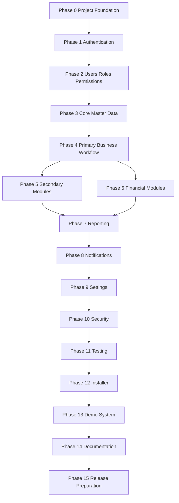

# Development Roadmap

## SimplePOS — Sistem Kasir & Penjualan Sederhana

**Document Version:** 1.0  
**Status:** Initial Technical Delivery Roadmap  
**Role Perspective:** Technical Project Manager  
**Primary References:**
- `docs/PRD.md`
- `docs/SRS.md`
- `docs/SYSTEM_DESIGN.md`
- `docs/BUSINESS_FLOW.md`
- `docs/DATABASE.md`
- `docs/UI_UX.md`
- `CURSOR.md`

> This roadmap translates the approved SimplePOS product and technical design into an implementation sequence. It intentionally keeps the MVP focused and does not introduce unsupported features such as public registration, refund/void workflows, multi-branch, multi-tenant SaaS, external payment gateways, or advanced accounting.

---

# 1. Roadmap Principles

The implementation sequence must follow these principles:

1. Foundation before features.
2. Authentication before authorization-sensitive modules.
3. Roles and permissions before management pages.
4. Master data before transaction processing.
5. Database integrity before UI polish.
6. Primary checkout workflow before secondary modules.
7. Reporting only after transaction and inventory data are reliable.
8. Security is continuous, but a dedicated hardening phase is still required.
9. Testing is continuous, but a dedicated regression phase is mandatory.
10. Installer/demo/release work happens only after core behavior is stable.
11. Documentation must remain synchronized with implementation.
12. Every phase has an acceptance gate before the next phase starts.

---

# 2. Phase Dependency Overview



---

# Phase 0 — Project Foundation

## Objectives

Establish a stable Laravel project foundation that matches the approved architecture and can support all later modules without rework.

## Modules

- Laravel application bootstrap
- Environment configuration
- Database connection
- Blade
- Livewire
- Alpine.js
- Tailwind CSS
- Base layout
- Shared UI components
- Base testing setup
- Code quality tooling if already standard/justified

## Dependencies

None.

This phase is the dependency for all other phases.

## Deliverables

- Laravel project initialized
- Verified runtime/framework versions
- MySQL connection configured
- `.env.example`
- Base application shell
- Sidebar/topbar skeleton
- Base responsive layout
- Shared Blade/Livewire UI primitives
- Test environment
- Git repository baseline
- `CURSOR.md` present at project root
- Existing documentation stored in `docs/`

## Acceptance Criteria

- Application boots successfully.
- Verified actual versions are recorded.
- Database connection works.
- Development environment can run migrations.
- Blade renders correctly.
- Livewire works.
- Alpine.js behavior works.
- Tailwind assets compile correctly.
- Base authenticated layout structure exists.
- No unsupported package is introduced.
- No business modules are prematurely implemented.

## Testing Requirements

- Application smoke test.
- Database connectivity verification.
- Frontend asset build verification.
- Livewire smoke test.
- Base route response test.
- CI/local test command succeeds.

---

# Phase 1 — Authentication

## Objectives

Implement secure session-based authentication for operational users.

## Modules

- Login
- Logout
- Session handling
- Active-user enforcement
- Authentication middleware

## Dependencies

- Phase 0 foundation
- Initial `users` schema

## Deliverables

- Login page
- Login action
- Logout action
- Authentication middleware
- Session regeneration on login
- Inactive-user rejection
- Generic authentication errors
- Protected application routes

## Acceptance Criteria

- Active valid user can log in.
- Invalid credentials are rejected.
- Inactive user cannot log in.
- Authenticated session is regenerated securely.
- Logout invalidates session.
- Protected routes reject unauthenticated access.
- Authentication errors do not reveal sensitive account information.

## Testing Requirements

Feature tests:

- active user login succeeds;
- invalid credentials fail;
- inactive account fails;
- logout invalidates session;
- protected route redirects/rejects unauthenticated user.

Security checks:

- session fixation prevention;
- password hashing;
- CSRF preserved.

---

# Phase 2 — Users / Roles / Permissions

## Objectives

Implement the approved role model and server-side authorization.

## Modules

- User administration
- Role assignment
- User activation/deactivation
- Policies
- Gates
- Role-based navigation
- Activity logging for user changes

## Dependencies

- Phase 1 authentication

## Deliverables

- Supported roles:
  - OWNER
  - ADMINISTRATOR
  - CASHIER
- User list
- Create user
- Edit user
- Activate/deactivate user
- Role update
- Policies/Gates
- Protected Owner rule
- Role-aware sidebar/navigation
- User-management audit records

## Acceptance Criteria

- Owner has full approved access.
- Administrator has operational access within documented restrictions.
- Cashier cannot access management-only functions.
- Administrator cannot create/promote/demote/deactivate protected Owner.
- Deactivation preserves historical references.
- Role/status changes create required audit records.
- UI visibility matches server authorization but never replaces it.

## Testing Requirements

Feature/policy tests:

- Owner permissions.
- Administrator restrictions.
- Cashier restrictions.
- Protected Owner behavior.
- User creation role validation.
- User deactivation/reactivation.
- Unauthorized URL access returns controlled forbidden state.
- IDOR-style record access is blocked.

---

# Phase 3 — Core Master Data

## Objectives

Create reliable master data required before sales can occur.

## Modules

- Categories
- Products
- Product status
- SKU
- Barcode
- Price
- Initial stock

## Dependencies

- Phase 2 authorization
- Approved database schema

## Deliverables

### Categories

- List
- Create
- Edit
- Activate/deactivate

### Products

- List
- Search
- Filter
- Create
- Edit
- Activate/deactivate
- SKU uniqueness
- Optional barcode uniqueness
- Selling price
- Optional cost price
- Stock quantity
- Category relationship

## Acceptance Criteria

- SKU must be unique.
- Populated barcode must be unique.
- Product name and required fields validate correctly.
- Selling price cannot be invalid/negative.
- Inactive products are clearly identified.
- Inactive products cannot later be selected for new sales.
- Product/category deactivation does not remove historical data.
- Lists are paginated.
- N+1 queries are prevented.

## Testing Requirements

- Category CRUD authorization tests.
- Product CRUD authorization tests.
- SKU uniqueness test.
- Barcode uniqueness test.
- Price validation test.
- Active/inactive behavior test.
- Pagination test.
- Search/filter test.
- Query/N+1 review.

---

# Phase 4 — Primary Business Workflow

## Objectives

Implement the core commercial value of SimplePOS: a correct and atomic POS checkout workflow.

## Modules

- POS screen
- Product search
- Cart
- Quantity management
- Transaction-level discount
- Cash payment
- Checkout
- Transaction persistence
- Transaction item snapshots
- Stock deduction
- Sale stock movements
- Receipt

## Dependencies

- Phase 3 products/categories
- Phase 2 authorization
- Database transaction strategy
- Final transaction schema

## Deliverables

### POS

- Product search by name
- SKU lookup
- Barcode lookup
- Add/remove cart item
- Quantity adjustment
- Cart subtotal
- Transaction-level discount
- Final total

### Payment

- Cash received
- Change calculation
- Insufficient cash validation

### Checkout

Atomic persistence of:

```text
transaction
transaction items
stock updates
stock movements
```

### Receipt

- Invoice
- Transaction date/time
- Cashier
- Item snapshots
- Subtotal
- Discount
- Total
- Cash
- Change
- Store identity

## Acceptance Criteria

- Empty cart cannot checkout.
- Inactive products cannot be sold.
- Invalid quantity is rejected.
- Insufficient stock is rejected.
- Final totals are recalculated server-side.
- Client-provided prices/totals are never trusted.
- Cash must be sufficient.
- Exactly one completed transaction exists per successful checkout.
- Invoice number is unique.
- Product snapshots are stored.
- Stock decreases exactly once.
- Stock movements are created.
- Failed checkout leaves no partial completed state.
- Receipt uses historical transaction data.
- Completed sale appears in transaction history.

## Testing Requirements

Critical tests:

- valid cash checkout;
- empty cart rejection;
- inactive product rejection;
- insufficient stock;
- insufficient payment;
- discount validation;
- invoice uniqueness;
- item snapshot correctness;
- stock deduction;
- stock movement creation;
- rollback on forced failure;
- concurrent stock sale scenario;
- duplicate submission protection;
- product price change after sale does not change historical transaction.

This phase is a release-critical quality gate.

---

# Phase 5 — Secondary Modules

## Objectives

Implement operational modules that support day-to-day store management around the primary sale workflow.

## Modules

- Transaction history
- Transaction detail
- Inventory overview
- Stock movement history
- Manual stock adjustment
- Low-stock view
- Activity log viewer

## Dependencies

- Phase 4 checkout
- Phase 3 products
- Phase 2 permissions

## Deliverables

### Transactions

- Search by invoice
- Filter by date
- Filter by cashier where authorized
- Read-only detail
- Receipt access

### Inventory

- Current stock list
- Low-stock identification
- Manual stock adjustment
- Required adjustment reason
- Movement history

### Activity Log

- Sensitive business event list
- Role-controlled access

## Acceptance Criteria

- Completed transaction is read-only.
- No normal hard-delete action exists.
- Cashier sees only permitted transaction scope.
- Manual stock adjustment requires authorization.
- Manual stock adjustment requires reason.
- Stock update + movement + audit are consistent.
- Low-stock products are identifiable.
- Activity logs cannot be silently edited/deleted.

## Testing Requirements

- Transaction search/filter tests.
- Transaction authorization tests.
- Read-only completed transaction test.
- Manual adjustment authorization.
- Adjustment reason validation.
- Increase/decrease stock tests.
- Stock movement consistency.
- Audit record creation.
- Low-stock query behavior.
- Pagination tests.

---

# Phase 6 — Financial Modules

## Objectives

Finalize MVP financial calculations and financial-data consistency without expanding into accounting/ERP.

## Modules

- Transaction totals
- Discounts
- Cash received
- Change
- Sales monetary integrity
- Financial display formatting

## Dependencies

- Phase 4 checkout

## Deliverables

- Decimal-safe monetary handling
- Currency formatting
- Financial calculation service/action where appropriate
- Consistent subtotal/discount/total behavior
- Stored final payment values
- Validation rules for all monetary inputs

## Acceptance Criteria

- No FLOAT/DOUBLE is used for persisted money.
- Discount cannot reduce total below zero.
- Cash received cannot be below final total.
- Change is calculated consistently.
- Historical totals are immutable through normal app flows.
- Current product price cannot affect old transactions.
- Financial display is consistent with configured currency.

## Testing Requirements

- Decimal precision tests.
- Discount edge cases.
- Zero discount.
- Exact cash payment.
- Overpayment/change.
- Very large but supported amounts.
- Rounding behavior.
- Historical financial integrity.

> Note: This phase does not add accounting journals, profit-and-loss accounting, receivables, taxes, or general ledger behavior.

---

# Phase 7 — Reporting

## Objectives

Provide reliable management reporting based on completed transaction data.

## Modules

- Dashboard metrics
- Daily sales report
- Date-range sales
- Completed transaction count
- Product sales aggregation
- Best-selling products
- Low-stock summary

## Dependencies

- Phase 4 transaction integrity
- Phase 5 inventory/history
- Phase 6 financial correctness

## Deliverables

### Dashboard

- Sales today
- Transactions today
- Low-stock count
- Best seller

### Reports

- Daily report
- Date-range report
- Sales total
- Transaction count
- Product quantity sold

## Acceptance Criteria

- Reports include only eligible completed transactions.
- Failed checkouts never affect reports.
- Dashboard totals reconcile with reports.
- Historical product prices come from snapshots.
- Date range is visible and valid.
- Empty-report state is handled.
- Reporting queries are paginated/bounded where applicable.
- Report performance meets documented targets under defined test conditions.

## Testing Requirements

- Daily totals.
- Date-range totals.
- Transaction counts.
- Product aggregation.
- Best-seller calculation.
- Empty-period report.
- Product price changed after sale.
- Dashboard/report reconciliation.
- Performance test with representative dataset.

---

# Phase 8 — Notifications

## Objectives

Implement consistent in-application operational feedback.

## Modules

- Success messages
- Validation errors
- Business-rule warnings
- Low-stock alerts
- Global error feedback
- Toasts/alerts

## Dependencies

- Primary business workflows implemented

## Deliverables

- Standard toast component
- Inline validation pattern
- Business error alert pattern
- Low-stock warning treatment
- Loading/processing states
- Duplicate-submit prevention states

## Acceptance Criteria

- Successful action shows success feedback.
- Failed action never shows success.
- Validation errors are contextual.
- Critical business errors remain visible long enough to act on.
- Low-stock notification is in-app only.
- No SMS/email/WhatsApp/push infrastructure is added.

## Testing Requirements

- Success feedback rendering.
- Validation error rendering.
- Checkout error state.
- Insufficient-stock feedback.
- Notification accessibility.
- No duplicate submit during loading.

---

# Phase 9 — Settings

## Objectives

Allow authorized users to configure store identity and supported application settings.

## Modules

- Store information
- Receipt settings
- Currency display
- Store logo
- Low-stock threshold if using global threshold
- Profile

## Dependencies

- Phase 2 authorization
- Phase 8 notification patterns
- File-storage configuration

## Deliverables

### Store Settings

- Store name
- Address
- Phone/contact
- Currency code/symbol
- Receipt footer
- Logo upload
- Low-stock threshold where approved

### Profile

- Name
- Login identity
- Role read-only in profile context
- Password change if supported

## Acceptance Criteria

- Only authorized users can change settings.
- Invalid logo cannot replace valid logo.
- Upload type/size is validated.
- File path, not raw binary, is stored in DB.
- Sensitive settings changes are audited.
- Currency display updates supported UI consistently.
- User cannot self-escalate role from profile.

## Testing Requirements

- Settings authorization.
- Valid/invalid logo upload.
- Storage failure handling.
- Existing-logo preservation on failure.
- Currency display.
- Audit logging.
- Profile authorization.

---

# Phase 10 — Security

## Objectives

Perform dedicated security hardening across the entire system.

## Modules

Cross-cutting:

- Authentication
- Authorization
- CSRF
- Session
- Input validation
- File uploads
- Output escaping
- Error exposure
- Database access
- Secrets
- Rate limiting
- Security headers

## Dependencies

- Major product functionality complete

## Deliverables

- Security checklist review
- Authorization audit
- Route protection audit
- Upload hardening
- Production error configuration
- Authentication throttling
- Secret/configuration review
- Security header configuration where appropriate
- Dependency vulnerability review

## Acceptance Criteria

- No management route depends solely on hidden UI.
- No credentials committed.
- `.env` is not exposed.
- User-generated output is escaped.
- Uploads are validated.
- CSRF remains enabled.
- Debug is disabled in production configuration.
- Sensitive stack traces are not exposed.
- IDOR checks pass.
- Password/session handling follows framework security conventions.

## Testing Requirements

- Unauthorized route access.
- Forbidden resource access.
- CSRF checks.
- Upload abuse cases.
- XSS output review.
- Authentication brute-force/throttle behavior.
- Session invalidation.
- Dependency security scan if tooling available.

---

# Phase 11 — Testing

## Objectives

Execute full regression and quality verification for the commercial MVP.

## Modules

All modules.

## Dependencies

- Phases 0–10 complete

## Deliverables

- Unit test suite
- Feature test suite
- Livewire/component tests
- Critical end-to-end/browser tests
- Regression checklist
- Performance verification
- Test data/factories
- Release test report

## Acceptance Criteria

Critical end-to-end flow passes:

```text
Login
→ Product
→ POS
→ Cart
→ Payment
→ Checkout
→ Transaction
→ Stock
→ Receipt
→ Report
```

Additionally:

- no release-blocking defects;
- authorization tests pass;
- transaction rollback tests pass;
- historical integrity tests pass;
- reports reconcile;
- supported responsive views are usable.

## Testing Requirements

Mandatory categories:

- Unit
- Feature
- Integration
- Transaction integrity
- Authorization
- Validation
- UI/Livewire
- End-to-end
- Performance baseline
- Regression

High-risk checkout tests must be repeatable and automated.

---

# Phase 12 — Installer

## Objectives

Make SimplePOS straightforward to install as a commercial source-code product on a supported VPS/environment.

## Modules

- Installation process
- Environment validation
- Database initialization
- Seed/admin bootstrap
- Storage setup
- Application key/configuration
- Production optimization instructions

## Dependencies

- Stable tested application

## Deliverables

At minimum:

- installation guide;
- environment requirements;
- `.env.example`;
- database creation instructions;
- migration instructions;
- storage linking/setup;
- asset build instructions;
- first Owner/admin creation method;
- production web-server guidance;
- scheduler/worker instructions only if actually used.

Optional later:

- guided web installer, only if commercially justified.

## Acceptance Criteria

A clean supported environment can install SimplePOS using documented steps without editing application source code for normal configuration.

Installer/setup:

- validates required extensions;
- avoids exposing secrets;
- does not overwrite existing production data;
- results in a usable Owner login.

## Testing Requirements

- clean installation test;
- reinstall/failure scenario;
- missing extension/config detection;
- fresh DB migration;
- storage setup;
- production environment smoke test.

---

# Phase 13 — Demo System

## Objectives

Provide a safe commercial demo experience without compromising production behavior.

## Modules

- Demo seed data
- Demo user accounts
- Demo banner
- Restricted sensitive operations
- Data reset strategy if deployed publicly

## Dependencies

- Phase 12 installation
- Stable application

## Deliverables

- Realistic sample products
- Categories
- Transactions
- Inventory states
- Low-stock examples
- Owner/Admin/Cashier demo accounts
- Reports with meaningful data
- Demo mode indicator
- Demo restrictions

## Acceptance Criteria

- Demo clearly identifies itself.
- Demo data represents realistic use.
- Protected configuration cannot damage the demo environment.
- Demo users cannot obtain hidden production credentials.
- Demo restrictions do not alter normal non-demo behavior.

## Testing Requirements

- Demo login.
- Demo workflow.
- Restricted actions.
- Seed repeatability.
- Reset behavior if implemented.
- No secret leakage.

---

# Phase 14 — Documentation

## Objectives

Ensure commercial users and developers can install, use, customize, and maintain the application.

## Modules

Documentation only.

## Dependencies

- Stable final implementation

## Deliverables

### Product Documentation

- Installation guide
- User guide
- Owner guide
- Cashier guide
- Administrator guide

### Developer Documentation

- Architecture overview
- Database overview
- Module structure
- Business rules
- Role/permission matrix
- Testing guide
- Deployment guide
- Customization guide

### Existing Design Docs Updated

- `PRD.md`
- `SRS.md`
- `SYSTEM_DESIGN.md`
- `BUSINESS_FLOW.md`
- `DATABASE.md`
- `UI_UX.md`
- `ROADMAP.md`
- `CURSOR.md`

## Acceptance Criteria

- Documentation matches actual implementation.
- No outdated route/module/schema descriptions.
- Setup instructions work from a clean environment.
- Important business rules are explicitly documented.
- Customization points are identified without encouraging unsafe core modifications.

## Testing Requirements

Documentation validation:

- follow installation guide from scratch;
- verify commands;
- verify screenshots/examples where used;
- verify role documentation;
- verify schema/module names.

---

# Phase 15 — Release Preparation

## Objectives

Prepare SimplePOS for a stable commercial source-code release.

## Modules

- Versioning
- Packaging
- Release checklist
- Licensing
- Changelog
- Production configuration
- Backup/recovery verification
- Commercial package QA

## Dependencies

- All previous phases

## Deliverables

- Release version
- Release notes
- Changelog
- License file
- Clean source package
- Required docs
- `.env.example`
- No local secrets/debug files
- Production deployment checklist
- Backup/restore instructions
- Demo package/link if applicable
- Known limitations
- Upgrade notes

## Acceptance Criteria

- Full test suite passes.
- Clean install passes.
- Production smoke test passes.
- No credentials exist in repository/package.
- Debug mode is disabled for production guidance.
- No development-only files are unintentionally packaged.
- Documentation is synchronized.
- Database migrations are ordered and safe.
- Critical checkout/inventory/reporting regression passes.
- License and commercial terms are included.
- Version number is consistent across release artifacts.

## Testing Requirements

Final release gate:

```text
[ ] Fresh installation
[ ] Authentication
[ ] Roles/permissions
[ ] Product management
[ ] POS checkout
[ ] Stock movement
[ ] Transaction history
[ ] Receipt
[ ] Reports
[ ] Settings
[ ] Uploads
[ ] Security checks
[ ] Backup/restore procedure
[ ] Responsive smoke tests
[ ] Demo validation
[ ] Documentation validation
```

No release should proceed with an unresolved release-critical defect affecting:

- sale correctness;
- payment calculation;
- stock consistency;
- authorization;
- transaction history;
- reporting totals;
- sensitive data exposure.

---

# 3. Phase Completion Gate

Before advancing from any phase:

```text
1. Deliverables complete
2. Acceptance criteria pass
3. Required automated tests pass
4. No critical regression introduced
5. Documentation updated where necessary
6. Diff reviewed
7. No unrelated architectural drift
8. No new dependency without justification
```

---

# 4. MVP Critical Path

The critical delivery path is:

```mermaid
flowchart LR
    A[Foundation] --> B[Authentication]
    B --> C[Authorization]
    C --> D[Products]
    D --> E[POS Cart]
    E --> F[Cash Payment]
    F --> G[Atomic Checkout]
    G --> H[Stock Movement]
    H --> I[Transaction History]
    I --> J[Reporting]
    J --> K[Security + Regression]
    K --> L[Release]
```



Any delay in atomic checkout correctness blocks the MVP release.

---

# 5. Suggested Implementation Order Inside Cursor

When executing this roadmap with an AI coding assistant, complete one bounded implementation task at a time.

Recommended rhythm:

```text
Read docs
→ Inspect existing code
→ Implement one module slice
→ Add tests
→ Run tests
→ Review diff
→ Commit
→ Continue
```

Avoid prompts such as:

```text
"Build the entire POS application."
```

Prefer bounded tasks such as:

```text
"Implement Phase 3 product CRUD according to docs/PRD.md,
docs/DATABASE.md, docs/UI_UX.md, and CURSOR.md.
Do not implement checkout yet."
```

This reduces architecture drift and makes regression easier to identify.

---

# 6. Commercial MVP Completion Definition

SimplePOS V1.0 is considered commercially MVP-ready only when the following are stable:

```text
Authentication
Roles and permissions
Categories
Products
POS cart
Cash payment
Atomic checkout
Transaction item snapshots
Stock deduction
Stock movements
Transaction history
Receipt
Manual stock adjustment
Dashboard
Reports
Store settings
User management
Activity logging
Security baseline
Automated regression tests
Installation process
Documentation
Release package
```

Not required for V1.0:

```text
Customers
Suppliers
Purchasing
Returns/refunds
Multiple payment methods
Expenses
Profit analysis
Cashier shifts
Multi-branch
Multi-warehouse
Public API
External notifications
Accounting
SaaS multi-tenancy
```

---

# 7. Final Roadmap Position

The roadmap prioritizes:

```text
Correctness
→ Security
→ Operational usability
→ Maintainability
→ Commercial packaging
→ Future extensibility
```

The most important release rule is:

> **SimplePOS must not advance to commercial release until a successful sale, its financial values, and its stock effects are proven to remain consistent under normal, failure, and concurrency scenarios.**
