# System Design

## SimplePOS — Sistem Kasir & Penjualan Sederhana

**Document Version:** 1.0  
**Status:** Initial Architecture Design  
**Authoritative Product Source:** `docs/PRD.md`  
**Authoritative Technical Source:** `docs/SRS.md`

> This document defines the system architecture for SimplePOS based on the approved PRD and SRS. Product scope remains governed by the PRD. Technical-version details remain subject to environment verification as defined in the SRS.

---

# 1. Architecture Overview

SimplePOS will use a **Laravel modular monolith** architecture.

The initial product is intentionally designed as one deployable Laravel application because the PRD describes a focused single-store POS product with a limited number of closely related business domains:

- authentication;
- user and role management;
- product/category management;
- point of sale;
- transactions;
- inventory;
- reports;
- settings;
- audit/activity logging.

A microservice architecture is not justified for the MVP because:

1. all modules participate in one transactional business workflow;
2. checkout and stock consistency benefit from one database transaction boundary;
3. operational scale targets a small-to-medium retail business on a VPS;
4. deployment simplicity is a commercial requirement;
5. the product is intended to be reusable as source code;
6. distributed systems would introduce unnecessary deployment, consistency, monitoring, and support complexity.

Primary architecture:

```text
Browser
   |
 HTTPS
   |
   v
Laravel Web Application
   |
   +-- Authentication / Authorization
   +-- Dashboard
   +-- Users
   +-- Categories
   +-- Products
   +-- POS
   +-- Transactions
   +-- Inventory
   +-- Reports
   +-- Settings
   +-- Audit
   |
   +------> MySQL
   |
   +------> Persistent File Storage
```

The architecture must prioritize:

- transaction integrity;
- server-side business validation;
- clear module boundaries;
- historical record stability;
- simple VPS deployment;
- maintainability;
- future extensibility without premature infrastructure.

---

# 2. System Context Diagram using Mermaid

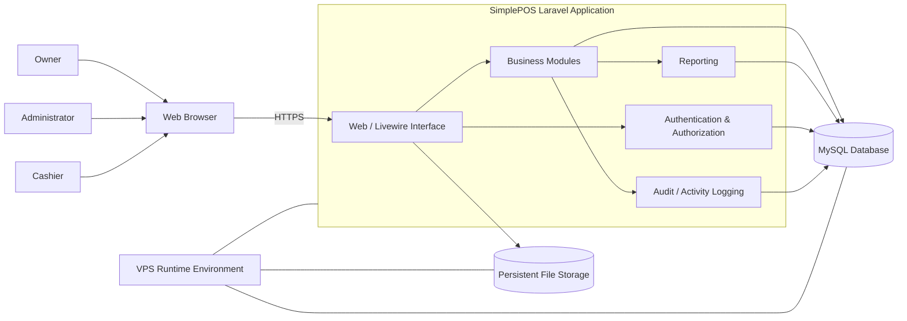

## Context Notes

The MVP has no mandatory external integrations.

The following are explicitly not part of the initial context:

- payment gateways;
- WhatsApp;
- SMS;
- external email workflows;
- marketplace integrations;
- mobile applications;
- accounting platforms;
- multi-tenant SaaS management;
- external search services;
- distributed queues.

---

# 3. Application Architecture

## 3.1 Architectural Style

Use a layered Laravel modular monolith.

```text
Presentation Layer
    |
    +-- Blade Views
    +-- Livewire Components
    +-- Alpine.js Local UI Behavior
    +-- Tailwind CSS
    |
Application Layer
    |
    +-- Controllers
    +-- Form Requests / Livewire Validation
    +-- Policies / Gates
    +-- Application Services / Actions
    |
Domain / Business Layer
    |
    +-- Checkout Rules
    +-- Inventory Rules
    +-- Reporting Rules
    +-- User/Role Rules
    +-- Store Configuration Rules
    |
Persistence Layer
    |
    +-- Eloquent Models
    +-- Query Objects where justified
    +-- MySQL
```

## 3.2 Responsibilities

### Presentation Layer

Responsible for:

- displaying pages and components;
- collecting input;
- maintaining local interactive UI state;
- presenting validation and business errors;
- rendering receipts and reports.

The presentation layer must not be the source of truth for:

- final prices;
- stock;
- permissions;
- final transaction totals;
- transaction completion.

### Application Layer

Responsible for:

- request orchestration;
- authentication context;
- authorization checks;
- validation;
- invoking business workflows;
- formatting results for the presentation layer.

### Business Layer

Responsible for rules that must remain consistent regardless of UI entry point.

Examples:

- checkout completion;
- transaction calculations;
- stock deduction;
- stock adjustment;
- historical transaction preservation;
- report eligibility rules.

### Persistence Layer

Responsible for:

- durable state;
- relational integrity;
- uniqueness;
- transactional persistence;
- indexed queries.

---

# 4. Module Architecture

The codebase should be organized around business capabilities rather than technical file type alone.

Logical modules:

```text
SimplePOS
|
+-- Identity
|   +-- Authentication
|   +-- Users
|   +-- Roles / Authorization
|
+-- Catalog
|   +-- Categories
|   +-- Products
|
+-- Sales
|   +-- POS Cart
|   +-- Checkout
|   +-- Transactions
|   +-- Receipts
|
+-- Inventory
|   +-- Current Stock
|   +-- Stock Adjustment
|   +-- Stock Movements
|   +-- Low Stock
|
+-- Reporting
|   +-- Dashboard Metrics
|   +-- Daily Sales
|   +-- Date Range Sales
|   +-- Product Sales
|
+-- Configuration
|   +-- Store Settings
|   +-- Logo / Receipt Settings
|
+-- Audit
    +-- User Activity
    +-- Sensitive Change Records
```

## Module Coupling Rules

1. Sales may read Catalog data.
2. Sales may write Inventory state only through approved inventory business logic.
3. Reporting may read Sales and Inventory data but should not mutate them.
4. Configuration may influence display and receipt output but must not change historical financial records.
5. Audit observes important business events but must not control transaction correctness.
6. Identity provides authorization context to all protected modules.

---

# 5. Domain Boundaries

## 5.1 Identity Domain

Owns:

- operational users;
- account active status;
- user roles;
- authentication identity;
- authorization capability.

Does not own:

- transactions;
- products;
- stock.

Historical references to a user remain valid after account deactivation.

## 5.2 Catalog Domain

Owns:

- categories;
- product master data;
- SKU;
- barcode;
- current selling price;
- active/inactive state.

Does not own historical sale price.

Historical sale price belongs to Sales transaction snapshots.

## 5.3 Sales Domain

Owns:

- cart business behavior;
- transaction calculation;
- discount;
- cash payment;
- change;
- checkout;
- invoice identity;
- completed transaction history;
- transaction item snapshots.

Sales is the central financial domain of the MVP.

## 5.4 Inventory Domain

Owns:

- current stock;
- manual adjustment;
- stock movement;
- stock availability validation.

Inventory receives sale-driven stock changes from the checkout process.

## 5.5 Reporting Domain

Owns read models and aggregation logic for:

- dashboard metrics;
- sales summaries;
- transaction counts;
- product sales.

Reporting must use completed transaction data as source of truth.

## 5.6 Configuration Domain

Owns:

- store name;
- address;
- contact details;
- logo;
- currency display;
- receipt footer.

## 5.7 Audit Domain

Owns traceable records for:

- manual stock adjustments;
- user role changes;
- user active status changes;
- sensitive settings changes.

---

# 6. Data Flow

## 6.1 Core Sales Data Flow

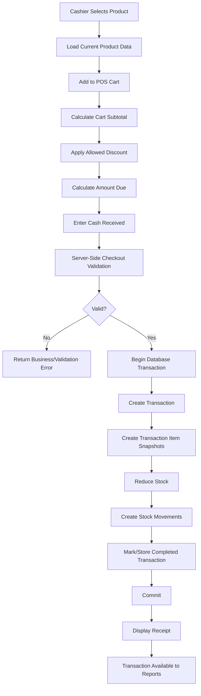

## 6.2 Product Data Flow

```text
Authorized User
    |
    v
Product Form
    |
Validation
    |
Authorization
    |
Product Business Rules
    |
Eloquent
    |
MySQL
    |
Available to POS if active
```

## 6.3 Stock Adjustment Flow

```text
Authorized User
    |
Select Product
    |
Adjustment + Reason
    |
Validate Permission and Input
    |
Begin DB Transaction
    |
Update Stock
    |
Create Stock Movement
    |
Create Audit Record
    |
Commit
```

---

# 7. Request Lifecycle

A normal protected web request follows this lifecycle:

```text
Browser Request
    |
    v
Web Server
    |
    v
Laravel Entry Point
    |
    v
Global Middleware
    |
    +-- Session
    +-- CSRF
    +-- Authentication Context
    |
    v
Route Matching
    |
    v
Authorization Middleware / Policy
    |
    v
Controller or Livewire Component
    |
    v
Input Validation
    |
    v
Business Service / Action
    |
    v
Eloquent / Query Layer
    |
    v
MySQL
    |
    v
Response / Livewire Update
    |
    v
Blade Render
    |
    v
Browser
```

## Lifecycle Rules

1. Authorization must be checked before protected state changes.
2. Business-critical validation must be repeated in the server workflow.
3. Request data must never directly determine authoritative totals without recalculation.
4. Exceptions must pass through centralized Laravel error handling.

---

# 8. Authentication Flow

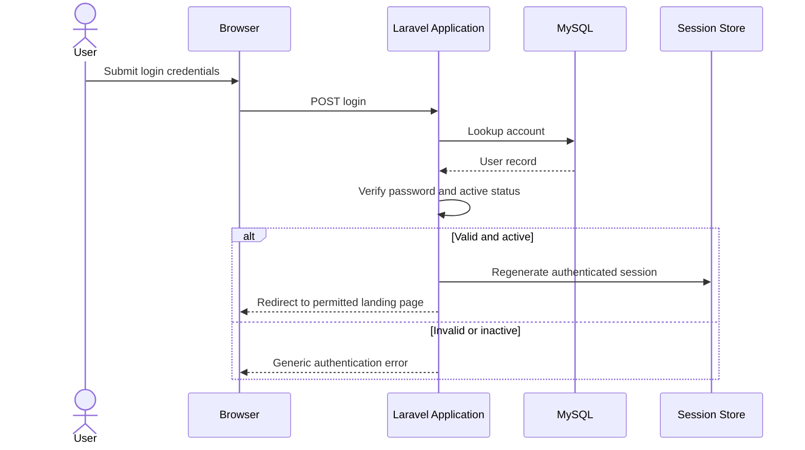

## Authentication Rules

- session-based authentication;
- active users only;
- passwords never stored or displayed in plaintext;
- successful login regenerates session identity;
- logout invalidates authenticated session;
- protected routes require authentication.

---

# 9. Authorization Flow

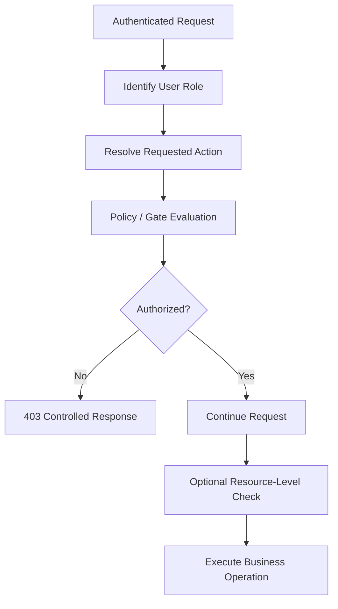

## Authorization Strategy

Use Laravel-native policies/gates or equivalent capabilities supported by the verified framework environment.

Role model:

```text
Owner
  > broad management permissions

Administrator
  > operational administration
  > cannot control protected Owner account

Cashier
  > POS and allowed transaction visibility only
```

Avoid a complex dynamic permission-builder for MVP.

---

# 10. Business Logic Flow

## 10.1 Checkout Business Flow

The checkout workflow is the most critical business operation.

```text
Checkout Request
   |
   +-- Validate user can sell
   +-- Validate cart not empty
   +-- Reload product records
   +-- Validate active products
   +-- Validate quantities
   +-- Validate stock
   +-- Recalculate item prices
   +-- Recalculate subtotal
   +-- Validate discount
   +-- Recalculate total
   +-- Validate cash received
   +-- Calculate change
   |
   v
Database Transaction
   |
   +-- Generate unique invoice
   +-- Create sale transaction
   +-- Create transaction item snapshots
   +-- Decrease stock
   +-- Record stock movements
   |
   v
Commit
   |
   v
Receipt
```

## 10.2 Historical Integrity Rule

A completed transaction must preserve sale-time values.

Therefore reports and receipts use:

```text
transaction_items.unit_price
transaction_items.quantity
transaction totals
```

and not:

```text
products.current_price
```

for historical financial reconstruction.

## 10.3 Calculation Authority

Any cart total displayed in the UI is provisional.

The server recalculates final authoritative values at checkout.

---

# 11. Notification Flow

The MVP uses only in-application feedback.

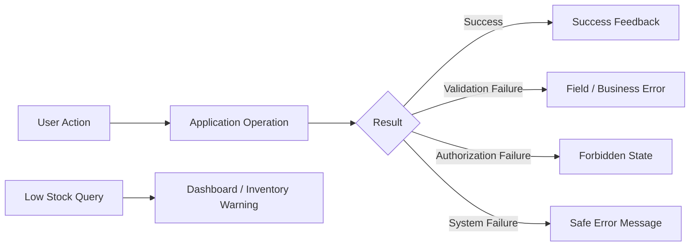

No MVP infrastructure is required for:

- SMS;
- WhatsApp;
- push notifications;
- WebSockets;
- external notification gateways.

---

# 12. File Storage Flow

MVP file storage is primarily required for store logo upload.

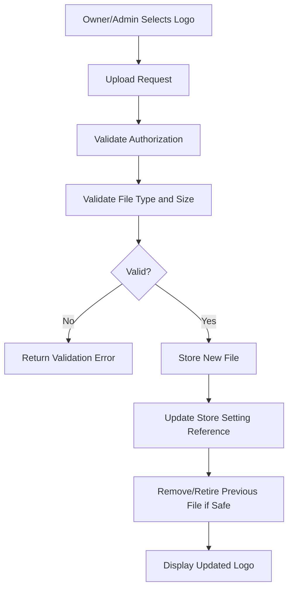

## File Storage Principles

1. use Laravel filesystem abstraction;
2. keep persistent uploaded files outside ephemeral deployment assets;
3. only expose files intended for public display;
4. invalid uploads must not replace valid files;
5. product images remain optional/out of core MVP.

---

# 13. Reporting Flow

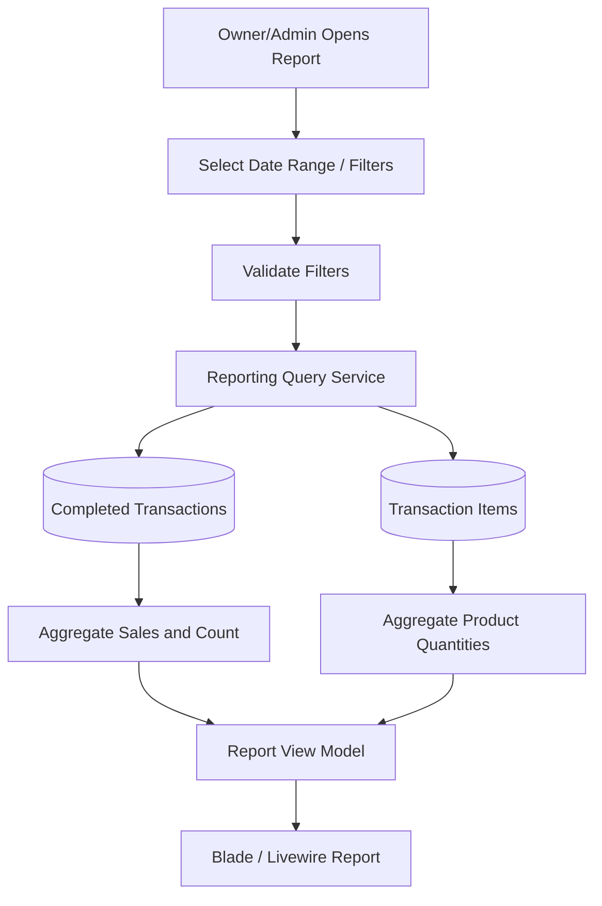

## Reporting Principles

- source of truth: completed transactions;
- product sales: transaction item snapshots;
- current product price must not change historical report values;
- dashboard and report queries must use consistent period rules;
- no separate analytics database in MVP.

---

# 14. Background Job Flow

No critical MVP flow requires background processing.

The following must remain synchronous:

- checkout;
- stock deduction;
- transaction creation;
- stock movement creation;
- basic receipt readiness.

Future optional asynchronous flow:

```text
User / Scheduler
    |
    v
Create Non-Critical Job
    |
    v
Queue
    |
    v
Worker
    |
    +-- Email
    +-- Large Export
    +-- Large Import
    +-- External Notification
```

Background jobs must never determine whether the core sale exists.

---

# 15. Scheduled Task Architecture

The MVP has no mandatory product-level scheduled jobs.

Future architecture:

```text
System Scheduler / Cron
        |
        v
Laravel Scheduler
        |
        +-- Backup Trigger
        +-- Temporary File Cleanup
        +-- Future Scheduled Reports
        +-- Future Notification Checks
```

For a VPS, one scheduler trigger should invoke Laravel's scheduler according to the verified framework convention.

Scheduled tasks must be idempotent where repeated execution could otherwise duplicate work.

---

# 16. Integration Architecture

## MVP

No required external business integration.

```text
SimplePOS
   |
   +-- MySQL
   +-- Local/Persistent Storage
```

## Future Integration Boundary

External integrations must enter through explicit adapters/services.

```text
Business Module
     |
     v
Integration Interface
     |
     v
Provider Adapter
     |
     v
External System
```

Possible future integrations:

- payment gateway;
- accounting;
- marketplace;
- email;
- messaging;
- cloud object storage.

Rules for future integrations:

1. external provider logic must not be scattered throughout business modules;
2. failures must not corrupt completed internal transactions;
3. webhook contracts require separate specification;
4. provider credentials belong in secure environment configuration.

---

# 17. Database Architecture

## 17.1 Core Entity Model

Conceptual model:

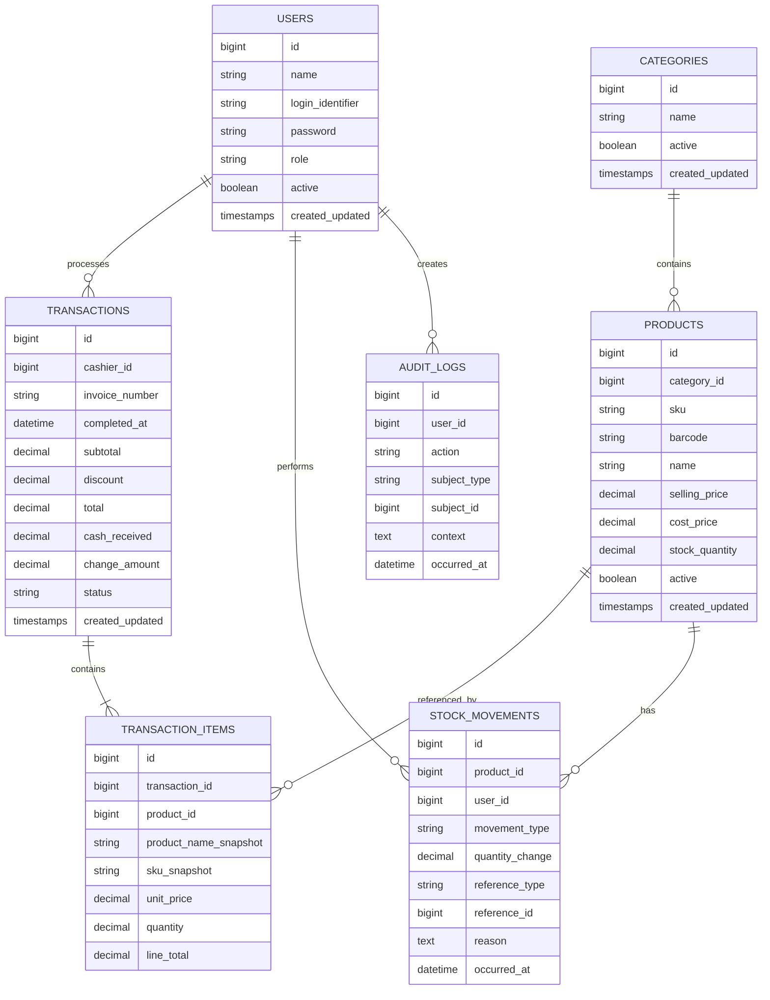

This is a conceptual architecture, not the final migration specification.

## 17.2 Database Design Principles

- exact decimal types for money;
- database uniqueness for SKU;
- database uniqueness for invoice number;
- uniqueness for populated barcode;
- foreign keys where appropriate;
- indexes on frequent lookup/filter fields;
- no destructive cascades that erase completed financial history;
- migrations are version-controlled;
- completed transaction snapshots preserve historical data.

---

# 18. Cache Architecture

Initial position: **cache is optional optimization, not correctness infrastructure**.

```text
Application
   |
   +-- Direct DB Read (default)
   |
   +-- Cache (only for measured hot, non-critical reads)
```

Potential candidates:

- store settings;
- static lookup lists;
- carefully defined dashboard aggregates.

Do not use cache as authoritative source for:

- current sale stock validation;
- final cart totals;
- authorization state;
- completed transactions.

Cache invalidation must be explicit when cached settings or lookup data are updated.

Redis is not required by the current PRD/SRS.

---

# 19. Queue Architecture

Initial queue architecture:

```text
Critical Business Flow
    |
    +--> Synchronous
```

Future non-critical:

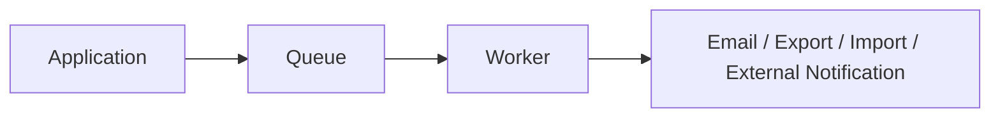

Rules:

1. no queue dependency for checkout;
2. no queue dependency for stock;
3. no queue dependency for basic receipt generation;
4. queue driver selected only if a future feature requires it;
5. failed queued jobs must be inspectable/retryable if queues are introduced.

---

# 20. Logging Architecture

Logging has two separate purposes.

## 20.1 Diagnostic Logging

```text
Application Event / Exception
          |
          v
Laravel Logging
          |
          v
Rotated Application Log / Configured Handler
```

Contains:

- unexpected errors;
- checkout failures;
- database failures;
- storage failures;
- queue/scheduler failures if introduced.

Must not contain:

- plaintext password;
- application secrets;
- session secrets.

## 20.2 Business Audit Logging

Persisted to business audit records for traceability.

Examples:

- stock adjustment;
- user role change;
- user deactivation;
- sensitive settings change.

Diagnostic logs and audit logs must not be treated as interchangeable.

---

# 21. Error Handling Architecture

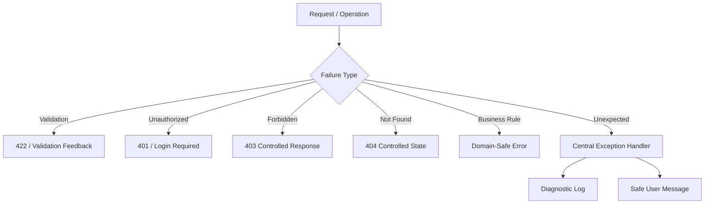

## Error Architecture Rules

1. failed checkout cannot appear completed;
2. database transaction failures roll back critical changes;
3. business errors are separated from unexpected infrastructure errors;
4. production users do not see stack traces;
5. errors provide enough context for user correction when appropriate;
6. diagnostic details go to logs, not UI.

---

# 22. Backup Architecture

Backups are an operational VPS responsibility in MVP.

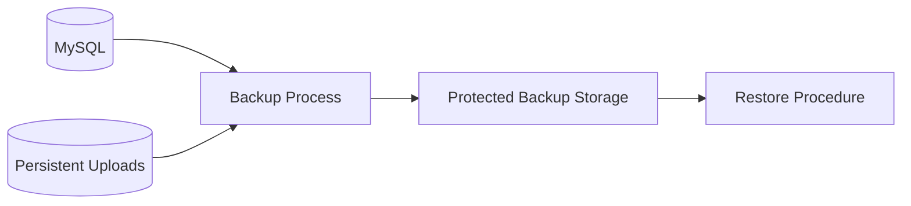

Backup requirements:

- MySQL backup;
- uploaded persistent file backup;
- documented retention;
- separate backup location or protection against single-server loss;
- restore procedure;
- periodic restore test;
- secure handling of environment configuration.

An end-user backup UI is not required for MVP.

---

# 23. Security Boundaries

## Boundary 1 — Internet to VPS

Controls:

- HTTPS;
- secure web server configuration;
- only required public ports.

## Boundary 2 — Browser to Laravel

Controls:

- authentication;
- CSRF;
- validation;
- secure session cookies;
- authorization;
- output escaping.

## Boundary 3 — Laravel to Database

Controls:

- parameterized database access;
- application database credentials;
- least-required database access;
- no public database exposure.

## Boundary 4 — Laravel to File Storage

Controls:

- file validation;
- controlled public visibility;
- safe path handling.

## Boundary 5 — User Role Boundary

Controls:

- Owner/Admin/Cashier policies;
- resource-level checks;
- server-side enforcement.

## Boundary 6 — Historical Financial Data

Controls:

- no normal hard deletion;
- immutable historical price snapshots;
- protected transaction workflow;
- audit traceability.

---

# 24. Deployment Architecture

Target initial architecture:

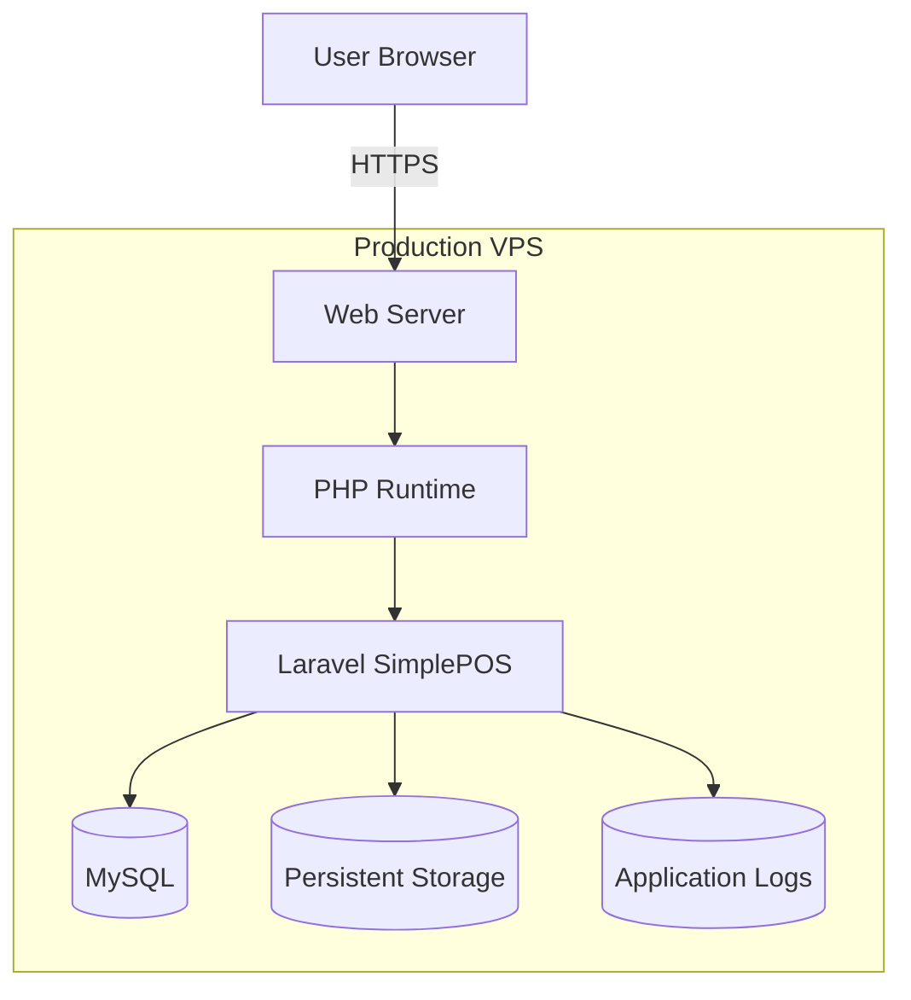

## Deployment Characteristics

- one VPS;
- one Laravel application;
- one MySQL database;
- persistent local or attached file storage;
- HTTPS;
- production secrets in environment configuration;
- deterministic Composer/package installation using lock files;
- controlled migrations;
- production debug disabled.

## Optional Process Layer

Only if later required:

```text
VPS
 |
 +-- Web Server
 +-- PHP Application
 +-- MySQL
 +-- Queue Worker
 +-- Scheduler Trigger
```

---

# 25. Scalability Strategy

The initial scalability strategy is vertical and application-level optimization before distribution.

## Phase 1 — MVP

- single VPS;
- indexed MySQL;
- pagination;
- optimized queries;
- bounded result sets;
- measurement-driven tuning.

## Phase 2 — Increased Store Load

Possible improvements:

- larger VPS;
- tuned PHP runtime;
- tuned MySQL;
- query optimization;
- selective caching;
- asynchronous non-critical jobs.

## Phase 3 — Large Hosted Deployment

Only if actual demand requires:

- external database;
- object storage;
- shared session/cache;
- multiple application instances;
- load balancer.

No Phase 3 infrastructure should be implemented in the initial source-code product without evidence of need.

---

# 26. Future SaaS/Multi-Tenant Considerations

The PRD explicitly postpones SaaS until a later product phase.

Therefore the MVP must **not** be multi-tenant.

However, avoid architectural decisions that make future migration unnecessarily difficult.

## Future SaaS concerns will include:

- tenant identity;
- tenant onboarding;
- tenant data isolation;
- subscription plans;
- billing;
- tenant-specific settings;
- central SaaS administration;
- backup isolation;
- rate/usage limits;
- storage isolation;
- tenant-aware queues;
- tenant-aware reporting;
- tenant-aware authorization.

## Current Design Guidance

Do:

- keep store-specific settings in data/configuration;
- keep business domains modular;
- keep infrastructure abstractions conventional;
- keep core logic free from one customer's hard-coded values.

Do not:

- add `tenant_id` everywhere preemptively;
- add SaaS billing now;
- introduce tenant middleware now;
- create multi-database tenancy now.

SaaS conversion requires a dedicated architecture decision and migration plan.

---

# 27. Architecture Decisions

## ADR-01 — Modular Monolith

**Decision:** Use one Laravel application with logical business modules.

**Reason:** Best balance of simplicity, transaction integrity, maintainability, and source-code commercial deployment.

## ADR-02 — Laravel-Native First

**Decision:** Prefer framework-native authentication, authorization, validation, sessions, filesystem, logging, scheduling, and queue capabilities.

**Reason:** Reduce dependencies and maintenance burden.

## ADR-03 — Server-Rendered UI

**Decision:** Use Blade as the primary rendering model, Livewire for server-driven reactivity, and Alpine.js only for lightweight local interaction.

**Reason:** POS needs dynamic behavior but does not justify a separate SPA architecture.

## ADR-04 — MySQL as Primary Source of Truth

**Decision:** Persist financial, inventory, user, settings, and audit business state in MySQL.

**Reason:** Strong relational and transactional requirements.

## ADR-05 — Synchronous Checkout

**Decision:** Perform checkout transaction and stock effects synchronously.

**Reason:** Sale success must immediately correspond to durable transaction and stock state.

## ADR-06 — Historical Snapshots

**Decision:** Store sale-time transaction item values.

**Reason:** Current product changes must not alter historical financial records.

## ADR-07 — No Repository by Default

**Decision:** Use Eloquent directly for normal persistence and introduce query/service abstractions only when they add real value.

**Reason:** Avoid redundant abstraction.

## ADR-08 — No Mandatory Cache/Queue

**Decision:** Cache and queues remain optional until a concrete workload requires them.

**Reason:** Avoid infrastructure without product need.

## ADR-09 — Single Store MVP

**Decision:** Initial deployment represents one business/store instance.

**Reason:** Matches PRD and reduces multi-tenant complexity.

## ADR-10 — No Public API in MVP

**Decision:** Web application is the only required delivery interface.

**Reason:** No current consumer requires a public API.

---

# 28. Architecture Trade-Offs

## Modular Monolith vs Microservices

**Chosen:** Modular monolith.

Benefits:

- simpler deployment;
- easier database transactions;
- lower infrastructure cost;
- easier local development;
- easier source-code resale.

Trade-off:

- modules share one deployment lifecycle.

Accepted because current product scale and team needs do not justify distributed services.

## Blade/Livewire vs SPA

**Chosen:** Blade + Livewire + Alpine.js.

Benefits:

- Laravel-native development;
- reduced API duplication;
- simpler authentication/session model;
- interactive POS without a separate frontend application.

Trade-off:

- highly complex client-side applications may eventually outgrow server-driven interaction.

Accepted because SimplePOS is primarily form-, transaction-, and dashboard-driven.

## Single Database vs Domain Databases

**Chosen:** One MySQL database.

Benefits:

- atomic checkout;
- simple reporting;
- simple deployment;
- straightforward backup.

Trade-off:

- stronger coupling at persistence level.

Accepted for the MVP modular monolith.

## Synchronous Checkout vs Queue-Based Processing

**Chosen:** synchronous.

Benefits:

- immediate transaction certainty;
- immediate stock consistency;
- simpler error model.

Trade-off:

- checkout response includes all required persistence work.

Accepted because the workflow is small and correctness-critical.

## Local Persistent Storage vs Object Storage

**Chosen for initial VPS:** local persistent storage through Laravel filesystem abstraction.

Benefits:

- inexpensive;
- simple;
- sufficient for store logo.

Trade-off:

- multi-node deployment later requires shared/object storage.

Accepted because initial deployment is one VPS.

## Simple Roles vs Dynamic RBAC

**Chosen:** fixed Owner/Admin/Cashier roles.

Benefits:

- easier testing;
- easier support;
- fewer permission configuration errors.

Trade-off:

- less flexible for organizations with custom role requirements.

Accepted because the PRD defines three roles.

---

# Architecture Quality Attributes

The system design prioritizes the following quality attributes in order:

1. **Correctness**
2. **Data Integrity**
3. **Security**
4. **Maintainability**
5. **Usability**
6. **Commercial Reusability**
7. **Performance**
8. **Scalability**

The architecture must not sacrifice checkout correctness or historical financial integrity for premature optimization.

---

# Recommended Initial Project Structure

The exact Laravel version and generated project structure must be verified before implementation, but the logical organization should follow this direction:

```text
app/
|
+-- Actions/
|   +-- Sales/
|   +-- Inventory/
|
+-- Http/
|   +-- Controllers/
|   +-- Requests/
|   +-- Middleware/
|
+-- Livewire/
|   +-- Pos/
|   +-- Products/
|   +-- Reports/
|   +-- Settings/
|
+-- Models/
|
+-- Policies/
|
+-- Queries/
|   +-- Reports/
|
+-- Services/
|   +-- Sales/
|   +-- Inventory/
|
+-- Support/
|
resources/
|
+-- views/
|   +-- components/
|   +-- layouts/
|   +-- pos/
|   +-- reports/
|
routes/
|
+-- web.php
|
database/
|
+-- migrations/
+-- seeders/
+-- factories/
|
tests/
|
+-- Feature/
+-- Unit/
```

This is a design direction, not a requirement to create empty abstraction folders before they are needed.

---

# Critical Architecture Flow

The core SimplePOS system depends on one architecture invariant:

```text
Customer Purchase
       |
       v
Cashier POS
       |
       v
Server Validation
       |
       v
Atomic Checkout
  +----+----+
  |         |
Sale      Stock
Record    Update
  |         |
  +----+----+
       |
       v
Transaction History
       |
   +---+---+
   |       |
Receipt  Reports
```

If sale persistence and stock state cannot be completed consistently, the transaction must not be represented as successfully completed.

---

# Final Architecture Position

SimplePOS should begin as a **single Laravel modular monolith deployed to one VPS with one MySQL database**.

The system should use:

- Laravel conventions;
- server-side authorization;
- business-service/action boundaries for multi-record workflows;
- Eloquent for persistence;
- MySQL transactions for checkout and stock consistency;
- Blade + Livewire for the primary web experience;
- Alpine.js only for lightweight local interaction;
- Laravel filesystem abstraction for uploaded branding;
- Laravel-native logging and error handling;
- no mandatory queue, cache server, API, microservice, or external integration.

This architecture satisfies the PRD/SRS priorities of simplicity, maintainability, commercial repeatability, transaction integrity, and controlled future growth.
