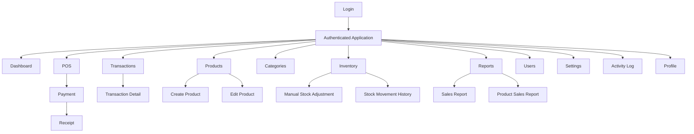

# UI/UX Design Specification

## SimplePOS — Sistem Kasir & Penjualan Sederhana

**Document Version:** 1.0  
**Status:** Initial UI/UX Specification  
**Authoritative Product Source:** `docs/PRD.md`  
**Technical References:** `docs/SRS.md`, `docs/SYSTEM_DESIGN.md`, `docs/BUSINESS_FLOW.md`, `docs/DATABASE.md`  
**Frontend Direction:** Blade + Livewire + Alpine.js + Tailwind CSS

> This document defines the UI/UX architecture for SimplePOS. It focuses on product behavior, navigation, interaction patterns, layout consistency, responsiveness, and accessibility. It does not define implementation code.

---

# 1. UX Principles

SimplePOS must feel like a professional commercial SaaS product while remaining fast and uncomplicated for retail operation.

## 1.1 Clarity Before Decoration

Every page must make the primary action immediately understandable.

Avoid:

- decorative gradients without functional purpose;
- oversized hero sections inside the authenticated app;
- excessive cards;
- excessive rounded containers;
- too many icons competing for attention;
- hidden actions that users need frequently.

## 1.2 Cashier Speed First

The POS workflow is the highest-frequency interaction.

The interface should minimize:

- pointer travel;
- menu switching;
- modal interruption;
- repeated data entry;
- unnecessary confirmation.

Target flow:

```text
Search Product
→ Add to Cart
→ Adjust Quantity
→ Enter Payment
→ Checkout
→ Receipt
```

## 1.3 Owner Visibility

Management pages should emphasize:

- today's sales;
- transaction count;
- low stock;
- best-selling products;
- reports;
- recent operational context.

Do not overload the dashboard with secondary analytics.

## 1.4 Familiar SaaS Patterns

Use familiar patterns for:

- sidebar navigation;
- page headers;
- data tables;
- filters;
- forms;
- confirmation dialogs;
- breadcrumbs where useful;
- status badges.

Do not reinvent standard CRUD interactions.

## 1.5 Consistent Information Density

SimplePOS is a business application, not a marketing landing page.

Use moderate information density:

- compact enough for operational speed;
- spacious enough for scanning;
- avoid unnecessarily large typography inside working screens.

## 1.6 Progressive Disclosure

Show advanced or low-frequency options only when needed.

Examples:

- destructive/administrative actions inside overflow menu;
- secondary filters behind a filter panel on small screens;
- advanced settings grouped into sections.

## 1.7 Immediate Feedback

Every state-changing action should have clear feedback:

- saved;
- failed;
- invalid;
- insufficient stock;
- payment insufficient;
- loading;
- empty result.

## 1.8 No Ambiguous Status

Use explicit text labels such as:

- Active
- Inactive
- Completed
- Low Stock

Do not rely only on color.

---

# 2. Application Layout

The authenticated application uses a persistent desktop shell.

```text
+-----------------------------------------------------------+
| Sidebar | Top Navigation                                  |
|         +-------------------------------------------------+
|         | Page Header                                     |
|         |-------------------------------------------------|
|         | Page Content                                    |
|         |                                                 |
|         |                                                 |
+-----------------------------------------------------------+
```

## Desktop Layout

### Sidebar

- fixed left navigation;
- collapsible to icon-only mode if needed;
- contains major modules;
- current section clearly highlighted.

### Main Content

Includes:

1. top navigation;
2. contextual page header;
3. optional breadcrumb;
4. page-specific actions;
5. content body.

## Content Width

Use full available workspace for:

- POS;
- tables;
- reports;
- dashboard.

Forms and settings may use constrained reading width where appropriate.

---

# 3. Sidebar Structure

Recommended desktop sidebar:

```text
SimplePOS

MAIN
- Dashboard
- POS

MANAGEMENT
- Transactions
- Products
- Categories
- Inventory
- Reports

ADMINISTRATION
- Users
- Settings
- Activity Log
```

Visibility depends on role.

## Owner

```text
Dashboard
POS
Transactions
Products
Categories
Inventory
Reports
Users
Settings
Activity Log
```

## Administrator

```text
Dashboard
POS
Transactions
Products
Categories
Inventory
Reports
Users (limited)
Settings (limited)
Activity Log (limited/if permitted)
```

## Cashier

Recommended simplified navigation:

```text
POS
Transactions
```

Optionally:

```text
Dashboard
```

only if the cashier dashboard is role-specific and contains no unrestricted business metrics.

## Sidebar Behavior

- active item uses clear selected state;
- groups use small labels, not large headings;
- use icons consistently;
- no nested navigation deeper than one level for MVP;
- avoid accordion menus unless module count grows substantially.

---

# 4. Top Navigation

Top navigation should remain simple.

Recommended elements:

```text
[Sidebar Toggle] [Page Context]              [User Menu]
```

Optional:

- quick POS shortcut for management users;
- current store name;
- contextual date only where helpful.

## User Menu

Contains:

- user name;
- role;
- Profile;
- Logout.

Avoid putting operational navigation inside the user dropdown.

---

# 5. Mobile Navigation

The application is desktop/tablet-first for POS, but management functions should remain usable on mobile.

## Mobile Shell

Recommended:

```text
Top App Bar
+ Off-canvas Navigation Drawer
```

For Cashier, a compact bottom navigation may be considered only if real mobile cashier usage becomes a product requirement.

Default MVP recommendation:

- hamburger menu;
- slide-over sidebar;
- sticky top app bar;
- no permanent bottom navigation unless validated by usage.

## Mobile Priority

Most important mobile-accessible management tasks:

- dashboard review;
- transaction lookup;
- low-stock review;
- simple product lookup.

POS should remain usable on a tablet-size viewport, but a narrow phone is not the primary cashier target.

---

# 6. Page Hierarchy

Standard hierarchy:

```text
Application
├── Authentication
│   └── Login
│
├── Dashboard
│
├── POS
│   ├── Product Search
│   ├── Cart
│   ├── Payment
│   └── Receipt
│
├── Transactions
│   ├── List
│   └── Detail
│
├── Products
│   ├── List
│   ├── Create
│   ├── Edit
│   └── Detail / Overview
│
├── Categories
│   ├── List
│   ├── Create
│   └── Edit
│
├── Inventory
│   ├── Stock Overview
│   ├── Manual Adjustment
│   └── Movement History
│
├── Reports
│   ├── Sales
│   └── Product Sales
│
├── Users
│   ├── List
│   ├── Create
│   └── Edit
│
├── Settings
│   ├── Store Information
│   ├── Receipt
│   └── Appearance / Localization if approved
│
├── Activity Log
│
└── Profile
```

---

# 7. Sitemap



Role permissions determine which nodes are visible and accessible.

---

# 8. Dashboard Layout

The dashboard should answer:

```text
How is the store doing today?
What needs attention?
```

Recommended desktop layout:

```text
Page Header
-------------------------------------------------

[ Sales Today ] [ Transactions ] [ Low Stock ] [ Best Seller ]

-------------------------------------------------

[ Sales Summary / Trend if approved ]

-------------------------------------------------

[ Low Stock Products ]        [ Recent Transactions ]
```

## Priority Cards

### Sales Today

Displays:

- currency-formatted revenue;
- label "Sales Today".

### Transactions Today

Displays:

- completed transaction count.

### Low Stock

Displays:

- low-stock product count;
- clickable to Inventory.

### Best Seller

Displays:

- product name;
- quantity sold for defined period.

## Dashboard Rules

- no chart is mandatory for MVP;
- use charts only if they communicate useful information;
- do not add decorative analytics;
- empty values should show `0`, not blank;
- cards should be clickable only when destination is meaningful.

---

# 9. Module Navigation

Each module should have a predictable local page structure.

Example Products:

```text
Products
[Search] [Category Filter] [Status Filter]      [+ Add Product]

-------------------------------------------------------------

Product Table
```

Example Inventory:

```text
Inventory
[Search] [Status/Low Stock Filter]      [Stock Movement History]

-------------------------------------------------------------

Stock Table
```

Avoid secondary horizontal sub-navigation unless a module genuinely has multiple distinct views.

---

# 10. Form Patterns

Forms should follow one consistent pattern.

## Page Form Layout

```text
Page Header
Title
Short supporting text

[Form Card / Section]

Field Label
Input
Helper / Error Text

Field Label
Input

...

[Cancel] [Save]
```

## Field Rules

Each field includes:

- visible label;
- clear required indication when needed;
- helper text only where useful;
- inline validation;
- no placeholder-only labels.

## Field Width

Use semantic widths.

Examples:

- product name: wide;
- SKU: medium;
- barcode: medium;
- price: medium;
- role: medium;
- active toggle: compact.

## Button Ordering

For left-to-right interface:

```text
Secondary / Cancel     Primary Action
```

For long forms, actions may be sticky at the bottom on smaller screens if required.

## Validation

- display field error directly beneath field;
- preserve valid submitted input;
- focus/scroll to first invalid section where practical.

---

# 11. Table Patterns

Tables are core operational UI.

## Standard Table Structure

```text
[Checkbox only if bulk action exists]
Name / Identifier
Relevant Fields
Status
Updated / Date
Actions
```

## Example Products Table

```text
Product
SKU
Category
Price
Stock
Status
Actions
```

## Example Transactions Table

```text
Invoice
Date & Time
Cashier
Items
Total
Status
Actions
```

## Row Actions

Use:

- primary contextual action as text/link when common;
- overflow menu for Edit / Deactivate / secondary operations.

Avoid placing 4–6 icon buttons in every row.

## Table Requirements

- sortable only where useful;
- pagination;
- empty state;
- visible filters;
- sticky header may be used for long operational tables;
- numbers aligned consistently;
- currency aligned right.

---

# 12. Filter Patterns

Filters should be directly tied to user tasks.

## Transaction Filters

```text
Date Range
Cashier
Invoice Search
```

## Product Filters

```text
Category
Status
Low Stock if relevant
```

## Filter Behavior

- active filter count visible on compact/mobile UI;
- clear all action;
- filters persist during pagination where appropriate;
- changing filters should not create confusing hidden state;
- default state should show the most useful records.

---

# 13. Search Patterns

Search is high priority in POS and management lists.

## POS Search

Search input should support:

- product name;
- SKU;
- barcode.

Recommended interaction:

- autofocus when POS opens on desktop;
- results appear quickly;
- keyboard selection where practical;
- exact barcode/SKU matches prioritized.

## Management Search

Use a conventional search field:

```text
[ Search products... ]
```

Search should be:

- clearly labeled;
- debounced only if responsive behavior remains predictable;
- resettable;
- preserved with active filters.

---

# 14. Modal Usage

Use modals sparingly.

Good use cases:

- payment confirmation/panel;
- short stock adjustment;
- small destructive/status confirmation.

Avoid modals for:

- full product create/edit forms;
- settings pages;
- complex reports;
- large detail views.

Reason:

large modals reduce usability and create nested scrolling.

---

# 15. Toast / Notification Behavior

Use toast notifications for transient outcomes.

Examples:

- Product saved.
- Category updated.
- Stock adjusted.
- Settings saved.

## Behavior

- success toast: temporary;
- error toast: only for non-field/global errors;
- validation errors remain near relevant field;
- critical business blockers should be visible in context, not only as disappearing toast.

## Position

Recommended:

```text
top-right desktop
top-center or top mobile
```

Avoid stacking excessive notifications.

---

# 16. Empty States

Every empty list must explain what the user can do next.

## Products Empty

```text
No products yet.
Add your first product to start selling.
[Add Product]
```

## Transactions Empty

```text
No transactions found for this period.
```

## Reports Empty

```text
No completed sales are available for the selected period.
```

## Search Empty

```text
No results match your search.
Clear filters or try another keyword.
```

Do not use large illustrations that dominate operational pages.

---

# 17. Loading States

Use loading indicators proportional to the operation.

## Small Interaction

Examples:

- search;
- filter;
- quantity update.

Use:

- subtle spinner;
- button loading state;
- skeleton only where content layout benefits.

## Checkout

The checkout action must visibly disable repeated submission while processing.

Recommended:

```text
Processing sale...
```

The UI must prevent accidental duplicate confirmation while the server is completing checkout.

## Reports

Use skeleton rows/cards or contained loader while report data loads.

Avoid full-screen blocking loaders for normal table filtering.

---

# 18. Error States

Errors should be grouped into:

## Validation Error

Displayed next to input.

Example:

```text
SKU is already in use.
```

## Business Rule Error

Displayed prominently near the affected workflow.

Example:

```text
Only 2 units are available in stock.
```

## Authorization Error

Controlled access denied screen/message.

## Not Found

Clear 404-style in-app state.

## System Error

Use safe wording:

```text
Something went wrong while processing this request.
Please try again.
```

Do not show stack traces or technical details.

---

# 19. Confirmation Dialogs

Confirmation is required only for actions with material impact.

Recommended confirmations:

- deactivate user;
- deactivate product;
- manual stock adjustment;
- final checkout;
- sensitive settings changes only when impact warrants.

Avoid confirmation for:

- normal Save;
- opening pages;
- search;
- filters.

## Checkout Confirmation

Should summarize:

```text
Total
Cash Received
Change
```

Primary action:

```text
Complete Sale
```

Secondary:

```text
Back
```

---

# 20. Responsive Behavior

## Desktop

Primary target for:

- cashier POS;
- management;
- reporting.

## Tablet

Must support POS well.

Suggested POS layout:

```text
Left: Product Search / Results
Right: Cart / Payment
```

On narrower tablet:

```text
Product area
then
sticky cart/payment panel
```

## Mobile

Management tables may convert to:

- horizontally scrollable constrained table;
- responsive stacked row/card only where readability improves.

Do not automatically convert every table into decorative cards.

## Breakpoint Behavior

Use Tailwind responsive breakpoints based on content needs rather than device branding.

---

# 21. Accessibility Requirements

Minimum accessibility requirements:

1. all form inputs have visible labels;
2. interactive controls have accessible names;
3. keyboard focus is visible;
4. color is not the sole indicator of state;
5. status badges contain text;
6. text/background contrast meets reasonable WCAG AA targets;
7. validation errors are associated with relevant fields;
8. dialogs trap focus while open;
9. dialog close action is keyboard-accessible;
10. icon-only actions require accessible labels;
11. tables use semantic headers;
12. page titles follow logical heading hierarchy.

---

# 22. Keyboard Navigation

Cashier efficiency should support keyboard-heavy usage.

## POS

Recommended shortcuts/interactions:

- search field receives initial focus;
- Enter selects/highlights appropriate result where unambiguous;
- quantity controls keyboard accessible;
- payment input keyboard accessible;
- checkout action reachable without mouse.

Do not introduce obscure shortcut combinations without visible discoverability.

## Forms

Tab order must follow visual order.

## Dialogs

- Escape closes non-critical modal where safe;
- Enter may trigger primary action only when accidental destructive activation risk is controlled.

---

# 23. Design Consistency Rules

## Typography

Use one primary UI font family.

Recommended characteristics:

- neutral;
- highly legible;
- professional;
- supports Indonesian/Latin characters well.

Avoid mixing multiple display fonts.

## Spacing

Use a consistent spacing scale based on Tailwind tokens.

## Border Radius

Use moderate radius consistently.

Avoid making every container heavily rounded.

## Shadows

Use subtle elevation only for:

- overlays;
- dropdowns;
- modals.

Standard page cards should rely mostly on borders/background separation.

## Icons

Use one icon set consistently.

Do not mix icon styles.

## Color

Use:

- one primary brand color;
- neutral grayscale;
- semantic success/warning/error colors.

Avoid excessive gradients and neon accent combinations.

## Status Colors

Examples:

```text
Active     → success semantics
Inactive   → neutral
Low Stock  → warning
Completed  → success/neutral confirmed state
Error      → destructive
```

Always pair color with text.

---

# 24. CRUD Page Standards

All CRUD modules should share a consistent architecture.

## List Page

Includes:

1. page title;
2. short contextual text if useful;
3. primary create action;
4. search;
5. relevant filters;
6. table;
7. pagination;
8. empty state.

## Create Page

Includes:

- clear title;
- grouped form sections;
- Cancel;
- Save.

## Edit Page

Includes:

- existing record context;
- same field order as Create where possible;
- explicit active/inactive controls;
- no unrelated actions in primary form.

## Delete Pattern

Because the PRD prefers deactivation:

Use:

```text
Deactivate
Reactivate
```

rather than Delete for:

- users;
- categories;
- products.

---

# 25. Detail Page Standards

Detail pages should answer:

```text
What is this record?
What is its current status?
What can I do next?
```

## Transaction Detail

Header:

```text
Invoice Number
Completed badge
Date / Cashier
```

Content:

```text
Items
Subtotal
Discount
Total
Cash Received
Change
Receipt action
```

Completed transaction detail is read-only.

## Product Detail

May display:

- product identity;
- category;
- current price;
- current stock;
- status;
- recent stock movements if useful.

Avoid turning product detail into an analytics dashboard.

---

# 26. Settings Pages

Settings should be divided into clear sections.

Recommended structure:

```text
Settings

- Store Information
- Receipt
- Localization
```

## Store Information

Fields:

- store name;
- address;
- phone;
- email/contact if included;
- logo.

## Receipt

- receipt footer;
- store information preview if useful.

## Localization

- currency code/display;
- other approved locale display settings.

Use save actions per logical section rather than one very long page when this improves clarity.

---

# 27. Profile Pages

Profile scope should remain minimal.

Recommended:

```text
Profile
- Name
- Login identity
- Role (read-only unless administration context)
- Password change if supported
```

Role management belongs in User Administration, not self-profile.

Do not allow users to self-escalate permissions.

---

# 28. Authentication Pages

## Login Page

Design:

```text
Centered narrow panel

SimplePOS
Sign in to continue

[Email / Login]
[Password]

[Sign In]
```

Optional store/product branding.

Avoid:

- huge marketing graphics;
- testimonials;
- multiple promotional cards;
- social login buttons not supported by product.

## Error Behavior

Generic:

```text
Unable to sign in with those credentials.
```

Do not expose whether the account exists.

---

# 29. Public Pages

The PRD does not require a public marketing website as part of the operational SimplePOS MVP.

Therefore:

- no public product catalog required;
- no customer-facing storefront required;
- no public registration required.

Recommended minimum public routes:

```text
Login
Optional basic error/maintenance pages
```

A separate commercial marketing site may be built outside the operational application if SimplePOS is sold as a product.

---

# 30. Demo Mode Considerations

Because SimplePOS is intended to be commercially distributed as source code, a demo mode may be valuable for product presentation, but it is not a core PRD requirement.

If demo mode is introduced:

## Goals

- allow evaluators to explore product functionality;
- prevent destructive or sensitive configuration changes;
- show realistic sample data;
- periodically reset data.

## Demo Restrictions

Potential restrictions:

- disable password changes;
- disable protected Owner changes;
- disable destructive file upload if needed;
- limit configuration persistence;
- display clear `Demo Mode` indicator.

## Demo Data

Should include:

- realistic Indonesian retail products;
- categories;
- completed transactions;
- low-stock examples;
- sample cashier/admin users;
- reports with enough data to demonstrate value.

Avoid unrealistic lorem ipsum-heavy dashboards.

## Demo Visual Indicator

Use a subtle persistent badge/banner:

```text
Demo Mode
Changes may be reset periodically.
```

Do not use intrusive promotional popups.

---

# 31. POS Screen Specification

The POS deserves a specialized layout rather than ordinary CRUD design.

## Desktop / Tablet Wide Layout

```text
+--------------------------------------------------------------+
| POS                                        Cashier / User     |
+--------------------------------------------------------------+
| Search products...                                           |
+------------------------------+-------------------------------+
| Product Results              | Cart                          |
|                              |                               |
| Product                      | Item      Qty      Total      |
| Product                      | Item      Qty      Total      |
| Product                      |                               |
|                              | Subtotal                      |
|                              | Discount                      |
|                              | Total                         |
|                              |                               |
|                              | [Proceed to Payment]          |
+------------------------------+-------------------------------+
```

## Product Results

Each result should emphasize:

- product name;
- SKU/barcode where useful;
- price;
- stock state.

Avoid oversized product cards unless product images become an approved requirement.

## Cart

Keep visible:

- item;
- quantity;
- unit/line total;
- remove action;
- subtotal;
- discount;
- total.

Payment action should remain visible without excessive scrolling.

---

# 32. Payment UI Specification

Payment step should be concise.

```text
Payment

Total Due
Rp xxx.xxx

Cash Received
[ Rp __________ ]

Change
Rp xx.xxx

[Back] [Complete Sale]
```

Requirements:

- total visually dominant;
- payment input large enough for fast entry;
- change clearly visible;
- insufficient payment message immediate;
- checkout button disabled/loading while submitting;
- final server error can return user to correction state.

---

# 33. Inventory UI Specification

Inventory list:

```text
Product
SKU
Current Stock
Stock Status
Last Updated
Actions
```

Actions:

- Adjust Stock;
- View Movements.

## Manual Adjustment Dialog/Page

Fields:

```text
Product
Current Stock
Adjustment Type / Signed Quantity
Quantity
Reason
Resulting Stock preview
```

Final confirmation required.

---

# 34. Reporting UI Specification

Reports should emphasize readable business numbers, not visual spectacle.

## Header

```text
Sales Report

[Date From] [Date To] [Apply]
```

## Summary

```text
Total Sales
Transaction Count
```

## Detail

- sales by day if useful;
- product quantities sold;
- transaction list link where appropriate.

Charts are optional.

If used:

- one clear chart per question;
- no 3D charts;
- no decorative radial charts for simple counts.

---

# 35. Visual Style Direction

SimplePOS should visually communicate:

- trustworthy;
- modern;
- calm;
- operational;
- commercial;
- easy to customize.

Recommended direction:

```text
Background: neutral/light
Surfaces: white or subtle neutral
Primary: one confident brand accent
Borders: subtle
Typography: strong hierarchy, moderate size
Icons: simple outline/consistent set
```

Avoid:

- glassmorphism;
- excessive blur;
- gradient-heavy cards;
- huge dashboard numbers with little context;
- excessive pill-shaped controls;
- gamification;
- unnecessary animation.

Motion should be functional:

- dropdown;
- modal;
- toast;
- drawer;
- subtle state transition.

---

# 36. Component Inventory

Recommended reusable components:

```text
AppShell
Sidebar
TopBar
PageHeader
Breadcrumb
Button
IconButton
Input
Textarea
Select
Checkbox
Toggle
Badge
Card
MetricCard
Table
Pagination
SearchInput
FilterBar
DateRangeFilter
EmptyState
Alert
Toast
Modal
ConfirmDialog
DropdownMenu
FormField
ValidationMessage
LoadingIndicator
Skeleton
ReceiptLayout
MoneyDisplay
StatusBadge
```

POS-specific components:

```text
ProductSearch
ProductResultRow
Cart
CartItem
QuantityControl
DiscountInput
PaymentPanel
CheckoutSummary
```

---

# 37. Role-Based UX

Authorization determines both visible navigation and action availability.

## Owner UX

Full management navigation.

Emphasis:

- dashboard;
- reports;
- users;
- settings.

## Administrator UX

Operational management.

Emphasis:

- products;
- categories;
- inventory;
- reports;
- permitted user management.

Protected Owner actions must not appear as enabled options.

## Cashier UX

Minimal distraction.

Recommended landing page:

```text
POS
```

Navigation should not expose management-only pages.

---

# 38. Content and Microcopy Rules

Use concise Indonesian labels for operational UI when Indonesian is the default language.

Examples:

```text
Tambah Produk
Simpan
Batal
Nonaktifkan
Aktifkan
Sesuaikan Stok
Riwayat Transaksi
Penjualan Hari Ini
Stok Menipis
Selesaikan Penjualan
Uang Diterima
Kembalian
```

Avoid awkward technical terms when simpler business language exists.

Example:

Prefer:

```text
Stok Saat Ini
```

over:

```text
Current Inventory Quantity
```

unless English is explicitly selected as product language.

---

# 39. UI Acceptance Principles

A UI screen is acceptable when:

1. primary action is obvious;
2. user role only sees allowed functions;
3. loading state is visible;
4. validation is understandable;
5. empty state is handled;
6. responsive behavior remains usable;
7. keyboard focus is visible;
8. no core action relies solely on color/icon;
9. financial values are formatted consistently;
10. status is explicit;
11. CRUD patterns match other modules;
12. POS does not require unnecessary navigation;
13. destructive/status-changing actions use confirmation where appropriate;
14. no visual element exists solely to imitate a generic dashboard trend without business value.

---

# 40. Final UI/UX Position

SimplePOS should use a **clean operational SaaS interface**, not a marketing-dashboard aesthetic.

The experience should feel:

```text
Professional
Predictable
Fast
Calm
Dense enough for work
Simple enough for small-business users
```

The design hierarchy is:

```text
Cashier Efficiency
        ↓
Business Clarity
        ↓
Consistency
        ↓
Accessibility
        ↓
Visual Polish
```

Visual polish is important, but it must never interfere with the transaction flow or create unnecessary complexity.

The core UI principle is:

> **Make every high-frequency retail action obvious, fast, and difficult to perform incorrectly.**
