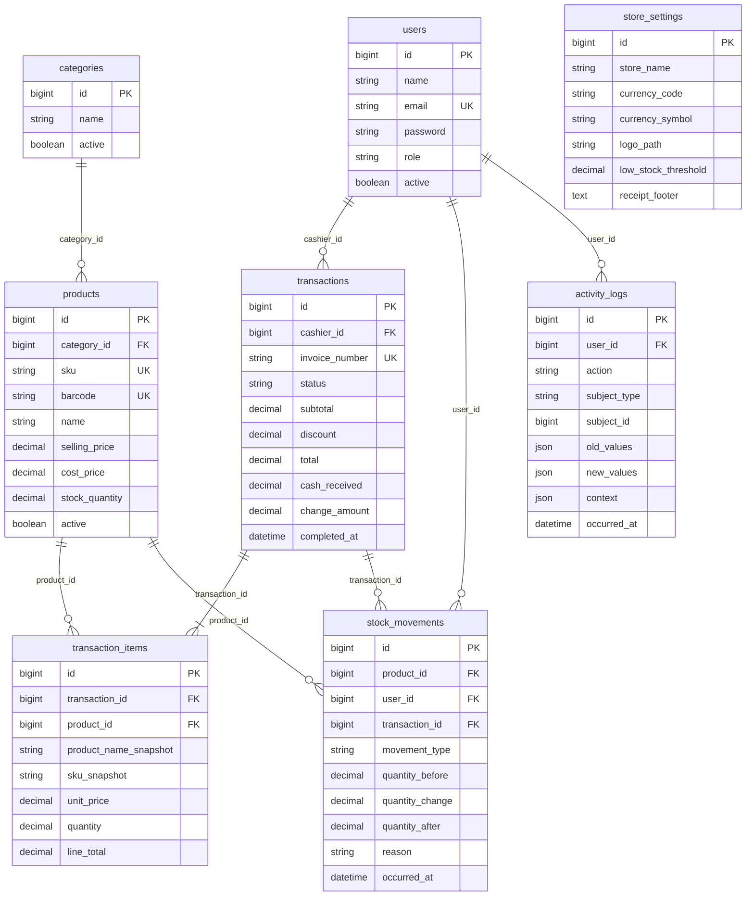

# Struktur dan Arsitektur SimplePOS

Dokumen ini menjelaskan bagaimana aplikasi SimplePOS disusun, bagaimana data bergerak, dan bagaimana seorang developer baru dapat menavigasi kode tanpa menebak batas tanggung jawab tiap lapisan.

SimplePOS adalah sistem kasir satu toko. Satu proses PHP menangani katalog, penjualan, stok, laporan, dan audit. Checkout selesai di dalam satu transaksi database; tidak ada API publik terpisah dan tidak ada antrean untuk penjualan.

---

## 1. Overview Proyek

### 1.1 Tujuan

Aplikasi ini melayani satu gerai. Kasir menjual barang, stok berkurang pada saat yang sama, dan Owner atau Administrator melihat riwayat, laporan, serta audit. Peran pengguna ada tiga: `OWNER`, `ADMINISTRATOR`, dan `CASHIER`.

### 1.2 Tech stack

| Lapisan | Teknologi | Peran |
|---|---|---|
| Runtime | PHP `^8.3` | Bahasa aplikasi. Perhitungan uang dan kuantitas memakai `bcmath` (string desimal), bukan float. |
| Framework | Laravel `^13.17` | Routing, Eloquent, session, validasi, migrasi, dan container. |
| UI | Livewire `^4.4` + Blade | Halaman interaktif (POS, form katalog, laporan) tanpa SPA. |
| Gaya | Tailwind CSS `^4` | Utility class di Blade. |
| Bundler | Vite `^8` + `laravel-vite-plugin` | Mengompilasi `resources/css/app.css` dan `resources/js/app.js`. |
| Database produksi | MySQL (`utf8mb4`) | Database operasional. Nama default di contoh environment: `simplepos`. |
| Database tes | SQLite in-memory | Diatur di `phpunit.xml`, terpisah dari MySQL lokal. |
| Auth | Session Laravel (`web` guard) | Login form klasik. Password di-hash lewat cast `hashed` pada model `User`. |
| Antrian | `sync` | Checkout wajib selesai di request yang sama. Jangan memindahkan penjualan ke worker Redis atau database. |
| Cache & session | File | Cukup untuk satu toko. Tabel `cache` dan `sessions` tetap ada di migrasi, tetapi driver default aplikasi memakai file. |
| Pengujian | PHPUnit `^12` | Feature test untuk alur HTTP/Livewire, unit test untuk kalkulasi dan installer. |
| Format kode | Laravel Pint | Style PHP. |

Dependensi produksi di `composer.json` sengaja kecil: `laravel/framework`, `laravel/tinker`, dan `livewire/livewire`. Tidak ada package modul, repository layer, atau frontend framework terpisah.

### 1.3 Bentuk arsitektur

Aplikasi ini adalah **modular monolith Laravel**. Batas domain terlihat dari subfolder (`Sales`, `Catalog`, `Inventory`, `Identity`, `Reporting`, `Audit`, `Configuration`, `Install`), bukan dari service terpisah.

Alur tulis dan baca dipisah secara ringan:

```text
HTTP request
    │
    ├─ Controller          login, struk, wizard installer
    └─ Livewire component  layar interaktif
            │
            ├─ Action      perubahan data (penjualan, stok, user, pengaturan)
            ├─ Service     perhitungan murni (total, diskon, kembalian)
            ├─ Query       pembacaan laporan dan dashboard
            └─ Policy/Gate otorisasi
                    │
                    └─ Eloquent Model ── MySQL
```

Eloquent adalah API persistensi. Tidak ada repository. Komponen Livewire dan controller tetap tipis: mereka memvalidasi input layar, lalu memanggil Action atau Query.

### 1.4 Peran pengguna

| Peran | Beranda setelah login | Akses utama |
|---|---|---|
| `CASHIER` | `/pos` | Kasir, transaksi milik sendiri, struk, profil. |
| `ADMINISTRATOR` | `/dashboard` | Semua yang kasir bisa, plus katalog, stok, laporan, pengguna, pengaturan toko. |
| `OWNER` | `/dashboard` | Sama dengan Administrator, plus audit log dan penetapan peran Owner. |

Gate didefinisikan di `App\Providers\AppServiceProvider`. Policy Eloquent memetakan kemampuan itu ke model. Transaksi yang sudah selesai tidak boleh diubah atau dihapus (`deleteCompletedTransaction` selalu `false`).

Pengguna dengan `active = false` dikeluarkan oleh middleware `EnsureUserIsActive` begitu session menyentuh rute terproteksi.

---

## 2. Struktur Folder dan File

Akar repositori mengikuti kerangka Laravel. Folder domain hanya ditambahkan di dalam `app/` ketika ada kode yang benar-benar memakainya.

```text
SimplePOS/
├── app/                  kode aplikasi
├── bootstrap/            bootstrap Laravel 11+ (app.php, providers.php)
├── config/               konfigurasi framework + installer
├── database/             migrasi, factory, seeder
├── docs/                 dokumen teknis dan operasional
├── public/               document root web server
├── resources/            Blade, CSS, JS
├── routes/               rute web, installer, perintah Artisan
├── storage/              log, cache, sesi file, lock installer, unggahan
├── tests/                PHPUnit
├── artisan               CLI Laravel
├── composer.json         dependensi PHP
├── package.json          dependensi frontend
├── phpunit.xml           environment pengujian
└── vite.config.js        entri aset Vite
```

### 2.1 `app/`

| Folder | Fungsi |
|---|---|
| `Actions/` | Satu kelas, satu perubahan bisnis. Contoh: `Sales/CompleteSale`, `Inventory/AdjustStock`, `Identity/CreateUser`, `Audit/RecordActivity`, serta langkah installer di `Actions/Install/`. |
| `Console/Commands/` | Perintah `simplepos:install` untuk instalasi dari CLI. |
| `Enums/` | Nilai tertutup: peran, status transaksi, jenis mutasi stok, aksi audit, mata uang. |
| `Http/Controllers/` | Controller klasik. Dipakai untuk login, struk, halaman sukses checkout, dan wizard `/install`. |
| `Http/Middleware/` | Gerbang instalasi (`RedirectIfNotInstalled`, `PreventAccessToInstaller`) dan penolakan akun nonaktif. |
| `Http/Requests/` | Form Request untuk login dan setiap langkah installer. |
| `Livewire/` | Komponen UI per domain: `Pos`, `Catalog`, `Sales`, `Inventory`, `Reporting`, `Identity`, `Configuration`, `Audit`. |
| `Models/` | Model Eloquent. Delapan model domain ditambah tabel framework. |
| `Policies/` | Aturan lihat/ubah per model. |
| `Providers/AppServiceProvider.php` | Binding installer dan seluruh Gate. |
| `Queries/Reporting/` | Pembacaan agregat untuk dashboard, laporan penjualan, dan laporan per produk. |
| `Services/Sales/` | `CheckoutCalculator` dan DTO `CheckoutCalculation`. Tidak menulis database. |
| `Support/` | Pembantu yang bukan Action: `Money`, `StoreSettings`, `Auth/AuthenticatedHome`, `Sales/InvoiceNumberGenerator`, dan seluruh mesin installer di `Support/Install/`. |

File krusial di `app/`:

- `Actions/Sales/CompleteSale.php` — satu-satunya jalur yang menulis transaksi penjualan. Mengunci baris produk, menghitung total, membuat invoice, menyimpan item, lalu mengurangi stok di dalam `DB::transaction`.
- `Actions/Inventory/ApplySaleStockDeduction.php` — menulis `stock_movements` bertipe `SALE` dan memperbarui `products.stock_quantity`.
- `Actions/Inventory/AdjustStock.php` — penyesuaian manual (`MANUAL_ADJUSTMENT`) plus catatan audit.
- `Actions/Audit/RecordActivity.php` — satu-satunya penulis `activity_logs`. Model `ActivityLog` di-guard penuh (`#[Guarded(['*'])]`).
- `Support/Sales/InvoiceNumberGenerator.php` — nomor `INV-YYYYMMDD-000001`, dikunci (`lockForUpdate`) agar urutan harian tidak bentrok.
- `Support/Auth/AuthenticatedHome.php` — kasir diarahkan ke POS; peran lain ke dashboard.
- `Support/Install/InstallState.php` — menentukan apakah aplikasi sudah terpasang (flag environment, file `storage/app/installed`, atau keberadaan akun Owner) dan menyimpan langkah wizard di session.

### 2.2 `bootstrap/`

`bootstrap/app.php` mendaftarkan:

- rute web (`routes/web.php`) dan perintah (`routes/console.php`);
- health check bawaan Laravel di `GET /up`;
- grup tambahan `routes/install.php` dengan middleware `web`;
- middleware global `RedirectIfNotInstalled` pada stack web;
- alias `install.unlocked` ke `PreventAccessToInstaller`.

`bootstrap/providers.php` hanya memuat `AppServiceProvider`.

### 2.3 `config/`

File konfigurasi Laravel standar (`app`, `auth`, `database`, `session`, `cache`, `queue`, `mail`, `filesystems`, `logging`, `services`) ditambah `config/installer.php`. File installer membaca tiga kunci: status terpasang, path file environment, dan path file contoh environment. Kunci itu dipakai wizard dan test agar path `.env` bisa diganti tanpa menulis file asli.

### 2.4 `database/`

| Isi | Fungsi |
|---|---|
| `migrations/` | Skema. Urutan tanggal memastikan `users` dan `categories` ada sebelum `products`, `transactions`, dan `stock_movements`. |
| `factories/` | Data palsu untuk tes (`User`, `Category`, `Product`, `StoreSetting`, `ActivityLog`). |
| `seeders/DatabaseSeeder.php` | Memanggil `OwnerSeeder` lalu `StoreSettingsSeeder`. |
| `seeders/DemoSeeder.php` | Pengguna dan katalog demo untuk QA manual. |
| `seeders/InstallDemoSeeder.php` | Katalog demo yang dipanggil wizard installer atau `simplepos:install --demo`. |

### 2.5 `resources/`

| Path | Fungsi |
|---|---|
| `views/layouts/app.blade.php` | Shell aplikasi setelah login (sidebar). |
| `views/layouts/guest.blade.php` | Shell login. |
| `views/layouts/install.blade.php` | Shell wizard instalasi. |
| `views/layouts/receipt.blade.php` | Layout cetak struk. |
| `views/components/` | Komponen Blade kecil: tombol, input, tabel, badge, modal, uang, sidebar. |
| `views/livewire/` | View pasangan tiap komponen Livewire, dikelompokkan per domain. |
| `views/install/` | Satu view per langkah wizard. |
| `views/auth/login.blade.php` | Form login. |
| `views/receipts/show.blade.php` | Struk transaksi. |
| `css/app.css` | Entri Tailwind. |
| `js/app.js` | Entri Vite. Alpine disediakan Livewire lewat `@livewireScripts`, bukan dari file ini. |

Layar POS (`resources/views/livewire/pos/pos-page.blade.php`) menyusun tiga komponen anak: pencarian produk, keranjang, dan panel bayar.

### 2.6 `routes/`

| File | Fungsi |
|---|---|
| `web.php` | Semua rute aplikasi setelah toko terpasang: auth, POS, katalog, stok, laporan, audit. |
| `install.php` | Wizard `/install/*`. Hanya hidup selama aplikasi belum dikunci. |
| `console.php` | Perintah Artisan bawaan `inspire`. Perintah instalasi didaftarkan lewat atribut `#[AsCommand]` pada kelas command, bukan di file ini. |

Tidak ada `routes/api.php`. Aplikasi tidak mengekspos REST API.

### 2.7 `tests/`

`tests/Feature/` mengikuti domain yang sama dengan `app/` (`Auth`, `Catalog`, `Sales`, `Inventory`, `Reporting`, `Identity`, `Audit`, `Configuration`, `Install`, `Regression`). `tests/Unit/` mencakup kalkulator checkout, generator invoice, dan pemeriksa installer. `tests/TestCase.php` adalah basis Laravel. `phpunit.xml` memaksa `APP_INSTALLED=true` supaya tes fitur tidak terseret ke wizard.

### 2.8 `storage/` dan `public/`

- `storage/app/installed` adalah file kunci. Setelah file ini ada, middleware installer menolak `/install`.
- Logo toko disimpan di disk `public`. Setelah instalasi, `php artisan storage:link` (atau action `EnsureStorageLink`) membuat `public/storage`.
- `public/` adalah satu-satunya folder yang boleh diarahkan ke web server. `public/index.php` adalah front controller.

### 2.9 Dokumen lain

Folder `docs/` juga berisi panduan installer, pengujian, rilis, dan struktur yang lebih preskriptif (`PROJECT_STRUCTURE.md`). Dokumen ini mendeskripsikan kode yang ada sekarang. Jika keduanya berbeda, percayai kode dan migrasi.

---

## 3. Arsitektur Data

### 3.1 Prinsip penyimpanan

- Satu database, satu toko. Tidak ada tabel `stores` atau multi-tenant.
- Harga dan total memakai `decimal(15,2)`. Kuantitas stok memakai `decimal(15,3)`.
- Baris penjualan menyimpan **snapshot** nama, SKU, barcode, dan harga. Perubahan katalog di kemudian hari tidak menulis ulang struk lama.
- `product_id` pada item transaksi boleh menjadi `null` jika produk dihapus (`nullOnDelete`). Penghapusan produk yang masih punya stok movement atau yang masih direferensikan dengan `restrictOnDelete` ditolak database.
- `store_settings` adalah baris tunggal. Migrasi menyisipkan `id = 1` dengan mata uang awal IDR.
- Stok saat ini ada di `products.stock_quantity`. Membuat atau mengedit produk tidak menulis `stock_movements`. Mutasi tercatat hanya saat penjualan atau penyesuaian manual.
- `activity_logs` tidak punya `updated_at`. Jejak audit hanya bertambah.

### 3.2 ERD



Tabel framework yang ikut termigrasi, tetapi bukan domain kasir: `password_reset_tokens`, `sessions`, `cache`, `cache_locks`, `jobs`, `job_batches`, `failed_jobs`.

### 3.3 Model dan relasi

| Model | Tabel | Relasi |
|---|---|---|
| `User` | `users` | Tidak mendeklarasikan `hasMany`; transaksi menunjuk balik lewat `Transaction::cashier()`. |
| `Category` | `categories` | `products()`. Scope `active()`. |
| `Product` | `products` | `category()`. Scope `active()`. |
| `StoreSetting` | `store_settings` | `currency()` memetakan kode ke enum `Currency`. `logoUrl()` membaca disk `public`. |
| `Transaction` | `transactions` | `cashier()`, `items()`, `stockMovements()`. |
| `TransactionItem` | `transaction_items` | `transaction()`, `product()`. |
| `StockMovement` | `stock_movements` | `product()`, `user()`, `transaction()`. |
| `ActivityLog` | `activity_logs` | `actor()` ke `users`. |

Enum yang mengetik kolom string:

| Enum | Nilai |
|---|---|
| `UserRole` | `OWNER`, `ADMINISTRATOR`, `CASHIER` |
| `TransactionStatus` | `COMPLETED` |
| `StockMovementType` | `SALE`, `MANUAL_ADJUSTMENT` |
| `ActivityAction` | `USER_CREATED`, `USER_ROLE_CHANGED`, `USER_STATUS_CHANGED`, `STOCK_MANUAL_ADJUSTED`, `STORE_SETTINGS_UPDATED` |
| `Currency` | `IDR` (0 desimal tampilan, simbol `Rp`), `USD` (2 desimal, simbol `$`) |

### 3.4 Aliran data utama

#### Instalasi

Aplikasi dianggap belum terpasang bila `APP_INSTALLED` tidak bernilai true, file `storage/app/installed` tidak ada, dan belum ada user berperan Owner. Middleware `RedirectIfNotInstalled` mengirim hampir semua permintaan ke `/install`. Health check `/up` dan aset `/build/*` dilewati.

Wizard berjalan berurutan dan menyimpan progres di session:

1. Selamat datang
2. Pemeriksaan versi PHP
3. Ekstensi PHP
4. Izin tulis folder
5. Uji koneksi database
6. Tulis file environment dan `APP_KEY`
7. Migrasi
8. Data Owner (disimpan sementara di session sampai selesai)
9. Pengaturan toko awal
10. Data demo, opsional
11. Kunci instalasi, lalu wizard ditutup

Perintah `php artisan simplepos:install` menjalankan jalur yang sama dari CLI. Opsi `--demo` mengisi katalog contoh. Opsi `--lock-only` hanya menulis kunci bila Owner sudah ada.

#### Login

`POST /login` divalidasi `LoginRequest`, session di-regenerate oleh attempt Laravel, lalu pengguna diarahkan ke beranda perannya. Logout menghapus session dan token CSRF.

#### Penjualan (POS)

Tiga komponen Livewire di halaman `/pos` berbicara lewat event, bukan lewat satu state global:

```text
ProductSearch
    pencarian nama / SKU, atau scan barcode persis
    event: add-to-cart {productId}
        │
        v
CartPanel
    state: items[productId] = quantity   (hidup di komponen, belum di database)
    menolak produk nonaktif dan kuantitas di atas stok
    event: cart-state-updated {subtotal, isEmpty, items}
        │
        v
PaymentPanel
    diskon dan uang diterima
    memanggil CompleteSale
        │
        v
CompleteSale  (DB::transaction)
    1. lockForUpdate produk yang ada di keranjang
    2. CheckoutCalculator: subtotal, diskon, total, cukup/tidak, kembalian
    3. InvoiceNumberGenerator
    4. insert transactions (status COMPLETED)
    5. insert transaction_items (snapshot)
    6. ApplySaleStockDeduction per baris
    7. commit, atau rollback bila stok tidak cukup / pembayaran kurang
        │
        v
redirect ke /pos/success/{transaction}
    lalu struk di /transactions/{transaction}/receipt
```

Keranjang tidak punya tabel sendiri. Menutup browser sebelum bayar tidak menyisakan draf penjualan.

`CheckoutCalculator` hanya menghitung. Ia tidak membaca atau menulis database, sehingga bisa diuji sebagai unit test.

#### Stok manual

`AdjustStockForm` memanggil `AdjustStock`. Action mengunci produk, menolak perubahan nol dan stok akhir negatif, menulis `stock_movements` bertipe `MANUAL_ADJUSTMENT`, memperbarui `stock_quantity`, lalu `RecordActivity` dengan aksi `STOCK_MANUAL_ADJUSTED`. Alasan wajib diisi.

#### Laporan

`Queries/Reporting/` membaca transaksi selesai pada rentang tanggal. `Dashboard` memakai `DashboardMetricsQuery`. Laporan penjualan memakai `DateRangeSalesQuery` dan `SalesPeriodSummary`. Laporan per produk memakai `ProductSalesQuery`. Query tidak mengubah data.

#### Audit

Perubahan pengguna (buat, ganti peran, aktif/nonaktif) dan pembaruan pengaturan toko juga lewat `RecordActivity`. Nilai sensitif disaring sebelum masuk JSON. Hanya Owner yang boleh membuka `/audit-log`.

---

## 4. Route Utama

Semua rute di bawah memakai middleware `web` (session, CSRF, cookie). Setelah toko terkunci, grup aplikasi juga memakai `auth` dan `EnsureUserIsActive`. Kemampuan (`can:*`) ditambahkan per grup.

Tidak ada prefix `/api`. Respons JSON hanya muncul bila klien meminta JSON atau path diawali `api/` (cadangan di `bootstrap/app.php`); tidak ada endpoint yang didaftarkan di sana.

### 4.1 Sistem

| Metode | Path | Nama | Kegunaan |
|---|---|---|---|
| `GET` | `/up` | — | Health check Laravel. |
| `GET` | `/` | `home` | Pengguna tamu ke login. Pengguna masuk ke POS atau dashboard sesuai peran. |

### 4.2 Autentikasi

| Metode | Path | Nama | Middleware | Kegunaan |
|---|---|---|---|---|
| `GET` | `/login` | `login` | `guest` | Form masuk. |
| `POST` | `/login` | `login.store` | `guest`, `throttle:10,1` | Proses masuk. Dibatasi 10 percobaan per menit. |
| `POST` | `/logout` | `logout` | `auth` | Keluar dan menghapus session. |
| `GET` | `/profile` | `profile.edit` | `auth` | Ubah nama dan kata sandi sendiri. |

### 4.3 Kasir dan penjualan

| Metode | Path | Nama | Izin | Kegunaan |
|---|---|---|---|---|
| `GET` | `/pos` | `pos` | `accessPos` | Layar kasir. |
| `GET` | `/pos/success/{transaction}` | `pos.checkout.success` | `accessPos` | Ringkasan setelah bayar. |
| `GET` | `/transactions` | `transactions.index` | policy `viewAny` di komponen | Daftar transaksi. Kasir melihat milik sendiri. |
| `GET` | `/transactions/{transaction}` | `transactions.show` | policy `view` | Detail satu transaksi. |
| `GET` | `/transactions/{transaction}/receipt` | `transactions.receipt` | policy `view` | Struk untuk ditampilkan atau dicetak. |

### 4.4 Katalog, stok, laporan, identitas

| Metode | Path | Nama | Izin | Kegunaan |
|---|---|---|---|---|
| `GET` | `/dashboard` | `dashboard` | `viewDashboard` | Ringkasan penjualan. |
| `GET` | `/categories` | `categories.index` | `manageCategories` | Daftar kategori. |
| `GET` | `/categories/create` | `categories.create` | `manageCategories` | Form kategori baru. |
| `GET` | `/categories/{category}/edit` | `categories.edit` | `manageCategories` | Ubah kategori. |
| `GET` | `/products` | `products.index` | `manageProducts` | Daftar produk. |
| `GET` | `/products/create` | `products.create` | `manageProducts` | Form produk baru. |
| `GET` | `/products/{product}/edit` | `products.edit` | `manageProducts` | Ubah produk. |
| `GET` | `/inventory` | `inventory.index` | `viewInventory` | Posisi stok dan ambang rendah. |
| `GET` | `/inventory/movements` | `inventory.movements.index` | `viewStockMovements` | Riwayat mutasi. |
| `GET` | `/reports/sales` | `reports.sales` | `viewReports` | Laporan penjualan per periode. |
| `GET` | `/reports/product-sales` | `reports.product-sales` | `viewReports` | Penjualan per produk. |
| `GET` | `/users` | `users.index` | `manageUsers` | Daftar pengguna. |
| `GET` | `/users/create` | `users.create` | `manageUsers` | Pengguna baru. |
| `GET` | `/users/{user}/edit` | `users.edit` | `manageUsers` | Ubah pengguna. |
| `GET` | `/settings` | `settings.edit` | `manageStoreSettings` | Nama toko, mata uang, logo, footer struk, ambang stok. |
| `GET` | `/audit-log` | `audit-log.index` | `viewAuditLog` | Jejak audit. Hanya Owner. |

Penyesuaian stok tidak punya URL sendiri. Form-nya hidup di dalam halaman inventori sebagai komponen `AdjustStockForm`.

Mutasi data pada layar Livewire (tambah ke keranjang, simpan produk, ubah stok, dan sebagainya) terjadi lewat request Livewire ke endpoint internal Livewire, bukan lewat rute REST yang didaftarkan di `routes/web.php`.

### 4.5 Wizard installer

Seluruh grup memakai middleware `install.unlocked` dan prefix nama `install.`. Setiap `POST` dibatasi `throttle:10,1`. Setelah kunci terpasang, grup ini tidak lagi dapat diakses.

| Metode | Path | Nama | Kegunaan |
|---|---|---|---|
| `GET` / `POST` | `/install` dan `/install/welcome` | `install.welcome`, `install.welcome.continue` | Langkah pembuka. |
| `GET` / `POST` | `/install/requirements` | `install.requirements` | Cek versi PHP. |
| `GET` / `POST` | `/install/extensions` | `install.extensions` | Cek ekstensi. |
| `GET` / `POST` | `/install/permissions` | `install.permissions` | Cek izin folder. |
| `GET` / `POST` | `/install/database` | `install.database` | Uji dan simpan kredensial database di session. |
| `GET` / `POST` | `/install/environment` | `install.environment` | Tulis `.env`. |
| `GET` / `POST` | `/install/migrate` | `install.migrate` | Jalankan migrasi. |
| `GET` / `POST` | `/install/owner` | `install.owner` | Data Owner. |
| `GET` / `POST` | `/install/settings` | `install.settings` | Pengaturan toko awal. |
| `GET` / `POST` | `/install/demo` | `install.demo` | Katalog demo, boleh dilewati. |
| `GET` / `POST` | `/install/complete` | `install.complete` | Tulis kunci dan selesai. |

### 4.6 Perintah Artisan aplikasi

| Perintah | Kegunaan |
|---|---|
| `php artisan simplepos:install` | Instalasi non-interaktif/interaktif dari CLI. |
| `php artisan simplepos:install --demo` | Instalasi plus data demo. |
| `php artisan simplepos:install --lock-only` | Menulis `storage/app/installed` bila Owner sudah ada. |
| `php artisan db:seed` | Owner dan baris pengaturan, memakai variabel `OWNER_*`. |
| `php artisan db:seed --class=DemoSeeder` | Pengguna dan katalog demo untuk QA. |

---

## 5. Konfigurasi Environment

Salin `.env.example` menjadi `.env`, lalu isi nilai lokal. Jangan commit `.env`. Bagian ini hanya menyebut **nama** variabel dan maksudnya. Nilai rahasia (kunci aplikasi, kata sandi database, kata sandi pengguna) tidak dicantumkan.

### 5.1 Wajib untuk menjalankan aplikasi

| Variabel | Maksud |
|---|---|
| `APP_NAME` | Nama aplikasi yang tampil di layout dan cookie session. |
| `APP_ENV` | `local` saat pengembangan. Produksi memakai `production`. |
| `APP_KEY` | Kunci enkripsi Laravel. Dihasilkan `php artisan key:generate` atau wizard. Kosongkan di repo. |
| `APP_DEBUG` | `true` hanya di mesin pengembangan. Produksi wajib `false`. |
| `APP_URL` | URL publik, termasuk skema. Dipakai tautan dan URL disk `public`. |
| `APP_LOCALE` | Locale aplikasi. |
| `APP_FALLBACK_LOCALE` | Locale cadangan. |
| `APP_FAKER_LOCALE` | Locale Faker untuk factory. |
| `APP_MAINTENANCE_DRIVER` | Penyimpanan mode maintenance. Default contoh: `file`. |
| `BCRYPT_ROUNDS` | Cost hash password. |
| `LOG_CHANNEL` | Kanal log. Contoh: `stack`. |
| `LOG_STACK` | Anggota stack. Contoh: `single`. |
| `LOG_DEPRECATIONS_CHANNEL` | Kanal peringatan deprecation. |
| `LOG_LEVEL` | Tingkat log. |
| `DB_CONNECTION` | Driver. Operasional: `mysql`. |
| `DB_HOST` | Host MySQL. |
| `DB_PORT` | Port MySQL. |
| `DB_DATABASE` | Nama database. Buat database `utf8mb4` yang sesuai sebelum migrasi. |
| `DB_USERNAME` | Pengguna database. |
| `DB_PASSWORD` | Kata sandi database. Biarkan kosong hanya jika server lokal memang tidak memakai sandi. |
| `SESSION_DRIVER` | Contoh aplikasi: `file`. |
| `SESSION_LIFETIME` | Umur session dalam menit. |
| `SESSION_ENCRYPT` | Enkripsi payload session. |
| `SESSION_PATH` | Path cookie. |
| `SESSION_DOMAIN` | Domain cookie. `null` berarti host saat ini. |
| `SESSION_SECURE_COOKIE` | `true` bila situs dilayani lewat HTTPS. |
| `SESSION_HTTP_ONLY` | Cookie tidak terbaca dari JavaScript. |
| `SESSION_SAME_SITE` | Kebijakan SameSite. Contoh: `lax`. |
| `BROADCAST_CONNECTION` | Siaran event. Aplikasi tidak memakai websocket; contoh: `log`. |
| `FILESYSTEM_DISK` | Disk default. Contoh: `local`. Logo memakai disk `public` secara eksplisit di kode. |
| `QUEUE_CONNECTION` | Wajib `sync` supaya penjualan tidak bergantung pada worker. |
| `CACHE_STORE` | Contoh aplikasi: `file`. |
| `VITE_APP_NAME` | Nama yang diteruskan ke aset frontend. Biasanya mengikuti `APP_NAME`. |

### 5.2 Email

Aplikasi MVP tidak mengirim email transaksional. Variabel berikut tetap ada karena konfigurasi mail Laravel membacanya. Contoh memakai mailer `log`, jadi pesan hanya masuk log.

| Variabel | Maksud |
|---|---|
| `MAIL_MAILER` | Driver surat. |
| `MAIL_SCHEME` | Skema koneksi SMTP. |
| `MAIL_HOST` | Host SMTP. |
| `MAIL_PORT` | Port SMTP. |
| `MAIL_USERNAME` | Pengguna SMTP. |
| `MAIL_PASSWORD` | Sandi SMTP. Jangan di-commit. |
| `MAIL_FROM_ADDRESS` | Alamat pengirim. |
| `MAIL_FROM_NAME` | Nama pengirim. |

### 5.3 Seed dan instalasi CLI

Dipakai `OwnerSeeder`, `DemoSeeder`, `InstallDemoSeeder`, dan `simplepos:install`. Ganti sebelum toko sungguhan dipakai. Jangan menaruh sandi produksi di file yang di-commit.

| Variabel | Maksud |
|---|---|
| `OWNER_NAME` | Nama lengkap Owner awal. |
| `OWNER_EMAIL` | Email login Owner. |
| `OWNER_PASSWORD` | Sandi awal Owner. |
| `DEMO_ADMIN_NAME` | Nama administrator demo. |
| `DEMO_ADMIN_EMAIL` | Email administrator demo. |
| `DEMO_ADMIN_PASSWORD` | Sandi administrator demo. |
| `DEMO_CASHIER_NAME` | Nama kasir demo. |
| `DEMO_CASHIER_EMAIL` | Email kasir demo. |
| `DEMO_CASHIER_PASSWORD` | Sandi kasir demo. |
| `STORE_NAME` | Nama toko saat `simplepos:install` tidak menanyakan secara interaktif. Opsional. |

### 5.4 Variabel yang dibaca kode, tetapi tidak wajib di `.env.example`

| Variabel | Maksud |
|---|---|
| `APP_INSTALLED` | Jika bernilai boolean true, `InstallState` menganggap aplikasi sudah terpasang. Tes PHPUnit menyetel ini. Wizard selesai mengandalkan file kunci dan akun Owner. |
| `INSTALLER_ENV_PATH` | Path file environment yang ditulis wizard. Kosong berarti `.env` di akar proyek. |
| `INSTALLER_ENV_EXAMPLE_PATH` | Path contoh environment yang disalin wizard. |
| `APP_PREVIOUS_KEYS` | Kunci lama saat rotasi `APP_KEY`, dipisah koma. |
| `DB_URL` | URL database alternatif. Jika diisi, Laravel memakainya sebagai pengganti host/port terpisah. |
| `DB_SOCKET` | Socket Unix MySQL, bila tidak memakai TCP. |
| `DB_CHARSET` | Charset. Default kode: `utf8mb4`. |
| `DB_COLLATION` | Collation. Default kode: `utf8mb4_unicode_ci`. |
| `MYSQL_ATTR_SSL_CA` | Berkas CA bila koneksi MySQL memakai TLS. |

File `config/database.php`, `config/cache.php`, `config/queue.php`, dan `config/logging.php` juga mengenal variabel Redis, Memcached, SQS, AWS, DynamoDB, Slack, dan Papertrail. SimplePOS tidak membutuhkan salah satu dari itu untuk berjalan. Mengisinya hanya perlu bila seseorang dengan sengaja mengganti driver.

### 5.5 Environment pengujian

`phpunit.xml` menimpa koneksi menjadi SQLite `:memory:`, cache dan session `array`, antrean `sync`, serta `APP_INSTALLED=true`. Tes tidak memakai database MySQL pengembangan.

---

## 6. Peta singkat saat mengubah kode

| Kebutuhan | Tempat yang tepat |
|---|---|
| Ubah tampilan layar | `resources/views/livewire/...` dan komponen di `app/Livewire/`. |
| Ubah aturan simpan | `app/Actions/...`, lalu sesuaikan feature test di `tests/Feature/`. |
| Ubah rumus total atau kembalian | `app/Services/Sales/CheckoutCalculator.php` dan unit test-nya. |
| Ubah angka laporan | `app/Queries/Reporting/`. |
| Tambah kolom | migrasi baru, model, factory bila tes membutuhkannya. Jangan mengedit migrasi yang sudah berjalan di lingkungan bersama. |
| Tambah hak akses | Gate di `AppServiceProvider` dan, bila menyentuh model, policy terkait. |
| Tambah halaman | rute di `routes/web.php`, komponen Livewire, entri sidebar. |

Checkout, stok, dan nomor invoice harus tetap berada di satu transaksi database. Memecah langkah itu ke job antrean akan membuat struk dan stok bisa tidak sejalan.
